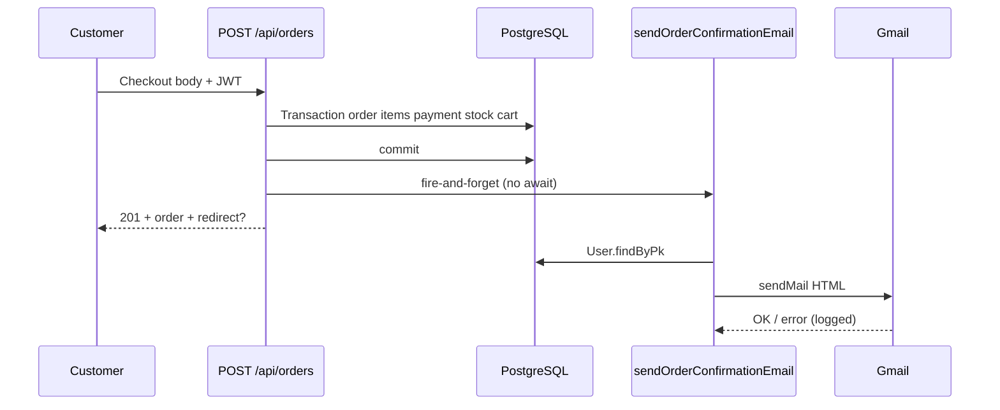

# Use Case — UC-NOT-01: Gửi email xác nhận đơn hàng (Send Order Confirmation Email)

| Thuộc tính | Giá trị |
|------------|---------|
| **ID** | UC-NOT-01 |
| **Tên** | Gửi email HTML xác nhận ngay sau khi tạo đơn thành công |
| **Mức độ ưu tiên** | Cao |
| **Phiên bản** | Bám code hiện tại |
| **Liên quan FR** | `FR_SendOrderConfirmationEmail.md` |
| **Liên quan UC** | UC-ORD-02 (COD), UC-ORD-03 (VNPay), UC-NOT-02 |

---

## 1. Mô tả ngắn

Sau **`POST /api/orders`** commit transaction thành công, hệ thống gọi **`sendOrderConfirmationEmail`** (`server/services/emailService.js`) — **fire-and-forget** (không `await`, không chặn HTTP **201**).

Email gửi tới **`users.email`** của người đặt hàng, nội dung tiếng Việt: mã đơn, sản phẩm, tổng tiền, địa chỉ giao hàng, nhãn phương thức thanh toán (COD / VNPay).

**Không phải REST API** — là side-effect nội bộ từ `orderController.createOrder`.

**Không gửi** khi: VNPay return thành công, admin đổi trạng thái, user hủy đơn (các luồng khác dùng UC-NOT-02 hoặc không có email).

---

## 2. Tác nhân

| Tác nhân | Vai trò |
|----------|---------|
| **Customer** | Nhận email |
| **orderController.createOrder** | Trigger sau `t.commit()` |
| **emailService** | Build HTML + `nodemailer.sendMail` |
| **User model** | `User.findByPk(order.user_id)` trong service |
| **Gmail SMTP** | `service: 'gmail'` + `EMAIL_USER` / `EMAIL_PASS` |

---

## 3. Preconditions

| # | Điều kiện |
|---|-----------|
| PRE-01 | `POST /api/orders` thành công — Order, OrderItems, Payment đã persist |
| PRE-02 | User có `user_id` hợp lệ và **email** |
| PRE-03 | `items_breakdown` đã build trong cùng request `createOrder` |
| PRE-04 | SMTP: `EMAIL_USER`, `EMAIL_PASS` (Gmail App Password khuyến nghị) |

---

## 4. Postconditions

| # | Kết quả |
|---|---------|
| POST-01 | Khách nhận email subject `Xác nhận đơn hàng {order_code} - LaptopStore` |
| POST-02 | API vẫn trả **201** dù email fail (`.catch` log) |
| POST-E01 | User không tồn tại → service throw (chỉ log, không ảnh hưởng HTTP) |
| POST-E02 | SMTP lỗi → `console.error`, đơn vẫn tạo |

---

## 5. Trigger

| Sự kiện | Chi tiết |
|---------|----------|
| **Checkout COD** | `payment_provider: "COD"` → order `status: processing` |
| **Checkout VNPay** | `payment_provider: "VNPAY"` → order `status: AWAITING_PAYMENT` + `redirect` URL (nếu cấu hình OK) |

Cả hai đều gọi email **một lần** ngay sau tạo đơn — **trước** khi khách thanh toán VNPay (nếu VNPay).

---

## 6. Luồng chính



| Bước | Mô tả |
|------|--------|
| 1 | Validate items, địa chỉ, `quoteShipping`, tính `final_amount` |
| 2 | `Order.create` — status COD=`processing`, VNPay=`AWAITING_PAYMENT` |
| 3 | Trừ kho, `OrderItem`, `Payment` pending |
| 4 | Xóa cart (theo `items` body hoặc full cart) |
| 5 | VNPay: build `redirect` (lỗi env → 502 **trước** commit) |
| 6 | `await t.commit()` |
| 7 | Gọi `sendOrderConfirmationEmail(...).catch(...)` |
| 8 | `return res.status(201).json({ order, redirect, ... })` |

### Code trigger (`orderController.js`)

```javascript
await t.commit();

try {
  const { sendOrderConfirmationEmail } = require("../services/emailService");
  sendOrderConfirmationEmail({
    order,
    items_breakdown,
    payment_provider: payment_provider,
    payment_method: payment_method,
  }).catch(err => console.error("Email send failed:", err));
} catch (emailError) {
  console.error("Failed to queue order confirmation email:", emailError);
}
```

---

## 7. Input contract — `sendOrderConfirmationEmail`

```javascript
sendOrderConfirmationEmail({
  order,              // Sequelize instance / plain fields
  items_breakdown,  // Array — xem §8
  payment_provider, // "COD" | "VNPAY"
  payment_method,   // "COD" | "VNPAYQR" | "VNBANK" | ...
})
```

Service **tự query** `User` — không nhận `user` từ caller.

---

## 8. `items_breakdown` (từ `createOrder`)

Build tại `orderController.js` (sau khi tính giá từng dòng):

| Field | Mô tả |
|-------|--------|
| `variation_id` | FK |
| `product_name` | Từ `variation.product.product_name` |
| `quantity` | Số lượng |
| `unit_price` | Giá gốc / đơn vị (đã round) |
| `unit_discount_amount` | Giảm theo % SP |
| `unit_final_price` | Sau giảm |
| `item_total` | `price * quantity` |
| `item_discount` | Tổng giảm dòng |
| `item_subtotal_after_discount` | Sau giảm dòng |

**Lưu ý template:** HTML map dùng `item.price` — payload thực tế là **`unit_price`** → dòng tiền SP có thể hiển thị **NaN** (GAP).

Template cũng tham chiếu `item.variation` (processor/ram/storage) — **`items_breakdown` không có object `variation`** → spec line có thể trống (GAP).

---

## 9. Nội dung email

### Metadata

| Field | Giá trị |
|-------|---------|
| **From** | `process.env.EMAIL_USER` \|\| `noreply@laptopstore.vn` |
| **To** | `user.email` |
| **Subject** | `Xác nhận đơn hàng ${order.order_code} - LaptopStore` |
| **Format** | HTML inline CSS |

### Nội dung chính

| Khối | Nội dung |
|------|----------|
| Header | LaptopStore — 「Xác nhận đơn hàng」 |
| Chào | `user.full_name` \|\| `user.username` |
| Thông tin đơn | `order_code`, `created_at` (vi-VN), **trạng thái**, PT thanh toán |
| Trạng thái text | `processing` → 「Đang xử lý」; else → 「Chờ thanh toán」 |
| PT thanh toán | `COD` → 「Thanh toán khi nhận hàng」; else → 「Ví điện tử VNPay」 |
| Line items | Tên SP, spec, SL, thành tiền dòng |
| Tổng kết | `total_amount`, `discount_amount`, `shipping_fee`, `final_amount` |
| Giao hàng | `shipping_name`, `shipping_phone`, `shipping_address` |
| Marketing | Bullet: email chuẩn bị, **SMS** (chưa implement), hotline placeholder |
| Footer | Auto-sent, © 2024 |

---

## 10. Cấu hình SMTP

```javascript
const transporter = nodemailer.createTransport({
  service: 'gmail',
  auth: {
    user: process.env.EMAIL_USER || 'your-email@gmail.com',
    pass: process.env.EMAIL_PASS || 'your-app-password'
  }
});
```

| Biến | Mô tả |
|------|--------|
| `EMAIL_USER` | Gmail / SMTP user |
| `EMAIL_PASS` | App password |

**Khác stack auth email:** `authController` dùng `EMAIL_HOST`, `EMAIL_PORT`, `EMAIL_FROM` cho verify/forgot — **không** dùng chung transporter với `emailService.js`.

---

## 11. Luồng thay thế / ngoại lệ

### ALT-01 — VNPay đơn chờ thanh toán

Email vẫn gửi với status 「Chờ thanh toán」; khách chưa trả tiền đã nhận xác nhận đặt hàng.

### ALT-02 — Transaction rollback

Không commit → **không** gọi email.

### EXC-01 — SMTP fail

Log `Email send failed` — đơn vẫn 201.

### EXC-02 — User không có email

`throw new Error('User not found...')` trong service — bị `.catch` ở caller.

---

## 12. Phân tách với UC-NOT-02

| Sự kiện | Email |
|---------|--------|
| Tạo đơn | **UC-NOT-01** (confirmation) |
| Đổi địa chỉ / PT thanh toán | UC-NOT-02 (`SHIPPING_ADDRESS`, `PAYMENT_METHOD`) |
| Admin ship / deliver / đổi status | UC-NOT-02 (`ORDER_STATUS`) |
| Admin hoàn tiền VNPay | UC-NOT-02 (`ORDER_REFUND`) |
| User hủy đơn | **Không email** |
| VNPay return paid | **Không email** (chỉ đổi DB) |

---

## 13. Ánh xạ mã nguồn

| Thành phần | Đường dẫn |
|------------|-----------|
| Service | `server/services/emailService.js` L17–141 |
| Trigger | `server/controllers/orderController.js` L366–379 |
| `items_breakdown` | `orderController.js` L171–197 |
| FE checkout | `client/app/pages/CheckoutPage.jsx` |
| Kiến trúc | `docs/architecture/event-driven-architecture.md` |

---

## 14. Known gaps

| # | Gap |
|---|-----|
| GAP-01 | Template dùng **`item.price`** — payload có **`unit_price`** → NaN₫ trên email |
| GAP-02 | Template expect **`item.variation`** — không có trong `items_breakdown` |
| GAP-03 | **Không** gửi lại email khi VNPay paid → `processing` |
| GAP-04 | SMS / hotline trong copy — **chưa** có tích hợp |
| GAP-05 | Không queue/retry/idempotency — duplicate submit order = duplicate email (nếu 2 đơn) |
| GAP-06 | Gmail hardcoded — không dùng `EMAIL_HOST` như auth |
| GAP-07 | `throw` trong service nhưng caller `.catch` — không metric/alert |
| GAP-08 | Status `FAILED` hiển thị 「Chờ thanh toán」 (else branch) |

---

## 15. Tiêu chí chấp nhận

- [ ] COD checkout → 201 + log `Order confirmation email sent to ...`
- [ ] VNPay checkout → 201 + email với 「Chờ thanh toán」
- [ ] Tắt SMTP → đơn vẫn 201, có log lỗi
- [ ] Subject chứa đúng `order_code`
- [ ] Email tới đúng `users.email` của `order.user_id`
- [ ] Hủy đơn / VNPay return — **không** gửi confirmation thêm

---

## 16. Test plan gợi ý

1. Cấu hình `EMAIL_USER` / `EMAIL_PASS` trên server.
2. Đặt đơn COD test — kiểm tra inbox + nội dung tổng tiền/địa chỉ.
3. Đặt đơn VNPay — xác nhận email trước khi thanh toán cổng.
4. Cố ý sai `EMAIL_PASS` — API 201, log error.
5. So sánh `items_breakdown` với HTML (kiểm tra bug `unit_price`).
