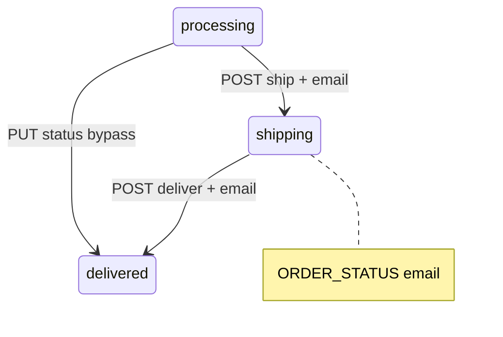
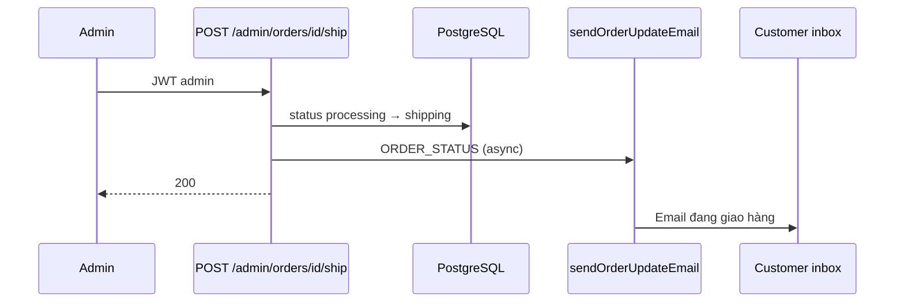

# Use Case — UC-NOT-02: Gửi email cập nhật đơn hàng (Send Order Status Update Email)

| Thuộc tính | Giá trị |
|------------|---------|
| **ID** | UC-NOT-02 |
| **Tên** | Gửi email HTML thông báo thay đổi đơn (trạng thái, địa chỉ, PT thanh toán, hoàn tiền) |
| **Mức độ ưu tiên** | Cao |
| **Phiên bản** | Bám code hiện tại |
| **Liên quan FR** | `FR_SendOrderUpdateEmail.md` |
| **Liên quan UC** | UC-NOT-01, UC-ADM-04, UC-ADM-05, UC-ORD-06, UC-ORD-07 |

---

## 1. Mô tả ngắn

Hàm **`sendOrderUpdateEmail`** (`server/services/emailService.js`) — **một template đa mục đích**, phân nhánh theo **`changeType`**. Gửi tới `user.email` sau các thao tác cập nhật đơn; pattern **fire-and-forget** (`.catch` log, không block HTTP response).

Tên file UC nhấn **trạng thái** (`ORDER_STATUS`) — đây là nhánh chính từ **admin fulfillment** — nhưng **cùng hàm** cũng phục vụ khách đổi **địa chỉ** và **phương thức thanh toán**.

```
changeType ∈ {
  ORDER_STATUS,      // Admin + trạng thái đơn
  SHIPPING_ADDRESS,  // Customer PUT shipping-address
  PAYMENT_METHOD,    // Customer đổi COD ↔ VNPay
  ORDER_REFUND       // Admin xác nhận hoàn tiền VNPay
}
```

**Không gửi** khi: user **hủy đơn**, VNPay return/IPN, tạo đơn mới (dùng UC-NOT-01).

---

## 2. Tác nhân

| Tác nhân | Vai trò |
|----------|---------|
| **Customer** | Nhận email; trigger địa chỉ / PT thanh toán |
| **Administrator** | Trigger status / ship / deliver / refund |
| **orderController** | `changePaymentMethod`, `updateShippingAddress` |
| **adminController** | `updateOrderStatus`, `shipOrder`, `deliverOrder`, `refundOrder` |
| **emailService** | HTML + nodemailer |

---

## 3. Preconditions

| # | Điều kiện |
|---|-----------|
| PRE-01 | Thao tác nguồn đã **commit** DB thành công |
| PRE-02 | `User.findByPk(order.user_id)` tồn tại |
| PRE-03 | `order.order_code`, amounts, shipping fields hợp lệ |
| PRE-04 | SMTP `EMAIL_USER` / `EMAIL_PASS` |

---

## 4. Postconditions

| # | Kết quả |
|---|---------|
| POST-01 | Email subject `{changeTitle} - Đơn hàng {order_code} - LaptopStore` |
| POST-02 | API nguồn vẫn 200/201 dù email fail |
| POST-E01 | `!user` → throw trong service (logged) |

---

## 5. Input contract

```javascript
sendOrderUpdateEmail({
  order,        // Order instance (sau update)
  changeType,   // string enum
  oldData,      // shape theo changeType
  newData,      // shape theo changeType
  user,         // User instance — bắt buộc (caller load)
})
```

---

## 6. Các `changeType` — chi tiết

### 6.1 `ORDER_STATUS` (trọng tâm — cập nhật trạng thái)

#### Call sites

| Nguồn | API | Transition |
|-------|-----|------------|
| Admin | `PUT /api/admin/orders/:id/status` | **Tùy ý** `{ status }` body |
| Admin | `POST /api/admin/orders/:id/ship` | `processing` → `shipping` |
| Admin | `POST /api/admin/orders/:id/deliver` | `shipping` → `delivered` |

#### Payload

```javascript
oldData: { status: oldStatus }
newData: { status: order.status }
```

#### Label tiếng Việt (`statusLabels`)

| DB status | Label email |
|-----------|-------------|
| `AWAITING_PAYMENT` | Chờ thanh toán |
| `processing` | Đang xử lý |
| `shipping` | Đang giao hàng |
| `delivered` | Đã giao hàng |
| `cancelled` | Đã hủy |
| Khác (`FAILED`, …) | Raw status |

#### `actionMessage` theo `newData.status`

| Status mới | Message |
|------------|---------|
| `shipping` | Đơn đang vận chuyển — theo dõi đơn vị giao hàng |
| `delivered` | Giao thành công — cảm ơn |
| `cancelled` | Đã hủy — hoàn 3–5 ngày nếu đã thanh toán |
| default | Theo dõi trong tài khoản |

**Thiếu label:** `FAILED` → hiển thị raw `FAILED` trong khối so sánh.

#### Sơ đồ fulfillment + email



---

### 6.2 `SHIPPING_ADDRESS`

| | |
|---|---|
| **Trigger** | `PUT /api/orders/:order_id/shipping-address` (customer JWT) |
| **Điều kiện** | Order **không** ở `shipping`, `delivered`, `cancelled` |
| **oldData** | `shipping_name`, `shipping_phone`, `shipping_address` |
| **newData** | Giá trị sau `order.update(patch)` |

**GAP:** `oldData` lấy từ `order._previousDataValues` **sau** `order.update()` — Sequelize có thể đã ghi đè → **địa chỉ cũ/mới trùng** trên email.

Có thể recalc `shipping_fee` / `final_amount`; chặn nếu VNPay paid + phí ship đổi.

---

### 6.3 `PAYMENT_METHOD`

| | |
|---|---|
| **Trigger** | `POST /api/orders/:order_id/payment-method` (ước lượng route `changePaymentMethod`) |
| **oldData** | `payment._previousDataValues` provider/method |
| **newData** | Payment sau update |
| **Side effect** | COD → `order.processing`; VNPay → `AWAITING_PAYMENT` + `redirect` URL |

**actionMessage:** COD → thanh toán khi nhận; VNPay → nhắc hoàn tất VNPay.

---

### 6.4 `ORDER_REFUND`

| | |
|---|---|
| **Trigger** | `POST /api/admin/orders/:id/refund` |
| **Điều kiện** | `order.status === cancelled`, `payment.provider === VNPAY` |
| **DB** | `payment.payment_status = refunded` (không gọi VNPay Refund API) |
| **newData** | `{ amount: order.final_amount, provider }` |
| **oldData** | `{}` |

**actionMessage:** Hoàn 3–5 ngày làm việc.

---

### 6.5 `default`

`changeTitle` = 「Cập nhật đơn hàng」— generic fallback.

---

## 7. Template email chung

| Phần | Mô tả |
|------|--------|
| Header | Nền **cam** `#f59e0b` — 「Thông báo cập nhật đơn hàng」 |
| Body | `changeTitle` + `changeDetails` + `actionMessage` (highlight vàng) |
| Khối hiện tại | Mã đơn, trạng thái (map một phần), `final_amount`, **PT thanh toán** |
| Footer | Auto-sent © 2024 |

### Subject

```
${changeTitle} - Đơn hàng ${order.order_code} - LaptopStore
```

Ví dụ: `Cập nhật trạng thái đơn hàng - Đơn hàng ORD-xxx - LaptopStore`

### Bug footer PT thanh toán

Khối 「Phương thức thanh toán hiện tại」:

```javascript
newData.provider === 'COD' ? 'Thanh toán khi nhận hàng' : 'Ví điện tử VNPay'
```

Với **`ORDER_STATUS`**, `newData` **chỉ có** `{ status }` → `provider` undefined → luôn hiển thị **VNPay** (GAP).

---

## 8. Luồng chính — Admin ship (ORDER_STATUS)



Pattern code (mọi call site):

```javascript
sendOrderUpdateEmail({ order, changeType: 'ORDER_STATUS', oldData, newData, user })
  .catch(err => console.error("... email failed:", err));
```

---

## 9. Bảng trigger toàn dự án

| Controller | Hàm | changeType | Route |
|------------|-----|------------|-------|
| orderController | `changePaymentMethod` | `PAYMENT_METHOD` | Đổi PT thanh toán |
| orderController | `updateShippingAddress` | `SHIPPING_ADDRESS` | PUT shipping-address |
| adminController | `updateOrderStatus` | `ORDER_STATUS` | PUT admin/orders/:id/status |
| adminController | `shipOrder` | `ORDER_STATUS` | POST .../ship |
| adminController | `deliverOrder` | `ORDER_STATUS` | POST .../deliver |
| adminController | `refundOrder` | `ORDER_REFUND` | POST .../refund |

### Không gửi UC-NOT-02

| Luồng | Ghi chú |
|-------|---------|
| `cancelOrder` | User hủy — **không** email |
| `vnpayController.vnpayReturn` | Paid/fail — **không** email |
| `createOrder` | UC-NOT-01 |
| Retry VNPay | Không email |

---

## 10. Cấu hình & transport

Giống UC-NOT-01:

- `nodemailer` + `service: 'gmail'`
- `EMAIL_USER`, `EMAIL_PASS`
- **Không** dùng `EMAIL_HOST` của auth module

---

## 11. Luồng thay thế

### ALT-01 — Admin nhảy status bằng dropdown

`PUT .../status` từ `AWAITING_PAYMENT` → `delivered` một bước → **một email** với message `delivered` — bỏ qua `shipping`.

### ALT-02 — Đổi địa chỉ khi đang giao

API **400** — không tới bước email.

### EXC-01 — User null

Không gọi `sendOrderUpdateEmail` (guard `if (user)`).

---

## 12. So sánh UC-NOT-01

| | UC-NOT-01 | UC-NOT-02 |
|---|-----------|-----------|
| Hàm | `sendOrderConfirmationEmail` | `sendOrderUpdateEmail` |
| Màu header | Xanh `#2563eb` | Cam `#f59e0b` |
| User load | Trong service | Caller truyền `user` |
| Chi tiết SP | Có (line items) | Không |
| Focus | Đặt hàng mới | Thay đổi sau đó |

---

## 13. Ánh xạ mã nguồn

| Thành phần | Đường dẫn |
|------------|-----------|
| Service | `server/services/emailService.js` L147–323 |
| Customer triggers | `server/controllers/orderController.js` ~1384–1553 |
| Admin triggers | `server/controllers/adminController.js` L444–607 |
| Admin routes | `server/routes/adminRoutes.js` |
| UC admin ship | `docs/use_cases/admin/UC_AdminFulfillOrderLifecycle.md` |
| Event map | `docs/architecture/event-driven-architecture.md` |

---

## 14. Known gaps

| # | Gap |
|---|-----|
| GAP-01 | **Hủy đơn không email** — khách không được thông báo `cancelled` qua mail |
| GAP-02 | **VNPay paid** không email — chỉ đổi `processing` im lặng |
| GAP-03 | `SHIPPING_ADDRESS` **oldData** có thể sai sau `update` |
| GAP-04 | Footer PT thanh toán dùng `newData.provider` — **sai** với `ORDER_STATUS` |
| GAP-05 | `statusLabels` thiếu `FAILED`, `shipping` vs label 「shipped」trên dashboard khác file |
| GAP-06 | Không queue/retry; admin spam đổi status = nhiều email |
| GAP-07 | Copy hoàn tiền 3–5 ngày — **không** liên kết trạng thái `payment.refunded` trong email |
| GAP-08 | SMS promised trong UC-NOT-01 — không có ở update |
| GAP-09 | `updateOrderStatus` không validate FSM — email có thể mâu thuẫn thực tế |

---

## 15. Tiêu chí chấp nhận

### ORDER_STATUS

- [ ] Admin ship → email 「Đang giao hàng」+ actionMessage shipping
- [ ] Admin deliver → email 「Đã giao hàng」
- [ ] PUT status → email phản ánh old/new status labels

### Khác

- [ ] Đổi địa chỉ hợp lệ → email SHIPPING_ADDRESS (kiểm tra old/new có khác không)
- [ ] Đổi COD ↔ VNPay → email PAYMENT_METHOD
- [ ] Admin refund VNPay cancelled → email ORDER_REFUND + số tiền

### Negative

- [ ] User cancel → **không** email UC-NOT-02
- [ ] SMTP fail → API nguồn vẫn success

---

## 16. Test plan gợi ý

1. Cấu hình SMTP.
2. Tạo đơn COD → admin **Giao hàng** → kiểm tra inbox.
3. **Đã nhận** → email delivered.
4. Đơn VNPay cancelled → admin **Hoàn tiền** → email refund.
5. Customer đổi địa chỉ (đơn processing) → kiểm tra nội dung cũ/mới.
6. Hủy đơn user → xác nhận **không** có email update.
7. `PUT admin/orders/:id/status` nhảy thẳng `delivered` → một email delivered.
