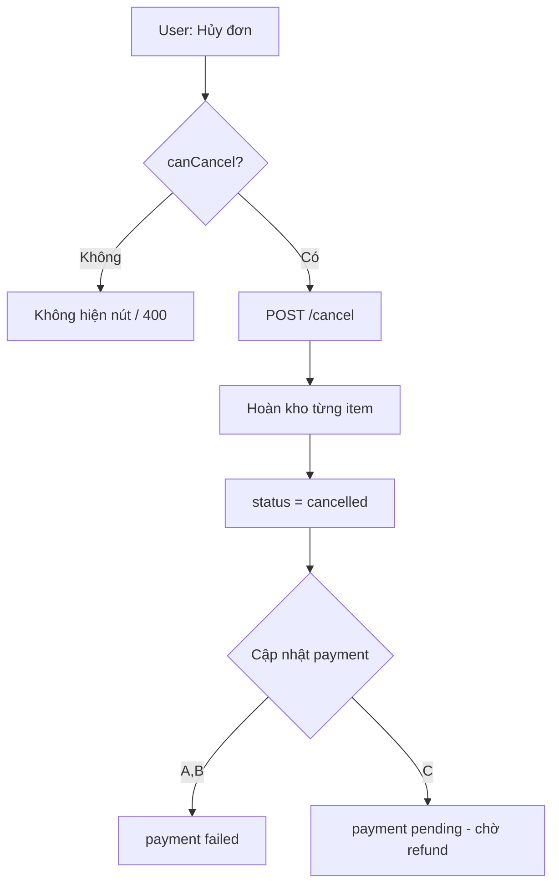

# Use Case — UC-ORD-13: Hủy đơn hàng (Cancel Pending / Eligible Order)

| Thuộc tính | Giá trị |
|------------|---------|
| **ID** | UC-ORD-13 |
| **Tên** | Khách hủy đơn trong các trạng thái được phép (chờ thanh toán / chờ giao) |
| **Mức độ ưu tiên** | Cao |
| **Phiên bản** | Bám code hiện tại |
| **Liên quan FR** | `FR_CancelOrder.md`, `FR_ReserveInventoryOnOrder.md` |
| **Liên quan UC** | UC-ORD-01, UC-ORD-14 |

---

## 1. Mô tả ngắn

Khách bấm **“Hủy đơn”** trên **`OrdersPage`** hoặc **`OrderDetailPage`** khi `canCancel(order)` đúng. API:

```
POST /api/orders/:order_id/cancel
Body: { "reason": "Khách tự hủy" }  // optional, max 500 ký tự
```

Backend transaction: khóa order, kiểm tra **3 case** hợp lệ, **hoàn kho** từng `OrderItem`, set `order.status = cancelled`, append `note`, cập nhật `payment_status` theo case. FE invalidate `orders`, `order`, `cart`, `order-counters`. Detail page navigate **`/orders?tab=cancelled`**.

Tên file “Pending” phản ánh case phổ biến (**AWAITING_PAYMENT**); UC còn bao gồm **COD/VNPAY chờ giao** (`processing`).

---

## 2. Tác nhân

| Tác nhân | Vai trò |
|----------|---------|
| **Customer** | Hủy đơn |
| **orderController.cancelOrder** | Stock restore + status |
| **canCancel** util | Mirror BE trên FE |
| **Admin** | Hủy/refund qua flow khác — **không** dùng endpoint này |

---

## 3. Ba case được hủy (BE ≡ FE)

| Case | `order.status` | `payment.provider` | `payment.payment_status` | Ý nghĩa |
|------|----------------|--------------------|---------------------------|---------|
| **A** | `AWAITING_PAYMENT` | `VNPAY` | `pending` | Chưa thanh toán VNPay |
| **B** | `processing` | `COD` | `pending` | COD chờ chuẩn bị/giao |
| **C** | `processing` | `VNPAY` | `completed` | Đã trả tiền, chưa ship — chờ hoàn tiền thủ công |

```javascript
// client/app/utils/orderCanCancel.js
export function canCancel(order) {
  const p = order.payment || {};
  const awaitingVnpay = p.provider === "VNPAY" && order.status === "AWAITING_PAYMENT" && p.payment_status === "pending";
  const toShipCOD = p.provider === "COD" && order.status === "processing" && p.payment_status === "pending";
  const toShipVNPAY = p.provider === "VNPAY" && order.status === "processing" && p.payment_status === "completed";
  return awaitingVnpay || toShipCOD || toShipVNPAY;
}
```

---

## 4. Preconditions & Postconditions

### Preconditions

| # | Điều kiện |
|---|-----------|
| PRE-01 | JWT, order thuộc user |
| PRE-02 | Một trong 3 case trên |
| PRE-03 | Không ở `shipping`, `delivered`, `cancelled` |

### Postconditions

| # | Kết quả |
|---|---------|
| POST-01 | `order.status = cancelled` |
| POST-02 | `order.note` += reason (`appendNote`) |
| POST-03 | Mỗi variation `stock_quantity += quantity` |
| POST-04 | Payment: case A/B → `failed`; case C → `pending` (refund pending semantics) |
| POST-05 | FE list/detail/counters refresh |

---

## 5. Trigger

- `OrdersPage`: nút **“Hủy đơn”** trên footer thẻ (không confirm dialog).
- `OrderDetailPage`: nút header hoặc cột thanh toán — `reason: "Khách tự hủy"`, success → `navigate("/orders?tab=cancelled", { replace: true })`.

---

## 6. Luồng chính (BE)

| Bước | Hành động |
|------|-----------|
| 1 | `BEGIN TRANSACTION` |
| 2 | `Order.findOne` FOR UPDATE, `user_id` |
| 3 | Load `Payment`, `OrderItem` riêng (tránh lock join) |
| 4 | Tính `isAwaitingVnpay`, `isToShipCOD`, `isToShipVNPAY` |
| 5 | Nếu không match → `400` Order cannot be cancelled in current state |
| 6 | Vòng `items`: lock variation, `increment stock_quantity` |
| 7 | `order.update({ status: cancelled, note })` |
| 8 | Update payment theo case (failed vs pending) |
| 9 | `COMMIT` → JSON summary |

### Payment sau hủy

| Case | `payment_status` sau hủy |
|------|--------------------------|
| A — awaiting VNPay | `failed`, `paid_at: null` |
| B — COD to-ship | `failed`, `paid_at: null` |
| C — VNPay paid, chưa ship | `pending` (admin refund sau) |

---

## 7. Luồng chính (FE)

| Bước | Hành động |
|------|-----------|
| 1 | `useCancelOrder().mutate({ orderId, reason })` |
| 2 | `POST /orders/:id/cancel` |
| 3 | `onSuccess`: invalidate queries |
| 4 | (Detail) redirect tab cancelled |

---

## 8. API

### Request

```http
POST /api/orders/42/cancel
Authorization: Bearer <token>
Content-Type: application/json

{ "reason": "Khách tự hủy" }
```

### Response 200

```json
{
  "message": "Order cancelled successfully",
  "order": {
    "order_id": 42,
    "status": "cancelled",
    "payment_status": "failed"
  }
}
```

---

## 9. Luồng thay thế

### ALT-01 — Không đủ điều kiện

User không thấy nút (`canCancel` false) hoặc API 400.

### ALT-02 — Case C: chờ hoàn tiền

UI `OrderDetailPage` có block **“Đã hoàn tiền”** khi `cancelled` + `payment_status === "refunded"` (sau admin refund).

### EXC-01 — Order 404

User khác hoặc `order_id` sai.

### EXC-02 — `skipLocked` variation

BE `continue` nếu variation lock fail — stock có thể lệch (edge).

---

## 10. Sơ đồ



---

## 11. Ánh xạ mã nguồn

| Thành phần | Đường dẫn |
|------------|-----------|
| BE | `server/controllers/orderController.js` — `cancelOrder` |
| Route | `POST /:order_id/cancel` |
| Util | `client/app/utils/orderCanCancel.js` |
| Hook | `client/app/hooks/useOrders.js` — `useCancelOrder` |
| List | `client/app/pages/OrdersPage.jsx` |
| Detail | `client/app/pages/OrderDetailPage.jsx` |

---

## 12. Known gaps

| # | Gap |
|---|-----|
| GAP-01 | **Không confirm** modal — misclick hủy ngay |
| GAP-02 | Không hủy đơn `FAILED` (VNPay fail) qua nút này — chỉ retry hoặc chờ cron |
| GAP-03 | Hoàn tiền VNPay **không tự động** — admin `refund` |
| GAP-04 | Case C: payment `pending` sau hủy dễ nhầm “chờ thanh toán” trên UI thô |
| GAP-05 | `reason` cố định `"Khách tự hủy"` — không nhập lý do tùy chọn |
| GAP-06 | Cron auto-cancel `reserve_expires_at` là flow riêng (FR reserve) |

---

## 13. Tiêu chí chấp nhận

- [ ] VNPay awaiting → hủy → stock tăng, tab cancelled
- [ ] COD processing → hủy → payment failed
- [ ] VNPay paid processing → hủy → payment pending, stock restore
- [ ] Đơn shipping → không hủy được
