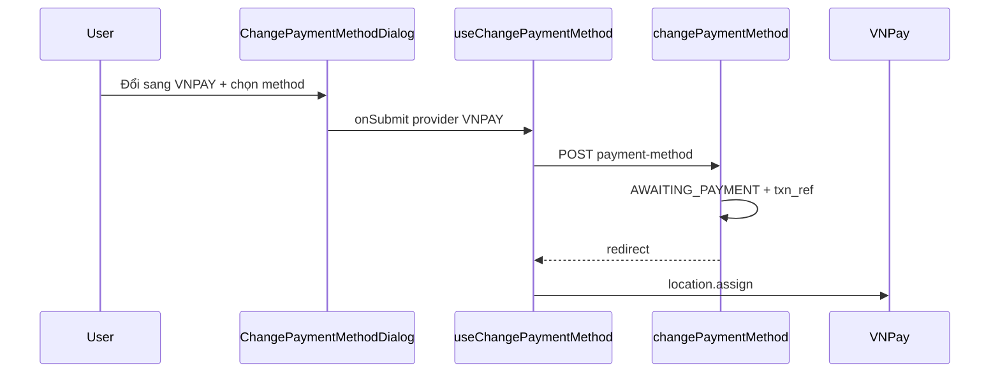

# Use Case — UC-ORD-12: Đổi phương thức thanh toán đơn (Change Order Payment Method)

| Thuộc tính | Giá trị |
|------------|---------|
| **ID** | UC-ORD-12 |
| **Tên** | Chuyển đơn từ COD sang VNPay (và logic BE đầy đủ COD ↔ VNPAY) |
| **Mức độ ưu tiên** | Trung bình |
| **Phiên bản** | Bám code hiện tại |
| **Liên quan UC** | UC-ORD-10 (retry), UC-ORD-02/03 |

---

## 1. Mô tả ngắn

Backend hỗ trợ đổi **`provider`** + **`method`** trong transaction:

```
POST /api/orders/:order_id/payment-method
Body: { "provider": "COD" | "VNPAY", "method": "COD" | "VNPAYQR" | ... }
```

- **→ COD:** payment pending, xóa txn VNPay, order **`processing`**
- **→ VNPAY:** payment pending, `txn_ref` mới, order **`AWAITING_PAYMENT`**, trả **`redirect`** URL

**Frontend thực tế** chỉ expose **COD → VNPAY** trên `OrderDetailPage` qua **`ChangePaymentMethodDialog`** (hardcode provider `VNPAY`, chọn sub-method). Không có UI đổi VNPAY → COD dù BE cho phép (trừ khi gọi API thủ công).

---

## 2. Tác nhân

| Tác nhân | Vai trò |
|----------|---------|
| **Customer** | Xác nhận đổi sang VNPay |
| **ChangePaymentMethodDialog** | Chọn VNPAYQR / VNBANK / INTCARD / INSTALLMENT |
| **orderController.changePaymentMethod** | Transaction + redirect |
| **emailService** | `PAYMENT_METHOD` update email |

---

## 3. Preconditions

| # | Điều kiện |
|---|-----------|
| PRE-01 | JWT, order của user |
| PRE-02 | `order.status` ∉ `shipping`, `delivered`, `cancelled` |
| PRE-03 | `payment.payment_status !== "completed"` |
| PRE-04 | FE: `pay.provider === "COD"` và status `AWAITING_PAYMENT` hoặc `processing` |

**Lưu ý:** Đơn COD thường ở `processing` — điều kiện FE khớp. Đơn `AWAITING_PAYMENT` + COD là edge case hiếm.

---

## 4. Postconditions

### Chuyển sang VNPAY

| # | Kết quả |
|---|---------|
| POST-01 | `order.status = AWAITING_PAYMENT` |
| POST-02 | `payment.provider = VNPAY`, `payment_method = method`, `txn_ref` mới |
| POST-03 | Response có `redirect` — FE `window.location.assign` |
| POST-04 | Invalidate orders / order / counters |

### Chuyển sang COD (BE only / API trực tiếp)

| # | Kết quả |
|---|---------|
| POST-05 | `order.status = processing` |
| POST-06 | Payment COD pending, clear VNPay fields |

---

## 5. Trigger

`OrderDetailPage` → **“Đổi sang VNPAY”** → modal → **Xác nhận** → `changePM.mutate({ orderId, provider: "VNPAY", method })`.

---

## 6. Validation BE

```javascript
const VALID = {
  COD: ["COD"],
  VNPAY: ["VNPAYQR", "VNBANK", "INTCARD", "INSTALLMENT"],
};
```

| Lỗi | HTTP | Message |
|-----|------|---------|
| Provider lạ | 400 | Unsupported provider |
| Method không thuộc provider | 400 | Invalid method for provider |
| Order shipping/delivered/cancelled | 400 | Cannot change payment in current state |
| Payment đã completed | 400 | Payment already completed; cannot change method |
| Thiếu ENV VNPay | 502 | VNPAY configuration error |

---

## 7. Luồng chính (COD → VNPAY)

| Bước | Tác nhân | Hành động |
|------|----------|-----------|
| 1 | User | Mở dialog, chọn VNPAYQR (mặc định) |
| 2 | FE | `POST /orders/:id/payment-method` `{ provider:"VNPAY", method }` |
| 3 | BE | Lock order + payment |
| 4 | BE | Update payment, `AWAITING_PAYMENT`, `newTxnRef` |
| 5 | BE | `getPaymentUrl(...)` |
| 6 | BE | Commit, gửi email async |
| 7 | FE | `onSuccess` → đóng modal, redirect VNPay |

---

## 8. Luồng BE (VNPAY → COD) — không có UI

| Bước | Hành động |
|------|-----------|
| 1 | `payment` → COD, clear txn/raw |
| 2 | `order.status` → `processing` |
| 3 | Không `redirect` |

---

## 9. API response mẫu (VNPAY)

```json
{
  "message": "Payment method updated",
  "order": { "order_id": 1, "status": "AWAITING_PAYMENT" },
  "payment": {
    "provider": "VNPAY",
    "method": "VNPAYQR",
    "status": "pending"
  },
  "redirect": "https://sandbox.vnpayment.vn/..."
}
```

---

## 10. FE vs BE capability matrix

| Hướng đổi | BE | FE UI |
|-----------|----|-------|
| COD → VNPAY | ✅ | ✅ Dialog |
| VNPAY → COD | ✅ | ❌ |
| VNPAY → VNPAY (đổi method) | ✅ (nếu chưa paid) | ❌ — dùng **retry** thay |
| Sau khi paid | ❌ | ❌ |

---

## 11. Sơ đồ



---

## 12. Ánh xạ mã nguồn

| Thành phần | Đường dẫn |
|------------|-----------|
| BE | `server/controllers/orderController.js` — `changePaymentMethod` |
| Route | `POST /:order_id/payment-method` |
| Dialog | `client/app/components/ChangePaymentMethodDialog.jsx` |
| Hook | `client/app/hooks/useOrders.js` — `useChangePaymentMethod` |
| Page | `client/app/pages/OrderDetailPage.jsx` |

---

## 13. Known gaps

| # | Gap |
|---|-----|
| GAP-01 | Dialog **không** cho chọn COD — chỉ thông báo chuyển COD→VNPAY |
| GAP-02 | `INSTALLMENT` trong dialog nhưng checkout ẩn sub-methods |
| GAP-03 | Props `initialProvider` / `initialMethod` **không dùng** trong dialog |
| GAP-04 | Không đổi PT từ **OrdersPage** |
| GAP-05 | Chuyển COD→VNPAY khi đã **reserve stock** — cần hiểu cùng policy 24h `reserve_expires_at` (không reset trên change) |
| GAP-06 | Email old payment có thể không chính xác sau update |

---

## 14. Tiêu chí chấp nhận

- [ ] Đơn COD processing — đổi VNPAY → redirect + status AWAITING_PAYMENT
- [ ] Đơn đã VNPAY completed — nút đổi ẩn / API 400
- [ ] ENV VNPay thiếu → 502, modal alert message
