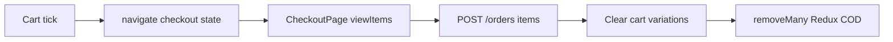

# Use Case — UC-ORD-06: Thanh toán từ giỏ đã chọn (Checkout From Selected Cart Items)

| Thuộc tính | Giá trị |
|------------|---------|
| **ID** | UC-ORD-06 |
| **Tên** | Chuyển subset giỏ hàng sang checkout với intent `cart` |
| **Mức độ ưu tiên** | Cao |
| **Phiên bản** | Bám code hiện tại |

---

## 1. Mô tả ngắn

Sau khi tick chọn trên **`/cart`** (UC-CART-06), khách bấm **Thanh toán** → navigate **`/checkout`** với:

```javascript
{
  mode: "cart",
  items: [{ variation_id, quantity }, ...]
}
```

`CheckoutPage` **chỉ** render và submit đúng `items` trong `location.state` — **không** lấy toàn bộ giỏ Redux. Sau đặt hàng COD thành công, FE `removeMany` các `cart_id` tương ứng; BE `createOrder` xóa `cart_items` theo `variation_id IN (...)`.

**Phụ thuộc:** UC-CART-06, UC-ORD-05, UC-ORD-02/03  
**FE:** `CartPage.handleCheckout`, `CheckoutPage`  
**BE:** `createOrder` nhánh `body.items`

---

## 2. Tác nhân

| Tác nhân | Vai trò |
|----------|---------|
| **Customer** | Tick + checkout |
| **CartPage** | Build payload, auth gate |
| **CheckoutPage** | `intentMode === "cart"` |
| **Backend** | Partial cart clear |

---

## 3. Preconditions

| # | Điều kiện |
|---|-----------|
| PRE-01 | ≥ 1 dòng tick, stock hợp lệ |
| PRE-02 | User authenticated (hoặc redirect login) |
| PRE-03 | `ProtectedRoute` cho `/checkout` |

---

## 4. Postconditions

### Thành công

| # | Kết quả |
|---|---------|
| POST-01 | Checkout hiển thị đúng subset |
| POST-02 | Order tạo với đúng `items` |
| POST-03 | Dòng đã mua xóa khỏi DB cart |
| POST-04 | COD: Redux `removeMany` cart lines |
| POST-05 | VNPAY: redirect — cart DB đã xóa lúc create |

### Dòng không mua

| # | Kết quả |
|---|---------|
| POST-R01 | Vẫn còn trong `GET /cart` |

---

## 5. Trigger

`CartPage.handleCheckout()` sau validate `selectedItems`.

---

## 6. Luồng chính

| Bước | Tác nhân | Hành động |
|------|----------|-----------|
| 1 | User | Tick items trên `/cart` |
| 2 | User | Click “Thanh toán” |
| 3 | FE | `itemsPayload = selectedItems.map({ variation_id, quantity })` |
| 4 | FE | Guest → `/login?redirect=/checkout` (**mất state** — GAP) |
| 5 | FE | Auth → `navigate('/checkout', { state: { mode:'cart', items }})` |
| 6 | FE | `viewItems` enrich từ Redux `cartItems` by `variation_id` |
| 7 | FE | User điền form + preview + submit |
| 8 | BE | `POST /orders` với `items` |
| 9 | BE | Destroy cart_items matching variation_ids |
| 10 | FE COD | `removeMany({ ids: cart_id })` |
| 11 | FE | Success page hoặc VNPAY redirect |

### `viewItems` shape

```javascript
{
  variation_id,
  quantity,
  product: inCart?.product || null,
  cart_id: inCart?.id || null,  // để removeMany
}
```

---

## 7. Luồng thay thế

### AF-01: Một phần item không có trong Redux

| Mô tả |
|--------|
| `product: null` — preview/order vẫn chạy theo `variation_id`; hiển thị fallback tên |

### AF-02: Login với `?redirect=/checkout` không kèm state

| Mô tả |
|--------|
| User login xong vào checkout **trống** → redirect `/cart` (useEffect CheckoutPage) |

### AF-03: Dùng `pendingCheckout` thay vì cart tick

| Mô tả |
|--------|
| Guest add-to-cart lưu `pendingCheckout` — **không** phải cart-mode checkout (UC-ORD-07/08) |

---

## 8. Luồng ngoại lệ

### EF-01: `intentItems.length === 0`

CheckoutPage `navigate('/cart', { replace: true })`.

### EF-02: `cart_id` null trên buy_now-like item trong cart flow

Không xảy ra nếu tất cả từ server cart — `cart_id` luôn có.

### EF-03: VNPAY success

FE không `removeMany` — DB đã xóa; Redux có thể stale đến refetch cart.

---

## 9. Quy tắc nghiệp vụ

| ID | Quy tắc |
|----|---------|
| BR-01 | `mode: "cart"` phân biệt với `buy_now` cho post-submit Redux |
| BR-02 | BE xóa cart theo **variation_id**, không theo `cart_item_id` |
| BR-03 | Submit luôn gửi explicit `items[]` — không fallback full cart trên FE |
| BR-04 | Giá đơn hàng tính lại từ DB tại create — không tin FE |

---

## 10. Triển khai

| File | Vai trò |
|------|---------|
| `client/app/pages/CartPage.jsx` | `handleCheckout` |
| `client/app/pages/CheckoutPage.jsx` | intent cart |
| `server/controllers/orderController.js` | items branch + cart destroy |
| `docs/use_cases/cart/UC_SelectItemsForCheckout.md` | UC giỏ |

---

## 11. Sơ đồ



---

## 12. Liên kết

| UC / FR |
|---------|
| UC-CART-06 |
| UC-ORD-05, UC-ORD-02, UC-ORD-03 |
| `FR_CreateOrder.md` |

---

## 13. Known gaps

| # | Mô tả |
|---|--------|
| GAP-01 | Login redirect mất `location.state` |
| GAP-02 | Không persist selected cart qua sessionStorage |
| GAP-03 | Xóa DB theo variation_id — nếu 2 dòng cùng variation (không thể) OK |
