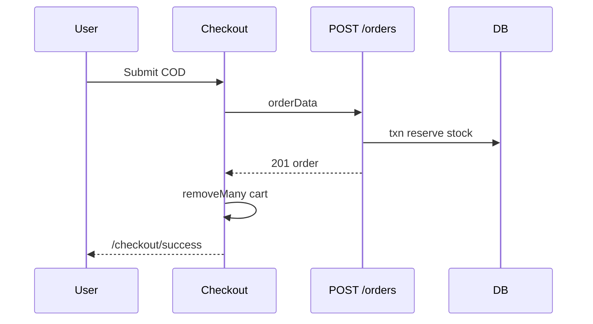

# Use Case — UC-ORD-02: Tạo đơn COD (Create Order With COD)

| Thuộc tính | Giá trị |
|------------|---------|
| **ID** | UC-ORD-02 |
| **Tên** | Đặt hàng thanh toán khi nhận hàng (Cash On Delivery) |
| **Mức độ ưu tiên** | Cao |
| **Phiên bản** | Bám code hiện tại |

---

## 1. Mô tả ngắn

Khách hoàn tất **`CheckoutPage`** với `payment_provider: "COD"` → **`POST /api/orders`**. Backend trong **transaction**:

1. Validate items, địa chỉ, geo, payment method  
2. Tính tiền + phí ship  
3. Tạo `Order` status **`processing`**  
4. **Trừ kho** (lock variation) + tạo `OrderItem`  
5. Tạo `Payment` pending  
6. Xóa dòng cart tương ứng (nếu có `items` body)  
7. Gửi email xác nhận (fire-and-forget)  
8. Trả `201` **không** `redirect`

FE navigate **`/checkout/success`**; nếu `mode === "cart"` → `removeMany` Redux.

---

## 2. Tác nhân

| Tác nhân | Vai trò |
|----------|---------|
| **Authenticated Customer** | Submit checkout |
| **orderController.createOrder** | Transaction |
| **emailService** | `sendOrderConfirmationEmail` |
| **CheckoutPage** | Post-submit UX |

---

## 3. Preconditions

| # | Điều kiện |
|---|-----------|
| PRE-01 | JWT + `canSubmit` checkout (địa chỉ, map confirmed, items) |
| PRE-02 | `payment_provider=COD`, `payment_method=COD` |
| PRE-03 | Stock đủ cho mọi dòng |
| PRE-04 | `province_id`, `ward_id`, `geo_lat`, `geo_lng` |

---

## 4. Postconditions

| # | Kết quả |
|---|---------|
| POST-01 | Order `processing`, `Payment` pending |
| POST-02 | Stock giảm |
| POST-03 | Cart partial/full clear |
| POST-04 | Email queue (best-effort) |
| POST-05 | FE success page với `order_code` |

---

## 5. Trigger

`CheckoutPage.handleSubmit` khi `payment.payment_provider === "COD"`.

---

## 6. Luồng chính (BE)

| Bước | Hành động |
|------|-----------|
| 1 | Parse body items hoặc load full cart |
| 2 | Stock + price check per variation |
| 3 | `quoteShipping` → `final_amount` |
| 4 | `Order.create` — `status: processing`, `reserve_expires_at: null` |
| 5 | Lock variation + `decrement stock` + `OrderItem.create` |
| 6 | `Payment.create` — provider COD, pending |
| 7 | `CartItem.destroy` theo variation_ids (nếu items body) |
| 8 | `commit` |
| 9 | Email async |
| 10 | `201` + order summary |

### Order status lifecycle (COD)

| Giai đoạn | `order.status` | `payment.payment_status` |
|-----------|----------------|---------------------------|
| Vừa tạo | `processing` | `pending` |
| Admin ship | `shipping` | `pending` |
| Giao xong | `delivered` | thường `completed` (admin flow) |

Tab **“Chờ giao hàng”** (`to_ship`) list COD `processing` + pending.

---

## 7. Luồng chính (FE)

| Bước | Hành động |
|------|-----------|
| 1 | `createOrder.mutateAsync(orderData)` |
| 2 | Không `res.redirect` |
| 3 | `intentMode === "cart"` → `removeMany(cart_ids)` |
| 4 | `navigate('/checkout/success', { state: { order_code, customer_name, payment_provider: 'COD' }})` |

---

## 8. Request body (đầy đủ)

```json
{
  "shipping_name": "...",
  "shipping_phone": "...",
  "shipping_address": "số nhà, Phường, Tỉnh",
  "note": "",
  "payment_provider": "COD",
  "payment_method": "COD",
  "province_id": 1,
  "ward_id": 100,
  "geo_lat": 10.123,
  "geo_lng": 106.456,
  "items": [{ "variation_id": 42, "quantity": 1 }]
}
```

---

## 9. Luồng ngoại lệ

### EF-01: Insufficient stock — 400

Transaction rollback — không tạo order.

### EF-02: Reserve race

`skipLocked` trên variation — có thể 400 `Out of stock during reserve`.

### EF-03: Submit error FE

`console.error` — chưa toast user (todo trong code).

---

## 10. Quy tắc nghiệp vụ

| ID | Quy tắc |
|----|---------|
| BR-01 | COD **trừ kho ngay** khi đặt (reserve) |
| BR-02 | Không giữ chỗ 24h (`reserve_expires_at` null) |
| BR-03 | Giá order từ DB tại thời điểm create |
| BR-04 | Admin thu tiền khi giao — payment pending đến khi complete |

---

## 11. Triển khai

| File | Vai trò |
|------|---------|
| `server/controllers/orderController.js` | `createOrder` |
| `client/app/pages/CheckoutPage.jsx` | Submit COD branch |
| `client/app/pages/CheckoutSuccessPage.jsx` | Thank you |
| `client/app/hooks/useOrders.js` | `useCreateOrder` |
| `server/services/emailService.js` | Confirmation |

---

## 12. Sơ đồ tuần tự



---

## 13. Liên kết

| UC / FR |
|---------|
| UC-ORD-04, UC-ORD-05, UC-ORD-06 |
| UC-ORD-01 (tab to_ship) |
| `FR_CreateOrder.md`, `FR_ReserveInventoryOnOrder.md` |

---

## 14. Known gaps

| # | Mô tả |
|---|--------|
| GAP-01 | Không auto-complete payment khi deliver (phụ thuộc admin) |
| GAP-02 | FE error handling submit chưa đầy đủ |
| GAP-03 | Success page yêu cầu state — refresh mất |
