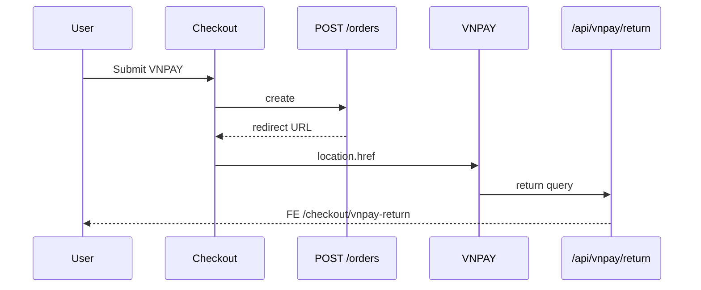

# Use Case — UC-ORD-03: Tạo đơn VNPAY (Create Order With VNPay)

| Thuộc tính | Giá trị |
|------------|---------|
| **ID** | UC-ORD-03 |
| **Tên** | Đặt hàng và chuyển hướng cổng VNPAY |
| **Mức độ ưu tiên** | Cao |
| **Phiên bản** | Bám code hiện tại |

---

## 1. Mô tả ngắn

Khách chọn **VNPAY** trên checkout và submit → **`POST /api/orders`** tạo đơn **`AWAITING_PAYMENT`**, giữ chỗ **24h** (`reserve_expires_at`), trừ kho, tạo `Payment` pending, xóa cart items đã chọn, build URL VNPAY → response **`redirect`**.

FE: `window.location.href = res.redirect` — **không** vào success page ngay, **không** `removeMany` Redux (cart đã xóa server-side).

Sau thanh toán, VNPAY gọi **Return URL** → `vnpayController` cập nhật DB → redirect FE **`/checkout/vnpay-return`** → Orders tab.

---

## 2. Tác nhân

| Tác nhân | Vai trò |
|----------|---------|
| **Customer** | Thanh toán online |
| **createOrder** | Transaction + redirect URL |
| **vnpayService** | Ký URL, verify return |
| **vnpayController** | Update payment/order on return |

---

## 3. Preconditions

| # | Điều kiện |
|---|-----------|
| PRE-01 | `payment_provider: VNPAY`, method ∈ VALID (mặc định VNPAYQR) |
| PRE-02 | VNPAY ENV cấu hình (xem GAP tên biến) |
| PRE-03 | Stock + địa chỉ hợp lệ như COD |

---

## 4. Postconditions

### Tại create (chưa trả tiền)

| # | Kết quả |
|---|---------|
| POST-01 | `order.status = AWAITING_PAYMENT` |
| POST-02 | `reserve_expires_at` ≈ now + 24h |
| POST-03 | Stock đã trừ |
| POST-04 | `txn_ref = orderId-timestamp` |
| POST-05 | Response `redirect` URL |

### Sau thanh toán thành công (return URL)

| # | Kết quả |
|---|---------|
| POST-P01 | `payment.payment_status = completed` |
| POST-P02 | `order.status = processing` |
| POST-P03 | Redirect FE `?status=success` → Orders `tab=to_ship` |

### Thanh toán thất bại

| # | Kết quả |
|---|---------|
| POST-F01 | `payment.payment_status = failed` |
| POST-F02 | Redirect `tab=failed` |

---

## 5. Trigger

Submit checkout với VNPAY selected.

---

## 6. Luồng chính — Create

| Bước | Hành động |
|------|-----------|
| 1 | Giống COD đến bước tạo Order |
| 2 | `status: AWAITING_PAYMENT`, `holdMs = 24h` |
| 3 | `txnRef` gán Payment |
| 4 | Reserve stock + order items |
| 5 | Clear cart variations |
| 6 | `getPaymentUrl({ method, amount: finalAmount, txnRef, orderDesc, ipAddr })` |
| 7 | Lỗi config → rollback 502 |
| 8 | `commit` + email |
| 9 | `201 { order, redirect }` |
| 10 | FE full page redirect VNPAY |

### FE branch

```javascript
if (res?.redirect) {
  window.location.href = res.redirect;
  return;
}
// COD mới removeMany + success
```

---

## 7. Luồng chính — Return URL

| Bước | Hành động |
|------|-----------|
| 1 | User hoàn tất / hủy trên VNPAY |
| 2 | Browser `GET /api/vnpay/return?vnp_...` |
| 3 | `verifyReturnUrl(req.query)` |
| 4 | Parse `orderId` từ `vnp_TxnRef` (split `-`)[0] |
| 5 | Success: Payment completed, Order → `processing` |
| 6 | Fail: Payment failed |
| 7 | `res.redirect` → `${FE_APP_URL}/checkout/vnpay-return?status=&orderId=` |

### VnpayReturn.jsx

| status | Navigate |
|--------|----------|
| success | `/orders?tab=to_ship` |
| failed | `/orders?tab=failed` |
| missing | countdown → `/orders` |

---

## 8. Retry payment

Từ OrdersPage tab awaiting:

`POST /orders/:order_id/payments/retry` → `{ redirect }` — `useRetryVnpayPayment` auto `window.location.assign`.

Điều kiện: `payment pending` && order `AWAITING_PAYMENT` hoặc `FAILED`.

---

## 9. Luồng ngoại lệ

### EF-01: ENV mismatch

`createOrder` checks `VNP_TMN_CODE`, `VNP_HASHSECRET`, …  
`vnpayService` uses `VNPAY_TMN_CODE`, `VNPAY_HASHSECRET`, … — dễ 502 dù sandbox key có.

### EF-02: User đóng tab trước khi pay

Order vẫn `AWAITING_PAYMENT`, stock đã trừ — countdown trên Orders.

### EF-03: Không IPN riêng

Chỉ **Return URL** — không thấy IPN handler trong repo (rely browser return).

### EF-04: Duplicate success return

Code check `payment_status !== completed` trước update — idempotent-ish.

---

## 10. Quy tắc nghiệp vụ

| ID | Quy tắc |
|----|---------|
| BR-01 | Tiền tệ VND, amount = `final_amount` |
| BR-02 | Stock reserve ngay khi tạo đơn, không đợi pay |
| BR-03 | 24h hold — UI countdown trên list |
| BR-04 | Thành công → chuyển tab “Chờ giao hàng” (processing + paid) |

---

## 11. API

**Create:**

```http
POST /api/orders
{ "payment_provider": "VNPAY", "payment_method": "VNPAYQR", ... }
```

**Response:**

```json
{
  "order": { "order_id": 5, "status": "AWAITING_PAYMENT", ... },
  "redirect": "https://sandbox.vnpayment.vn/..."
}
```

**Retry:**

```http
POST /api/orders/5/payments/retry
{ "method": "VNPAYQR" }
```

---

## 12. Triển khai

| File | Vai trò |
|------|---------|
| `server/controllers/orderController.js` | VNPAY branch create, retry |
| `server/services/vnpayService.js` | URL build/verify |
| `server/controllers/vnpayController.js` | Return handler |
| `server/routes/vnpayRoutes.js` | `/api/vnpay/return` |
| `client/app/pages/CheckoutPage.jsx` | redirect |
| `client/app/pages/checkout/VnpayReturn.jsx` | FE router |
| `docs/feature_requirements/payment/FR_VNPayPaymentInCreateOrder.md` | FR |

---

## 13. Sơ đồ



---

## 14. Liên kết

| UC / FR |
|---------|
| UC-ORD-04 ConfigurePaymentMethod |
| UC-ORD-01 ViewMyOrdersWithTabs |
| `FR_VNPayPaymentInCreateOrder.md`, `FR_OrderPaymentCountdownTimer.md` |

---

## 15. Known gaps

| # | Mô tả |
|---|--------|
| GAP-01 | ENV variable naming inconsistency `VNP_*` vs `VNPAY_*` |
| GAP-02 | Không IPN — mất return nếu user không quay lại |
| GAP-03 | Failed payment không auto-release stock trong return handler |
| GAP-04 | `standalone createPayment` API `/api/vnpay/create_payment_url` ít dùng từ FE chính |
