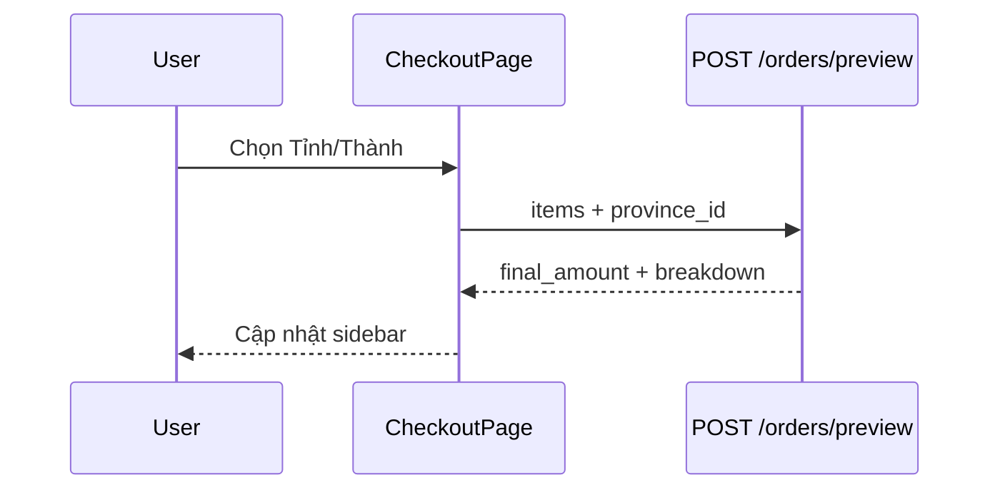

# Use Case — UC-ORD-05: Xem trước đơn hàng (Preview Order Before Submit)

| Thuộc tính | Giá trị |
|------------|---------|
| **ID** | UC-ORD-05 |
| **Tên** | Tính tạm tổng tiền, phí ship, cảnh báo tồn kho trước khi đặt |
| **Mức độ ưu tiên** | Cao |
| **Phiên bản** | Bám code hiện tại |

---

## 1. Mô tả ngắn

Trên **`CheckoutPage`**, khi khách chọn **Tỉnh/Thành** (`provinceId`) và có `viewItems`, hook **`useOrderPreview`** gọi **`POST /api/orders/preview`** (debounce 500ms) để lấy:

- `subtotal_after_discount`, `shipping_fee`, `final_amount`
- `items_breakdown` (giá từng dòng, ảnh thumbnail)
- `stock_warnings` (không chặn submit — chỉ cảnh báo)

Sidebar “Đơn hàng của bạn” ưu tiên hiển thị từ preview; fallback tính local từ `viewItems` nếu chưa có preview.

**Endpoint:** `POST /api/orders/preview`  
**FE:** `useOrderPreview.js`, `CheckoutPage`  
**BE:** `previewOrder`, `quoteShipping`

---

## 2. Tác nhân

| Tác nhân | Vai trò |
|----------|---------|
| **Customer** | Chọn tỉnh/phường, đổi qty intent (nếu quay lại cart) |
| **CheckoutPage** | Hiển thị tổng |
| **Backend** | Đọc giá DB, không tạo order, không trừ kho |

---

## 3. Preconditions

| # | Điều kiện |
|---|-----------|
| PRE-01 | `viewItems.length > 0` |
| PRE-02 | `provinceId` đã chọn |
| PRE-03 | JWT (route orders dùng `authenticateToken` — preview gửi token nếu có) |

---

## 4. Postconditions

### Thành công

| # | Kết quả |
|---|---------|
| POST-01 | UI hiển thị `showSubtotal`, `showShipping`, `showTotal` |
| POST-02 | `items_breakdown` render ảnh + giá chi tiết |

### Chưa đủ điều kiện

| # | Kết quả |
|---|---------|
| POST-N01 | Không gọi API — `data: null`, dùng fallback local |

---

## 5. Trigger

- Đổi `provinceId`, `wardId`, hoặc `viewItems` (stringify deps).
- Mount checkout sau khi có tỉnh.

---

## 6. Luồng chính

| Bước | Tác nhân | Hành động |
|------|----------|-----------|
| 1 | FE | `useOrderPreview({ provinceId, wardId, viewItems })` |
| 2 | FE | Nếu `!viewItems.length \|\| !provinceId` → clear state |
| 3 | FE | Debounce 500ms |
| 4 | FE | `POST /orders/preview` body `{ province_id, ward_id, items }` |
| 5 | BE | Load từng variation + product |
| 6 | BE | Tính `total_amount`, `discount_amount`, breakdown |
| 7 | BE | `quoteShipping({ province_id, ward_id, subtotal })` |
| 8 | BE | `final_amount = subtotal_after_discount + shipping_fee` |
| 9 | BE | `200` + `stock_warnings` array |
| 10 | FE | Bind `preview` vào sidebar |

### Payload FE

```javascript
{
  province_id: Number(provinceId),
  ward_id: wardId ? Number(wardId) : null,
  items: viewItems.map(it => ({
    variation_id: it.variation_id,
    quantity: it.quantity,
  })),
}
```

---

## 7. Backend response

```json
{
  "total_amount": 30000000,
  "discount_amount": 3000000,
  "subtotal_after_discount": 27000000,
  "shipping_fee": 30000,
  "shipping_reason": "...",
  "final_amount": 27030000,
  "items_breakdown": [{
    "variation_id": 1,
    "product_name": "...",
    "quantity": 2,
    "unit_price": 15000000,
    "unit_final_price": 13500000,
    "item_subtotal_after_discount": 27000000,
    "thumbnail_url": "...",
    "slug": "..."
  }],
  "stock_warnings": [{ "variation_id": 1, "message": "Only 1 left in stock" }]
}
```

---

## 8. Luồng thay thế

### AF-01: Fallback UI (chưa preview)

```javascript
const fallbackSubtotalAfterDiscount = viewItems.reduce(...);
const showSubtotal = preview?.subtotal_after_discount ?? fallbackSubtotalAfterDiscount;
const showShipping = preview?.shipping_fee ?? 0;
const showTotal = preview?.final_amount ?? fallbackSubtotalAfterDiscount;
```

### AF-02: Legacy constants trên page

`const shipping = 30000` và `subtotal` local vẫn tồn tại trong code nhưng sidebar chính dùng `show*` từ preview.

### AF-03: Ward chưa chọn

Preview vẫn gọi nếu có `provinceId`; `ward_id` có thể null — `quoteShipping` xử lý.

---

## 9. Luồng ngoại lệ

### EF-01: Variation not found — 400

`previewError` — UI có thể vẫn hiện fallback.

### EF-02: Preview không chặn submit

`stock_warnings` **không** disable nút đặt hàng — createOrder sẽ fail nếu hết hàng.

### EF-03: Route order

`POST /preview` đăng ký **sau** `/:order_id` routes — path `/orders/preview` không conflict GET `/:id`.

### EF-04: `discount_pct` trên FE

Checkout UI tham chiếu `it.discount_pct` — BE breakdown có thể **không** gửi field này (hiển thị % có thể thiếu).

---

## 10. Quy tắc nghiệp vụ

| ID | Quy tắc |
|----|---------|
| BR-01 | Preview **read-only** — không lock stock |
| BR-02 | Giá đồng bộ logic với `createOrder` (cùng công thức discount %) |
| BR-03 | Shipping phụ thuộc tỉnh/phường + subtotal |
| BR-04 | Debounce tránh spam khi user đổi địa chỉ nhanh |

---

## 11. Triển khai

| File | Vai trò |
|------|---------|
| `client/app/hooks/useOrderPreview.js` | Debounce + API call |
| `client/app/pages/CheckoutPage.jsx` | Sidebar binding |
| `server/controllers/orderController.js` | `previewOrder` |
| `server/services/shippingService.js` | `quoteShipping` |
| `server/routes/orderRoutes.js` | `POST /preview` |

---

## 12. Sơ đồ tuần tự



---

## 13. Liên kết

| UC / FR |
|---------|
| UC-ORD-06, UC-ORD-08 |
| UC-ORD-02, UC-ORD-03 |
| `FR_PreviewOrder.md` |

---

## 14. Known gaps

| # | Mô tả |
|---|--------|
| GAP-01 | `stock_warnings` không hiển thị rõ trên UI |
| GAP-02 | `discount_pct` có thể undefined trên breakdown |
| GAP-03 | Preview cần `provinceId` — chưa chọn tỉnh thì không gọi |
| GAP-04 | Biến `shipping=30000` legacy có thể gây nhầm khi đọc code |
