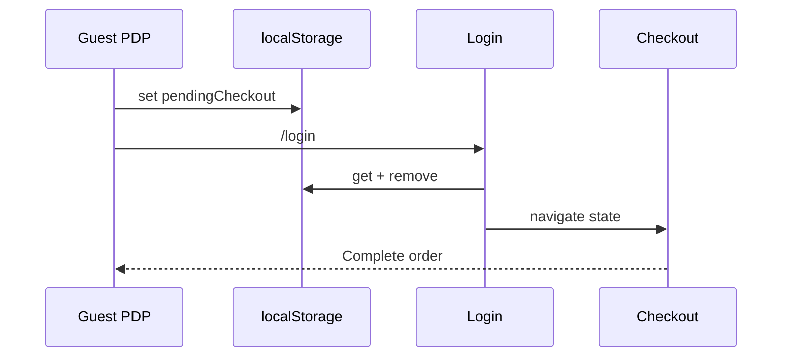

# Use Case — UC-ORD-07: Khôi phục checkout sau đăng nhập (Restore Pending Checkout After Login)

| Thuộc tính | Giá trị |
|------------|---------|
| **ID** | UC-ORD-07 |
| **Tên** | Tiếp tục checkout sau login/OAuth nhờ `localStorage.pendingCheckout` |
| **Mức độ ưu tiên** | Cao |
| **Phiên bản** | Bám code hiện tại |

---

## 1. Mô tả ngắn

Khi **guest** trên PDP bấm **Mua ngay** hoặc **Thêm giỏ** (nhánh guest), hệ thống lưu intent vào **`localStorage.pendingCheckout`** rồi chuyển **`/login?redirect=/checkout`**. Sau khi đăng nhập thành công (**username** hoặc **OAuth**), FE đọc JSON, **xóa key**, và **`navigate('/checkout', { state: checkoutData })`** — khôi phục `mode` + `items` (+ metadata hiển thị).

**Không** gọi API restore — pure client state.

**Liên quan:** UC-ORD-08 (buy now tạo pending), `LoginPage`, `OAuthSuccess`, `App.jsx` cleanup

---

## 2. Tác nhân

| Tác nhân | Vai trò |
|----------|---------|
| **Guest** | Bị chặn checkout ProtectedRoute |
| **LoginPage / OAuthSuccess** | Đọc LS sau auth |
| **App.jsx** | Dọn pending cũ > 5 phút |
| **useAuth logout** | Xóa pending |

---

## 3. Preconditions

| # | Điều kiện |
|---|-----------|
| PRE-01 | Trước login có ghi `pendingCheckout` |
| PRE-02 | JSON hợp lệ |
| PRE-03 | Sau login token + user trong Redux |

---

## 4. Postconditions

### Thành công

| # | Kết quả |
|---|---------|
| POST-01 | `pendingCheckout` removed từ LS |
| POST-02 | Checkout mở với `location.state` đầy đủ |
| POST-03 | User hoàn tất đặt hàng |

### Không restore

| # | Kết quả |
|---|---------|
| POST-F01 | Parse lỗi → login redirect `/` hoặc `redirect` query |
| POST-F02 | Pending > 5 phút khi đã auth → App xóa (nếu chưa consume) |

---

## 5. Cấu trúc `pendingCheckout` (thực tế)

### Buy now (ProductDetailPage)

```javascript
{
  mode: "buy_now",
  items: [{
    variation_id,
    quantity,
    product: {  // chỉ để HIỂN THỊ trên checkout nếu không có cart
      product_name,
      thumbnail_url,
      discount_percentage,
      variation: { price },
    },
  }],
  redirectAfterLogin: true,
  timestamp: Date.now(),  // buy now có timestamp
}
```

### Guest “thêm giỏ” (cùng file — lưu nhầm mode)

Guest `handleAddToCart` cũng lưu structure tương tự với `mode: "buy_now"` (không phải cart) — GAP naming.

---

## 6. Luồng chính — Login form

| Bước | Tác nhân | Hành động |
|------|----------|-----------|
| 1 | Guest | PDP → Mua ngay → LS set |
| 2 | Guest | `/login?redirect=/checkout` |
| 3 | User | Login success `useLogin` |
| 4 | FE | `pendingCheckout = localStorage.getItem(...)` |
| 5 | FE | `JSON.parse` → `checkoutData` |
| 6 | FE | `localStorage.removeItem('pendingCheckout')` |
| 7 | FE | `navigate('/checkout', { state: checkoutData })` — **ưu tiên hơn** `redirect` query |
| 8 | Checkout | `intentMode`, `intentItems` từ state |

```javascript
// LoginPage.jsx sau login success
if (pendingCheckout) {
  const checkoutData = JSON.parse(pendingCheckout);
  localStorage.removeItem('pendingCheckout');
  navigate('/checkout', { state: checkoutData });
  return;
}
const redirect = searchParams.get("redirect") || "/";
navigate(redirect);
```

---

## 7. Luồng chính — OAuth

| Bước | Hành động |
|------|-----------|
| 1 | `/oauth/success?token=` |
| 2 | Set token, `GET /auth/me`, `setCredentials` |
| 3 | Đọc `pendingCheckout` tương tự |
| 4 | `navigate('/checkout', { state: checkoutData, replace: true })` |
| 5 | Else → `/` |

---

## 8. Luồng thay thế

### AF-01: App cleanup stale pending

```javascript
// App.jsx — user đã authenticated
if (Date.now() - timestamp > 300000) { // 5 phút
  localStorage.removeItem('pendingCheckout');
}
```

Chỉ chạy khi **đã login** — guest pending không bị xóa bởi rule này trước login.

### AF-02: Logout

`useAuth` logout → `removeItem('pendingCheckout')` — tránh leak sang user khác.

### AF-03: Login không có pending

Follow `?redirect=/checkout` — **không có state** → Checkout redirect `/cart` (GAP).

---

## 9. Luồng ngoại lệ

### EF-01: `redirect=/checkout` without state

User bookmark login redirect — checkout trống.

### EF-02: Multi-tab

Tab A set pending, Tab B login — consume once.

### EF-03: `product` snapshot trong items

Chỉ enrich UI; submit vẫn chỉ `variation_id` + `quantity`.

---

## 10. Quy tắc nghiệp vụ

| ID | Quy tắc |
|----|---------|
| BR-01 | Pending **client-only** — không server session |
| BR-02 | Consume-once (remove sau navigate) |
| BR-03 | Ưu tiên pending hơn query `redirect` |
| BR-04 | Timestamp optional — buy now có, add cart guest có thể thiếu |

---

## 11. Triển khai

| File | Vai trò |
|------|---------|
| `client/app/pages/ProductDetailPage.jsx` | Ghi LS |
| `client/app/pages/LoginPage.jsx` | Restore |
| `client/app/pages/OAuthSuccess.jsx` | Restore OAuth |
| `client/app/App.jsx` | Stale cleanup |
| `client/app/hooks/useAuth.js` | Logout clear |
| `client/app/pages/CheckoutPage.jsx` | Đọc state |

---

## 12. Sơ đồ



---

## 13. Liên kết

| UC / FR |
|---------|
| UC-ORD-08 BuyNowWithoutFullLoginFlow |
| UC-ORD-06 CheckoutFromSelectedCartItems |
| Auth UC login/OAuth |

---

## 14. Known gaps

| # | Mô tả |
|---|--------|
| GAP-01 | Guest add-to-cart lưu `mode: buy_now` không phải cart |
| GAP-02 | Login `?redirect=/checkout` alone không đủ |
| GAP-03 | Không mã hóa/validate variation còn tồn tại trước checkout |
| GAP-04 | 5 phút cleanup có thể xóa pending hợp lệ nếu user login chậm |
