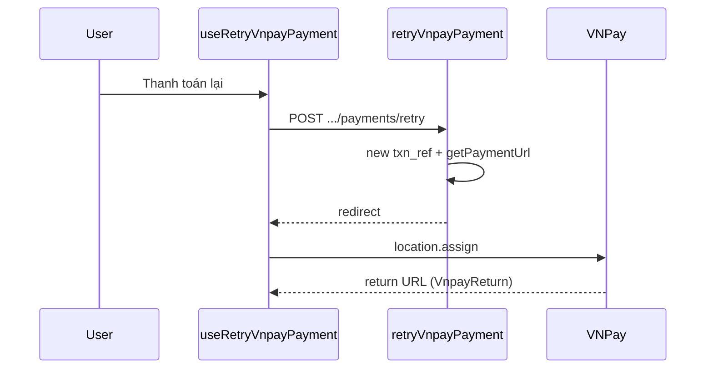

# Use Case — UC-ORD-10: Thanh toán lại VNPay (Retry VNPay Payment)

| Thuộc tính | Giá trị |
|------------|---------|
| **ID** | UC-ORD-10 |
| **Tên** | Tạo lại link thanh toán VNPay cho đơn chờ thanh toán / thất bại |
| **Mức độ ưu tiên** | Cao |
| **Phiên bản** | Bám code hiện tại |
| **Liên quan FR** | `FR_CreateVNPayPaymentUrl.md`, `FR_OrderPaymentCountdownTimer.md` |
| **Liên quan UC** | UC-ORD-03, UC-ORD-01 |

---

## 1. Mô tả ngắn

Khách có đơn **VNPay** ở trạng thái **`AWAITING_PAYMENT`** (payment `pending`) hoặc **`FAILED`** bấm **“Thanh toán ngay”** / **“Thanh toán lại”** trên **`OrdersPage`** hoặc **`OrderDetailPage`**. Frontend gọi:

```
POST /api/orders/:order_id/payments/retry
Body: { "method": "VNPAYQR" | "VNBANK" | "INTCARD" }
```

Backend khóa order + payment, kiểm tra điều kiện, sinh **`txn_ref` mới**, build URL VNPay qua **`vnpayService.getPaymentUrl`**, trả `{ redirect, txn_ref, expires_at }`. Hook **`useRetryVnpayPayment({ autoRedirect: true })`** invalidate cache và **`window.location.assign(redirect)`**.

---

## 2. Tác nhân

| Tác nhân | Vai trò |
|----------|---------|
| **Authenticated Customer** | Trigger retry |
| **orderController.retryVnpayPayment** | Transaction, txn_ref, URL |
| **vnpayService** | Ký URL thanh toán |
| **VNPay gateway** | Thu tiền |
| **vnpayController** (return/IPN) | Cập nhật order sau thanh toán (UC khác) |

---

## 3. Preconditions

| # | Điều kiện |
|---|-----------|
| PRE-01 | JWT hợp lệ — mọi route `/api/orders/*` qua `authenticateToken` |
| PRE-02 | `order.user_id === req.user.user_id` |
| PRE-03 | `Payment.provider === "VNPAY"` |
| PRE-04 | `payment.payment_status === "pending"` |
| PRE-05 | `order.status === "AWAITING_PAYMENT"` **hoặc** `"FAILED"` |
| PRE-06 | ENV VNPay đủ (`VNP_TMN_CODE`, `VNP_HASHSECRET`, `VNP_RETURNURL`, `VNP_PAYURL`) |

### Điều kiện FE (`canPayAgain` trên OrderDetailPage)

```javascript
const canPayAgain =
  (o.status === "AWAITING_PAYMENT" &&
    pay.provider === "VNPAY" &&
    pay.payment_status === "pending") ||
  (o.status === "FAILED" && pay.provider === "VNPAY");
```

**OrdersPage** chỉ hiện nút khi `status === "AWAITING_PAYMENT"` && `payment.provider === "VNPAY"` (không hiện trên tab `failed` nếu status FAILED — **gap nhỏ** so với detail page).

---

## 4. Postconditions

| # | Kết quả |
|---|---------|
| POST-01 | `payment.txn_ref` cập nhật `{order_id}-{timestamp}` |
| POST-02 | User redirect sang VNPay |
| POST-03 | React Query invalidate `orders`, `order`, `order-counters` |
| POST-E01 | Không đủ điều kiện → `400` “Order not eligible for retry payment” |
| POST-E02 | Không phải VNPay → `400` “Payment record not found or not VNPAY” |
| POST-E03 | Order không thuộc user → `404` |

---

## 5. Trigger

- `OrdersPage`: nút **“Thanh toán ngay”** trên thẻ đơn `AWAITING_PAYMENT`.
- `OrderDetailPage`: nút **“Thanh toán lại”** khi `canPayAgain`.

---

## 6. Luồng chính (BE)

| Bước | Hành động |
|------|-----------|
| 1 | `BEGIN TRANSACTION` |
| 2 | `Order.findOne` + `LOCK.UPDATE`, filter `user_id` |
| 3 | `Payment.findOne` provider VNPAY + lock |
| 4 | Kiểm tra `allow` (pending + AWAITING_PAYMENT \| FAILED) |
| 5 | `newTxnRef = `${order_id}-${Date.now()}`` |
| 6 | `payment.update({ txn_ref: newTxnRef })` |
| 7 | `getPaymentUrl({ method, amount, txnRef, orderDesc, ipAddr })` |
| 8 | `expires_at = now + 15 phút` (chỉ trả JSON, **không** ghi DB) |
| 9 | `COMMIT` → `{ redirect, order_id, txn_ref, expires_at }` |

---

## 7. Luồng chính (FE)

| Bước | Hành động |
|------|-----------|
| 1 | `retryPay.mutate({ orderId, method: pay.payment_method \|\| "VNPAYQR" })` |
| 2 | `POST /orders/:id/payments/retry` |
| 3 | `onSuccess`: invalidate queries |
| 4 | Nếu `data.redirect && autoRedirect` → `window.location.assign(redirect)` |
| 5 | User thanh toán trên VNPay → return URL → `VnpayReturn` |

---

## 8. API contract

### Request

```http
POST /api/orders/42/payments/retry
Authorization: Bearer <token>
Content-Type: application/json

{ "method": "VNPAYQR" }
```

| `method` | Ghi chú |
|----------|---------|
| `VNPAYQR` | Mặc định BE + FE |
| `VNBANK` | Thẻ/TK ngân hàng |
| `INTCARD` | Thẻ quốc tế |

### Response 200

```json
{
  "redirect": "https://sandbox.vnpayment.vn/...",
  "order_id": 42,
  "txn_ref": "42-1710000000000",
  "expires_at": "2026-05-27T10:15:00.000Z"
}
```

### Lỗi thường gặp

| HTTP | `message` |
|------|-----------|
| 404 | Order not found |
| 400 | Order not eligible for retry payment |
| 400 | Payment record not found or not VNPAY |
| 5xx | Lỗi `getPaymentUrl` / ENV |

---

## 9. So sánh với `changePaymentMethod` (COD → VNPAY)

| | **retryVnpayPayment** | **changePaymentMethod** |
|---|------------------------|-------------------------|
| Mục đích | Link mới, cùng provider VNPAY | Đổi COD ↔ VNPAY |
| Order status | AWAITING_PAYMENT / FAILED | Cập nhật status khi đổi COD→VNPAY |
| Payment fields | Chỉ `txn_ref` | provider, method, reset raw_* |
| Email | Không | `sendOrderUpdateEmail` |

---

## 10. Sơ đồ



---

## 11. Ánh xạ mã nguồn

| Thành phần | Đường dẫn |
|------------|-----------|
| Controller | `server/controllers/orderController.js` — `retryVnpayPayment` |
| Route | `server/routes/orderRoutes.js` — `POST /:order_id/payments/retry` |
| VNPay URL | `server/services/vnpayService.js` |
| Hook | `client/app/hooks/useOrders.js` — `useRetryVnpayPayment` |
| List UI | `client/app/pages/OrdersPage.jsx` |
| Detail UI | `client/app/pages/OrderDetailPage.jsx` |

---

## 12. Known gaps

| # | Gap |
|---|-----|
| GAP-01 | `expires_at` 15 phút **chỉ response** — không sync `reserve_expires_at` order (24h hold từ create) |
| GAP-02 | **OrdersPage** không nút retry khi `status === FAILED` (detail có) |
| GAP-03 | FE không hiển thị countdown từ `expires_at` retry |
| GAP-04 | Không cho chọn sub-method VNPAY trên list (dùng `payment_method` cũ) |
| GAP-05 | `INSTALLMENT` không dùng trong retry (chỉ QR/BANK/INTCARD ở BE create) |
| GAP-06 | Lỗi ENV VNPay — message generic, user khó sửa |

---

## 13. Tiêu chí chấp nhận

- [ ] Đơn AWAITING_PAYMENT + VNPAY pending → mở được cổng VNPay
- [ ] Đơn FAILED + VNPAY → retry từ detail (nếu có nút)
- [ ] Đơn processing đã paid → 400
- [ ] Sau retry thành công VNPay → order chuyển processing (flow return/IPN)
