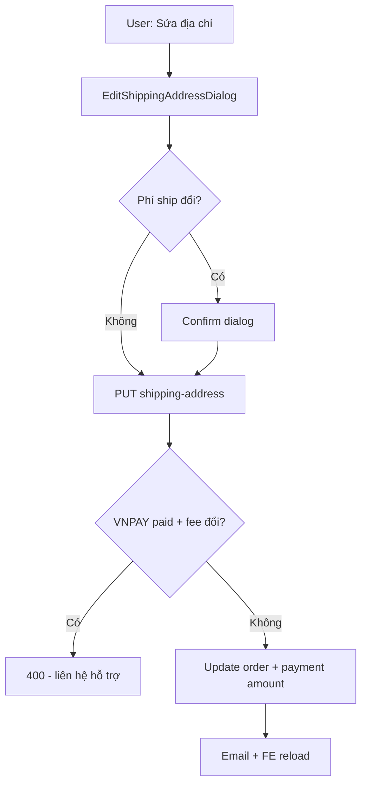

# Use Case — UC-ORD-11: Cập nhật địa chỉ giao hàng đơn (Update Order Shipping Address)

| Thuộc tính | Giá trị |
|------------|---------|
| **ID** | UC-ORD-11 |
| **Tên** | Sửa thông tin nhận hàng và tọa độ trên đơn chưa giao |
| **Mức độ ưu tiên** | Cao |
| **Phiên bản** | Bám code hiện tại |
| **Liên quan FR** | `FR_UpdateOrderShippingAddress.md` |
| **Liên quan UC** | UC-ORD-14/15 (chi tiết đơn) |

---

## 1. Mô tả ngắn

Trên **`OrderDetailPage`**, khách bấm **“Sửa địa chỉ”** → modal **`EditShippingAddressDialog`** (tỉnh/xã, địa chỉ, **MapPicker**, geocode Nominatim, preview **phí ship** qua `useShippingQuote`). Submit gọi:

```
PUT /api/orders/:order_id/shipping-address
```

Backend khóa order, chặn trạng thái `shipping` / `delivered` / `cancelled`, **tính lại phí ship** (`quoteShipping`), cập nhật `final_amount`, đồng bộ `payment.amount` nếu chưa `completed`. Trường hợp **VNPay đã thanh toán** mà phí ship đổi → **400** bắt liên hệ hỗ trợ.

Sau success: cache patch + invalidate + **`window.location.reload()` sau 500ms** (workaround UI).

---

## 2. Tác nhân

| Tác nhân | Vai trò |
|----------|---------|
| **Authenticated Customer** | Sửa địa chỉ đơn của mình |
| **EditShippingAddressDialog** | Form + map + confirm chênh phí ship |
| **orderController.updateShippingAddress** | Transaction, quote, payment sync |
| **emailService** | `sendOrderUpdateEmail` (SHIPPING_ADDRESS) async |

---

## 3. Preconditions

| # | Điều kiện |
|---|-----------|
| PRE-01 | JWT + order thuộc user |
| PRE-02 | `order.status` ∉ `shipping`, `delivered`, `cancelled` |
| PRE-03 | FE: không hiện nút nếu VNPAY `payment_status === "completed"` |
| PRE-04 | `province_id` hợp lệ (body mới hoặc giữ cũ trên order) |

---

## 4. Postconditions

| # | Kết quả |
|---|---------|
| POST-01 | `shipping_*`, `province_id`, `ward_id`, `geo_lat/lng` cập nhật |
| POST-02 | `shipping_fee`, `final_amount` recalc |
| POST-03 | `payment.amount` = `final_amount` nếu payment chưa completed |
| POST-04 | Email cập nhật (best-effort) |
| POST-E01 | VNPAY paid + phí ship đổi → 400 tiếng Việt |
| POST-E02 | 404 order không tồn tại / user khác |

---

## 5. Trigger

`OrderDetailPage` → nút **“Sửa địa chỉ”** khi:

```javascript
!["shipping", "delivered", "cancelled"].includes(o.status) &&
!(pay?.provider === "VNPAY" && pay?.payment_status === "completed")
```

---

## 6. Luồng chính (FE)

| Bước | Hành động |
|------|-----------|
| 1 | Mở `EditShippingAddressDialog` với `initialValue` từ order |
| 2 | `provincesData` preload từ `useProvinces()` (parent) |
| 3 | Chọn tỉnh → `useWards(provinceId)` |
| 4 | `useShippingQuote({ provinceId, wardId, subtotal })` — subtotal = `final_amount - shipping_fee` |
| 5 | Nhập địa chỉ → geocode OpenStreetMap Nominatim |
| 6 | MapPicker — xác nhận vị trí |
| 7 | Nếu `newShippingFee !== currentShippingFee` → dialog xác nhận chênh lệch |
| 8 | `updateAddr.mutate({ orderId, payload })` |
| 9 | Success: `setQueryData`, invalidate, `reload` 500ms |

### Payload gửi BE (ví dụ)

```json
{
  "shipping_name": "Nguyễn Văn A",
  "shipping_phone": "0901234567",
  "shipping_address": "123 Đường X, Phường Y, TP.HCM",
  "province_id": 79,
  "ward_id": 12345,
  "geo_lat": 10.776889,
  "geo_lng": 106.700806
}
```

Các field **optional** trên BE — thiếu thì giữ giá trị cũ (`?? order.field`).

---

## 7. Luồng chính (BE)

| Bước | Hành động |
|------|-----------|
| 1 | Lock order theo `order_id` + `user_id` |
| 2 | Chặn status shipping/delivered/cancelled |
| 3 | `newProvinceId`, `newWardId` từ body hoặc order |
| 4 | `subtotal = total_amount - discount_amount` |
| 5 | `quoteShipping({ province_id, ward_id, subtotal })` → `newShipFee` |
| 6 | Nếu VNPAY **completed** && `newShipFee !== oldShipFee` → rollback 400 |
| 7 | `patch.final_amount = subtotal + newShipFee` |
| 8 | `order.update(patch)` |
| 9 | Nếu `payment.payment_status !== "completed"` → `payment.update({ amount: final_amount })` |
| 10 | Commit + JSON order summary |
| 11 | Queue email `SHIPPING_ADDRESS` |

---

## 8. Luồng thay thế / ngoại lệ

### ALT-01 — Chỉ đổi tên/SĐT, phí ship không đổi

BE vẫn chạy quote; nếu fee giữ nguyên → VNPAY completed **được** sửa.

### ALT-02 — VNPAY đã trả tiền, đổi tỉnh làm tăng phí ship

| Bước | Kết quả |
|------|---------|
| 1 | `willChangeAmount === true` |
| 2 | `400` message: đơn đã thanh toán VNPAY, phí ship thay đổi — liên hệ hỗ trợ |

### EXC-01 — Thiếu province

`400` — `province_id is required (current or new)`.

---

## 9. API

```http
PUT /api/orders/:order_id/shipping-address
Authorization: Bearer <token>
Content-Type: application/json
```

### Response 200

```json
{
  "message": "Shipping address updated",
  "order": {
    "order_id": 1,
    "shipping_name": "...",
    "shipping_phone": "...",
    "shipping_address": "...",
    "province_id": 79,
    "ward_id": 12345,
    "geo_lat": 10.77,
    "geo_lng": 106.70,
    "shipping_fee": 35000,
    "final_amount": 22535000
  }
}
```

---

## 10. Sơ đồ



---

## 11. Ánh xạ mã nguồn

| Thành phần | Đường dẫn |
|------------|-----------|
| BE | `server/controllers/orderController.js` — `updateShippingAddress` |
| Route | `server/routes/orderRoutes.js` |
| Shipping quote BE | `quoteShipping` (shipping service) |
| Hook | `client/app/hooks/useOrders.js` — `useUpdateShippingAddress` |
| Dialog | `client/app/components/EditShippingAddressDialog.jsx` |
| Page | `client/app/pages/OrderDetailPage.jsx` |
| FE quote | `client/app/hooks/useShippingQuote.js` |

---

## 12. Known gaps

| # | Gap |
|---|-----|
| GAP-01 | Success dùng **`window.location.reload()`** — UX nặng, che race cache |
| GAP-02 | `console.log` debug còn trên BE/FE |
| GAP-03 | Email `oldData` có thể sai do Sequelize `_previousDataValues` sau `update` |
| GAP-04 | Không có UC sửa địa chỉ từ **OrdersPage** (chỉ detail) |
| GAP-05 | Geocode phụ thuộc Nominatim public — rate limit / offline |
| GAP-06 | Admin không dùng endpoint này cho sửa địa chỉ hộ |

---

## 13. Tiêu chí chấp nhận

- [ ] Đơn processing COD — đổi ward → phí ship + final_amount đúng
- [ ] VNPAY pending — đổi địa chỉ → `payment.amount` khớp
- [ ] VNPAY completed + phí đổi → 400, không mutate DB
- [ ] Đơn shipping → không có nút Sửa
