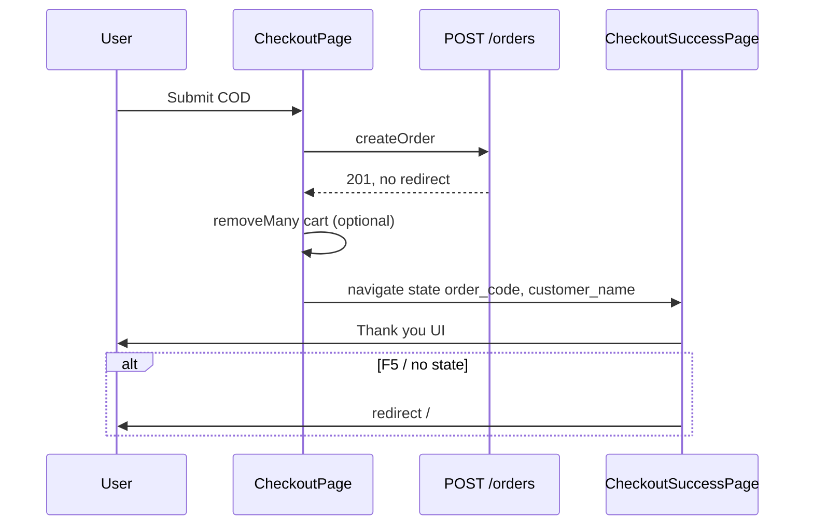

# Use Case — UC-ORD-09: Xem trang đặt hàng thành công (View Checkout Success Page)

| Thuộc tính | Giá trị |
|------------|---------|
| **ID** | UC-ORD-09 |
| **Tên** | Xem trang cảm ơn sau khi đặt hàng COD thành công |
| **Mức độ ưu tiên** | Trung bình |
| **Phiên bản** | Bám code hiện tại |
| **Liên quan FR** | `FR_CreateOrder.md` |
| **Liên quan UC** | UC-ORD-02 (Create Order COD), UC-ORD-03 (VNPay — **không** dùng trang này) |

---

## 1. Mô tả ngắn

Sau khi **`POST /api/orders`** thành công với **COD** (không có `redirect` VNPay), `CheckoutPage` điều hướng tới **`/checkout/success`** và truyền dữ liệu qua **`location.state`**. Trang **`CheckoutSuccessPage`** hiển thị thông báo cảm ơn, **mã đơn**, phương thức thanh toán, danh sách bước tiếp theo (email/SMS/hotline), và hai CTA: xem đơn hàng / tiếp tục mua sắm.

Trang **không gọi API** — chỉ render state từ navigation. Nếu thiếu state hợp lệ → redirect về **`/`**.

**Lưu ý quan trọng:** Luồng **VNPay** khi `res.redirect` có giá trị sẽ **`window.location.href`** sang cổng VNPay và **không** vào trang success này; sau thanh toán khách quay về **`/checkout/vnpay-return`** (`VnpayReturn.jsx`).

---

## 2. Tác nhân

| Tác nhân | Vai trò |
|----------|---------|
| **Authenticated Customer** | Vừa submit checkout COD |
| **CheckoutPage** | `navigate('/checkout/success', { state })` |
| **CheckoutSuccessPage** | UI tĩnh, guard state |
| **React Router** | Truyền `location.state` (mất khi F5 / mở tab mới) |

---

## 3. Preconditions

| # | Điều kiện |
|---|-----------|
| PRE-01 | User đã qua `ProtectedRoute` tại `/checkout` và submit thành công |
| PRE-02 | `payment_provider === "COD"` (response không có `redirect`) |
| PRE-03 | `createOrder` trả `201` với `order_code` trong body |
| PRE-04 | `navigate` kèm `state` đủ 3 field bắt buộc (xem mục 8) |

---

## 4. Postconditions

| # | Kết quả |
|---|---------|
| POST-01 | User thấy UI xác nhận với `order_code` và tên khách |
| POST-02 | Có thể vào `/orders` (cần đăng nhập — route protected) |
| POST-03 | Có thể về `/` tiếp tục mua sắm |
| POST-E01 | Truy cập trực tiếp `/checkout/success` không state → redirect `/` |

---

## 5. Trigger

`CheckoutPage.handleSubmit` — nhánh sau `createOrder.mutateAsync` khi **không** có `res.redirect`:

```javascript
navigate("/checkout/success", {
  state: {
    order_code: res?.order?.order_code || res?.order_code,
    customer_name: formData.full_name,
    payment_provider: payment.payment_provider,
  },
  replace: true,
});
```

---

## 6. Luồng chính

| Bước | Tác nhân | Hành động |
|------|----------|-----------|
| 1 | User | Bấm “Đặt hàng” trên Checkout (COD) |
| 2 | FE | `POST /api/orders` — nhận order, không redirect VNPay |
| 3 | FE | Nếu `intentMode === "cart"` → `removeMany` cart_ids đã mua |
| 4 | FE | `navigate('/checkout/success', { state, replace: true })` |
| 5 | FE | `CheckoutSuccessPage` mount — đọc `location.state` |
| 6 | FE | Render icon ✓, lời cảm ơn + `customer_name`, box mã đơn |
| 7 | FE | Hiển thị “Phương thức: Thanh toán khi nhận hàng” (nếu COD) |
| 8 | FE | Bullet “Tiếp theo” (email, SMS, hotline placeholder) |
| 9 | User | Bấm “Xem chi tiết đơn hàng” → `/orders` hoặc “Tiếp tục mua sắm” → `/` |

---

## 7. Luồng thay thế / ngoại lệ

### ALT-01 — Refresh hoặc bookmark URL

| Bước | Mô tả |
|------|-------|
| 1 | User F5 hoặc paste `/checkout/success` |
| 2 | `location.state` = `undefined` |
| 3 | `useEffect` thấy thiếu `order_code` hoặc `customer_name` |
| 4 | `navigate('/', { replace: true })` — flash `null` rồi rời trang |

### ALT-02 — Đơn VNPay

| Bước | Mô tả |
|------|-------|
| 1 | `res.redirect` tồn tại |
| 2 | `window.location.href = res.redirect` — **không** vào UC này |
| 3 | Sau VNPay → `VnpayReturn` → `/orders?tab=...` |

### EXC-01 — `createOrder` lỗi

Checkout không navigate; UC không chạy (lỗi log console, chưa có toast chuẩn).

---

## 8. Dữ liệu `location.state`

| Field | Nguồn | Bắt buộc guard |
|-------|--------|----------------|
| `order_code` | `res.order.order_code` | Có |
| `customer_name` | `formData.full_name` | Có |
| `payment_provider` | `payment.payment_provider` (`"COD"` \| `"VNPAY"`) | Không trong guard — chỉ ảnh hưởng copy UI |

Guard trong component:

```javascript
if (!orderData || !orderData.order_code || !orderData.customer_name) {
  navigate("/", { replace: true });
}
```

---

## 9. UI / nội dung hiển thị

| Khối | Nội dung |
|------|----------|
| Hero | `CheckCircle`, tiêu đề “Đặt hàng thành công!” |
| Cảm ơn | Tên khách in đậm |
| Mã đơn | `order_code` font lớn màu xanh |
| PT thanh toán | COD → “Thanh toán khi nhận hàng”; khác → “Ví điện tử VNPay” |
| Tiếp theo | List bullet khác nhau COD vs VNPAY (email, SMS, hotline **1900 XXX XXX**) |
| CTA 1 | `Link` → `/orders` — “Xem chi tiết đơn hàng” |
| CTA 2 | `Link` → `/` — “Tiếp tục mua sắm” |
| Footer | Hotline + `support@laptopstore.vn` |

**Gap:** Nút “Xem chi tiết” chỉ tới **danh sách** `/orders`, không deep-link `/orders/:order_id` vì state không có `order_id`.

---

## 10. Routing & bảo mật

| Route | Protected? | Ghi chú |
|-------|------------|---------|
| `/checkout` | Có (`ProtectedRoute`) | Submit COD |
| `/checkout/success` | **Không** | Ai cũng mở URL được nhưng không state → về `/` |
| `/orders` | Có | CTA danh sách đơn |

---

## 11. Sơ đồ luồng



---

## 12. Ánh xạ mã nguồn

| Thành phần | Đường dẫn |
|------------|-----------|
| Trang success | `client/app/pages/CheckoutSuccessPage.jsx` |
| Navigate state | `client/app/pages/CheckoutPage.jsx` (~445–452) |
| Route | `client/app/App.jsx` — `checkout/success` |
| Tạo đơn COD | `server/controllers/orderController.js` — `createOrder` |

---

## 13. Known gaps / hạn chế thực tế

| # | Gap |
|---|-----|
| GAP-01 | Chỉ phục vội **COD**; VNPay không dùng trang này |
| GAP-02 | **Không persist** state — F5 mất dữ liện → redirect home |
| GAP-03 | Route success **không** bọc `ProtectedRoute` (state vẫn cần vừa checkout) |
| GAP-04 | CTA “Xem chi tiết” → list, không → `OrderDetailPage` |
| GAP-05 | Hotline/email **placeholder**, chưa lấy từ config |
| GAP-06 | Không xác minh server-side order tồn tại trên trang success |
| GAP-07 | Copy “Tiếp theo” (SMS, email) **marketing** — chưa gắn job queue thực tế trên FE |

---

## 14. Tiêu chí chấp nhận (tham khảo)

- [ ] COD thành công → thấy đúng `order_code` và tên khách
- [ ] VNPay có redirect → không vào `/checkout/success`
- [ ] Mở `/checkout/success` trực tiếp → về `/`
- [ ] F5 trên success → về `/`
- [ ] Link `/orders` yêu cầu login nếu session hết hạn
