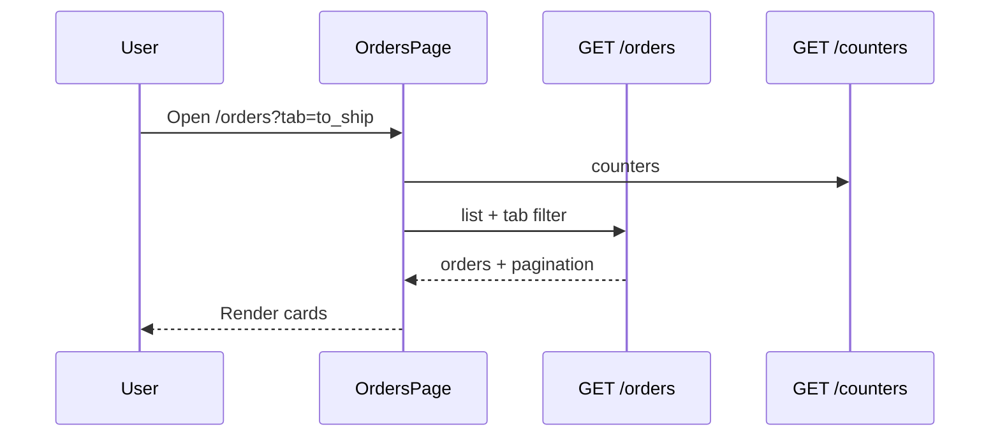

# Use Case — UC-ORD-01: Xem đơn hàng của tôi theo tab (View My Orders With Tabs)

| Thuộc tính | Giá trị |
|------------|---------|
| **ID** | UC-ORD-01 |
| **Tên** | Xem danh sách đơn hàng với tab trạng thái, tìm kiếm, phân trang |
| **Mức độ ưu tiên** | Cao |
| **Phiên bản** | Bám code hiện tại |

---

## 1. Mô tả ngắn

Khách **đã đăng nhập** mở **`/orders`** (bọc `ProtectedRoute`) để xem đơn của mình. Trang hiển thị **7 tab** trạng thái kèm **badge đếm** từ API, ô **tìm kiếm** mã đơn/tên SP, **phân trang**, và thẻ từng đơn (preview tối đa 2 SP, tổng tiền, hủy đơn, thanh toán lại VNPAY).

**API chính:**

- `GET /api/orders?tab=&page=&limit=&q=&sort=`
- `GET /api/orders/counters`

**FE:** `OrdersPage.jsx`, `useOrders`, `useOrderCounters`, `orderTabs` / `orderCanCancel` utils

---

## 2. Tác nhân

| Tác nhân | Vai trò |
|----------|---------|
| **Authenticated Customer** | Duyệt, tìm, hủy, retry VNPAY |
| **Backend** | `getUserOrdersV2`, `getOrderCountersV2` |
| **VNPAY** | Retry payment từ tab “Chờ thanh toán” |

---

## 3. Preconditions

| # | Điều kiện |
|---|-----------|
| PRE-01 | JWT hợp lệ |
| PRE-02 | `req.userId` set từ `authenticateToken` |
| PRE-03 | User có ít nhất 0 đơn (tab có thể rỗng) |

---

## 4. Postconditions

### Thành công

| # | Kết quả |
|---|---------|
| POST-01 | Danh sách đơn theo tab hiển thị |
| POST-02 | URL sync `?tab=&page=&q=` — deep link được |
| POST-03 | Badge counter cập nhật theo DB |

### Tab rỗng

| # | Kết quả |
|---|---------|
| POST-E01 | “Không có đơn nào.” |

---

## 5. Trigger

- Navigate `/orders` hoặc link Header “Đơn hàng”.
- Redirect sau VNPAY: `/orders?tab=to_ship` hoặc `tab=failed` (`VnpayReturn.jsx`).
- Đổi tab / trang / từ khóa tìm.

---

## 6. Tabs — mapping FE ↔ BE

| Tab FE (`TABS.key`) | Label | Filter BE (`getUserOrdersV2`) |
|---------------------|-------|-------------------------------|
| `all` | Tất cả | Không lọc status đặc biệt |
| `awaiting_payment` | Chờ thanh toán | `status = AWAITING_PAYMENT` + VNPAY `payment_status = pending` |
| `to_ship` | Chờ giao hàng | `status = processing` + (COD pending **or** VNPAY completed) |
| `shipping` | Vận chuyển | `status = shipping` + payment rule tương tự `to_ship` |
| `completed` | Hoàn thành | `status = delivered` + `payment_status = completed` |
| `cancelled` | Đã hủy | `status IN (cancelled, FAILED)` |
| `failed` | Thanh toán thất bại | `status = FAILED` |

**Counter map FE:**

```javascript
const counterKeyMap = {
  completed: "delivered", // tab completed → key delivered
  // ...
};
```

---

## 7. Luồng chính

| Bước | Tác nhân | Hành động |
|------|----------|-----------|
| 1 | User | Mở `/orders` |
| 2 | FE | Đọc `searchParams`: `tab`, `page`, `q` |
| 3 | FE | `useOrderCounters()` → `GET /orders/counters` |
| 4 | FE | `useOrders({ tab, page, limit:10, q, sort })` |
| 5 | BE | `findAndCountAll` + include items (variation→product), payment |
| 6 | BE | Map `items_preview` (max 2), `items_count` |
| 7 | FE | Render cards + pagination |
| 8 | User | Click header card → `/orders/:order_id` |

### URL sync

```javascript
useEffect(() => {
  params.set("tab", tab);
  params.set("page", String(page));
  if (q) params.set("q"); else params.delete("q");
  setSearchParams(params, { replace: true });
}, [tab, page, q]);
```

---

## 8. Luồng thay thế

### AF-01: Tìm kiếm

| Bước | Mô tả |
|------|--------|
| AF-01.1 | `q` → BE `Op.or` trên `order_code ILIKE` hoặc `product_name ILIKE` (join items) |
| AF-01.2 | Reset `page = 1` khi đổi `q` |

### AF-02: Hủy đơn

| Điều kiện | `canCancel(o)` — `orderCanCancel.js` |
|-----------|--------------------------------------|
| Hành động | `POST /orders/:id/cancel` — UC hủy đơn (FR riêng) |

### AF-03: Thanh toán lại VNPAY

| Điều kiện | `status === AWAITING_PAYMENT` && `payment.provider === VNPAY` |
|-----------|---------------------------------------------------------------|
| Hành động | `useRetryVnpayPayment` → `POST /orders/:id/payments/retry` → redirect |

### AF-04: Countdown giữ chỗ

| Mô tả |
|--------|
| `CountdownBadge` hiển thị `reserve_expires_at` khi `AWAITING_PAYMENT` (24h từ create VNPAY) |

---

## 9. Luồng ngoại lệ

### EF-01: 401

ProtectedRoute redirect login.

### EF-02: API lỗi

“Không tải được danh sách đơn.”

### EF-03: Tab `cancelled` vs `failed`

Đơn `FAILED` có thể xuất hiện ở cả tab cancelled (OR) và failed — có thể trùng hiển thị tùy filter.

---

## 10. Quy tắc nghiệp vụ

| ID | Quy tắc |
|----|---------|
| BR-01 | Chỉ đơn `user_id = req.userId` |
| BR-02 | Sort mặc định `created_at:desc` |
| BR-03 | `limit` max 100, default 10 |
| BR-04 | Preview tối đa **2** dòng SP trên list |
| BR-05 | Counter tính client-side scan all orders user (V2) — có thể chậm nếu nhiều đơn |

---

## 11. API

```http
GET /api/orders?tab=to_ship&page=1&limit=10&q=ORD-ABC&sort=created_at:desc
```

```http
GET /api/orders/counters
```

Response list (rút gọn):

```json
{
  "orders": [{
    "order_id": 1,
    "order_code": "ORD-...",
    "status": "processing",
    "final_amount": 25000000,
    "reserve_expires_at": null,
    "payment": { "provider": "COD", "payment_status": "pending" },
    "items_preview": [{ "variation_id": 1, "product_name": "...", "quantity": 1 }],
    "items_count": 3
  }],
  "pagination": { "page": 1, "limit": 10, "total": 25, "totalPages": 3 }
}
```

---

## 12. Triển khai

| File | Vai trò |
|------|---------|
| `client/app/pages/OrdersPage.jsx` | UI tabs, search, list |
| `client/app/hooks/useOrders.js` | `useOrders`, `useOrderCounters`, `useCancelOrder`, `useRetryVnpayPayment` |
| `client/app/utils/orderCanCancel.js` | Điều kiện hủy |
| `server/controllers/orderController.js` | `getUserOrdersV2`, `getOrderCountersV2` |
| `server/routes/orderRoutes.js` | Routes + `authenticateToken` |
| `client/app/App.jsx` | `ProtectedRoute` `/orders` |

---

## 13. Sơ đồ tuần tự



---

## 14. Liên kết

| UC / FR |
|---------|
| UC-ORD-03 CreateOrderWithVNPay |
| UC-ORD-02 CreateOrderWithCOD |
| `FR_ViewUserOrders.md`, `FR_ViewOrderTabCounters.md`, `FR_CancelOrder.md` |

---

## 15. Known gaps

| # | Mô tả |
|---|--------|
| GAP-01 | `getOrderDetail` route `GET /:order_id` có thể conflict nếu id = "counters" (GET counters đặt trước — OK) |
| GAP-02 | Tab label “Hoàn thành” map `delivered` — không gồm `status=completed` nếu có |
| GAP-03 | Search join phức tạp — performance trên DB lớn |
| GAP-04 | `OrderDetailPage` route `/orders/:id` **không** bọc ProtectedRoute trong App (chỉ list bọc) |
