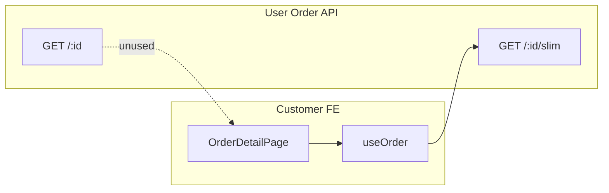

# Use Case — UC-ORD-15: Xem chi tiết đơn (Full API) — View Order Detail

| Thuộc tính | Giá trị |
|------------|---------|
| **ID** | UC-ORD-15 |
| **Tên** | API chi tiết đơn đầy đủ (Sequelize raw) — backend contract |
| **Mức độ ưu tiên** | Thấp (FE khách không dùng) |
| **Phiên bản** | Bám code hiện tại |
| **Liên quan FR** | `FR_ViewOrderDetail.md` |
| **Liên quan UC** | **UC-ORD-14** (slim — FE chính) |

---

## 1. Mô tả ngắn

Endpoint **đầy đủ** trả về model `Order` Sequelize kèm quan hệ lồng nhau **chưa chuẩn hóa**:

```
GET /api/orders/:order_id
Authorization: Bearer <JWT>
```

Include:

- `OrderItem` as `items` → `ProductVariation` as `variation` → `Product` as `product`
- `Payment` as `payment`

Response: `{ order: <sequelize instance JSON> }` — field names theo model DB, nested `variation` có thể chứa nhiều thuộc tính hơn slim.

**Frontend khách hàng hiện tại:** `useOrder` gọi **`/slim`**, không gọi endpoint này. `client/app/services/api.js` có `getOrderById: (id) => api.get('/orders/${id}')` nhưng **không được import** ở component nào.

**Admin** dùng API riêng: `GET /api/admin/orders/:order_id` (`adminController.getOrderDetail`).

---

## 2. Tác nhân

| Tác nhân | Vai trò |
|----------|---------|
| **Customer (API client)** | Có thể gọi trực tiếp (Postman, tích hợp tương lai) |
| **getOrderDetail** | `orderController.js` |
| **OrderDetailPage** | **Không** dùng UC này — dùng UC-ORD-14 |
| **Admin** | Panel admin — endpoint khác |

---

## 3. Preconditions

| # | Điều kiện |
|---|-----------|
| PRE-01 | JWT |
| PRE-02 | Order `order_id` + `user_id = req.user.user_id` |

---

## 4. Postconditions

| # | Kết quả |
|---|---------|
| POST-01 | `200` + object order nested đầy đủ |
| POST-E01 | `404` `{ message: "Order not found" }` |

---

## 5. Luồng chính (BE)

| Bước | Hành động |
|------|-----------|
| 1 | Parse `order_id` từ params |
| 2 | `Order.findOne({ where: { order_id, user_id }, include: [...] })` |
| 3 | Không sort items explicit (khác slim `order_item_id ASC`) |
| 4 | `res.json({ order })` |

### Include tree

```
Order
├── items[] (OrderItem)
│   └── variation (ProductVariation)
│       └── product (Product)
└── payment (Payment)
```

---

## 6. So sánh Slim vs Full

| Tiêu chí | **GET /:id/slim** (UC-ORD-14) | **GET /:id** (UC-ORD-15) |
|----------|-------------------------------|---------------------------|
| FE OrderDetailPage | ✅ | ❌ |
| Payload | Nhỏ, số đã `Number()` | Lớn, nested ORM |
| Product trong item | `product: { id, name, thumb, slug }` | Full `variation` + `product` |
| Payment | Object 6 field chuẩn | Full Payment model |
| `reserve_expires_at` | Không (cả hai thiếu trên slim; **full có thể có** trên Order root nếu model có cột) | Có trên order row nếu selected |
| Sort items | ASC `order_item_id` | Mặc định DB |
| Use case | Production UI | Legacy / debug / mobile app sau này |

*Kiểm tra model Order:* nếu `reserve_expires_at` là cột order, response **full** trả về field này — lý do có thể chuyển FE sang full hoặc bổ sung vào slim.*

---

## 7. Ví dụ response (cấu trúc — rút gọn)

```json
{
  "order": {
    "order_id": 42,
    "order_code": "ORD-...",
    "user_id": 7,
    "status": "processing",
    "total_amount": "25000000.00",
    "discount_amount": "2500000.00",
    "final_amount": "22530000.00",
    "shipping_fee": "30000.00",
    "shipping_name": "...",
    "reserve_expires_at": "2026-05-28T10:00:00.000Z",
    "note": null,
    "created_at": "...",
    "updated_at": "...",
    "items": [
      {
        "order_item_id": 1,
        "variation_id": 10,
        "quantity": 1,
        "price": "25000000.00",
        "variation": {
          "variation_id": 10,
          "sku": "...",
          "price": "...",
          "product": {
            "product_id": 5,
            "product_name": "...",
            "discount_percentage": 10
          }
        }
      }
    ],
    "payment": {
      "payment_id": 1,
      "provider": "COD",
      "payment_method": "COD",
      "payment_status": "pending",
      "amount": "22530000.00",
      "txn_ref": null,
      "raw_return": null
    }
  }
}
```

*Giá trị số có thể là string DECIMAL từ PostgreSQL/Sequelize — khác slim đã cast `Number()`.*

---

## 8. Route ordering (Express)

Trong `orderRoutes.js`:

```javascript
router.get("/:order_id", orderController.getOrderDetail)
router.get("/:order_id/slim", orderController.getOrderDetailSlim);
```

Không xung đột: `/slim` là path con.

---

## 9. Khi nào nên dùng Full API

| Scenario | Khuyến nghị |
|----------|-------------|
| UI web hiện tại | **Slim** |
| Cần `reserve_expires_at` trên detail | Bổ sung slim **hoặc** chuyển FE sang full |
| Tool debug / export | Full |
| Mobile app cần variation specs | Full hoặc mở rộng slim |

---

## 10. Sơ đồ kiến trúc dữ liệu



---

## 11. Ánh xạ mã nguồn

| Thành phần | Đường dẫn |
|------------|-----------|
| BE user | `server/controllers/orderController.js` — `getOrderDetail` |
| BE admin | `server/controllers/adminController.js` — `getOrderDetail` |
| Routes user | `server/routes/orderRoutes.js` |
| Routes admin | `server/routes/adminRoutes.js` |
| Dead helper | `client/app/services/api.js` — `getOrderById` |
| FE thực tế | `useOrder` → slim trong `useOrders.js` |

---

## 12. Known gaps

| # | Gap |
|---|-----|
| GAP-01 | Hai endpoint song song — dễ drift khi thêm field |
| GAP-02 | FE không dùng full → `getOrderById` dead code |
| GAP-03 | Full không chuẩn hóa → client phải tự parse số |
| GAP-04 | Countdown detail thiếu `reserve_expires_at` vì dùng slim, không phải vì full không có |
| GAP-05 | Admin detail ≠ user detail shape |

---

## 13. Tiêu chí chấp nhận

- [ ] `GET /orders/:id` cùng user → 200, có `items` + `payment`
- [ ] User khác → 404
- [ ] Postman gọi full vs slim — slim nhẹ hơn, field product gọn hơn
- [ ] OrderDetailPage vẫn chỉ gọi slim (regression nếu đổi hook)

---

## 14. Hướng cải thiện (ngoài scope code hiện tại)

1. Thêm `reserve_expires_at`, `note`, `updated_at` vào **slim** → giữ một contract.
2. Hoặc đổi `useOrder` sang full + mapper FE — tăng payload.
3. Xóa `getOrderById` hoặc wire vào hook có `select` transform.
