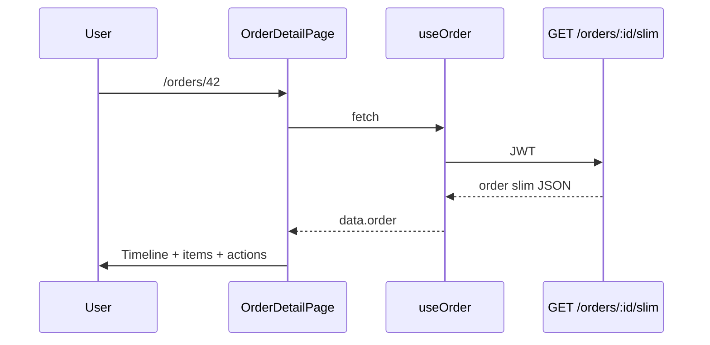

# Use Case — UC-ORD-14: Xem chi tiết đơn (Slim API) — View Order Detail Slim

| Thuộc tính | Giá trị |
|------------|---------|
| **ID** | UC-ORD-14 |
| **Tên** | Tải và hiển thị chi tiết đơn qua API slim (luồng FE chính) |
| **Mức độ ưu tiên** | Cao |
| **Phiên bản** | Bám code hiện tại |
| **Liên quan FR** | `FR_ViewOrderDetailSlim.md` |
| **Liên quan UC** | UC-ORD-10, 11, 12, 13; UC-ORD-15 (full API) |

---

## 1. Mô tả ngắn

Khách mở **`/orders/:id`** (`OrderDetailPage`). Hook **`useOrder(id)`** gọi:

```
GET /api/orders/:order_id/slim
Authorization: Bearer <JWT>
```

Backend trả JSON **đã chuẩn hóa**: metadata đơn, shipping, geo, `payment` object, `items[]` với product summary (thumbnail, slug, name). Trang render timeline, danh sách SP, tổng tiền, và gắn các action: hủy, retry VNPay, sửa địa chỉ, đổi COD→VNPay.

Đây là **nguồn dữ liệu duy nhất** mà UI chi tiết đơn khách hàng dùng hiện tại (không gọi `GET /orders/:id` full).

---

## 2. Tác nhân

| Tác nhân | Vai trò |
|----------|---------|
| **Customer** | Xem đơn của mình |
| **OrderDetailPage** | Layout + dialogs |
| **getOrderDetailSlim** | Map Sequelize → JSON gọn |
| **React Query** | `queryKey: ["order", id]` |

---

## 3. Preconditions

| # | Điều kiện |
|---|-----------|
| PRE-01 | JWT (API bắt buộc auth) |
| PRE-02 | `order_id` tồn tại và `user_id` khớp |
| PRE-03 | Route param `id` = `order_id` (số) |

**Lưu ý routing:** `/orders/:id` **không** bọc `ProtectedRoute` trong `App.jsx`, nhưng API không token → 401 → UI lỗi.

---

## 4. Postconditions

| # | Kết quả |
|---|---------|
| POST-01 | Hiển thị mã đơn, status badge, items, tổng tiền |
| POST-02 | Timeline trạng thái (logic FE tĩnh từ status + payment) |
| POST-03 | Nút action theo `canCancel`, `canPayAgain`, điều kiện sửa địa chỉ/đổi PT |
| POST-E01 | 404 → “Không tải được chi tiết đơn.” |

---

## 5. Trigger

- Link từ `OrdersPage`: `to={/orders/${o.order_id}}`
- Bookmark / share URL `/orders/42`
- (Không có) deep link từ `CheckoutSuccessPage`

---

## 6. Response schema (BE)

```json
{
  "order": {
    "order_id": 42,
    "order_code": "ORD-20260527-001",
    "status": "AWAITING_PAYMENT",
    "total_amount": 25000000,
    "discount_amount": 2500000,
    "final_amount": 22530000,
    "shipping_fee": 30000,
    "shipping_name": "Nguyễn Văn A",
    "shipping_phone": "0901234567",
    "shipping_address": "123..., Phường X, TP.HCM",
    "province_id": 79,
    "ward_id": 12345,
    "geo_lat": 10.776889,
    "geo_lng": 106.700806,
    "created_at": "2026-05-27T10:00:00.000Z",
    "payment": {
      "provider": "VNPAY",
      "payment_method": "VNPAYQR",
      "payment_status": "pending",
      "amount": 22530000,
      "txn_ref": "42-1710000000000",
      "paid_at": null
    },
    "items": [
      {
        "order_item_id": 1,
        "variation_id": 10,
        "quantity": 1,
        "price": 25000000,
        "discount_amount": 2500000,
        "subtotal": 22500000,
        "product": {
          "product_id": 5,
          "product_name": "Laptop XYZ",
          "thumbnail_url": "https://...",
          "slug": "laptop-xyz"
        }
      }
    ]
  }
}
```

### Mapping item thumbnail (BE)

```javascript
const thumb = p.images?.[0]?.image_url || p.thumbnail_url || null;
```

Items sort: `order_item_id ASC`.

### Fields **không** có trong slim (so với list V2 / full)

| Field | Ảnh hưởng |
|-------|-----------|
| `reserve_expires_at` | `PaymentCountdown` trên detail **không có data** |
| `note` | Timeline hủy ít hiển thị note từ API slim |
| `updated_at` | Timeline “đã giao” có thể trống |
| Variation specs (RAM/SSD) | Không hiện cấu hình |

---

## 7. Luồng chính (FE)

| Bước | Hành động |
|------|-----------|
| 1 | `useParams().id` |
| 2 | `useOrder(id)` → GET slim |
| 3 | Loading → `LoadingSpinner` |
| 4 | Render header `order_code`, badge `status` |
| 5 | Block tổng tiền + nút hủy (nếu `canCancel`) |
| 6 | Refund banner nếu `cancelled` + `refunded` |
| 7 | `PaymentCountdown` nếu `AWAITING_PAYMENT` && `reserve_expires_at` (**thường thiếu**) |
| 8 | Timeline các bước (đặt hàng → thanh toán → xử lý → ship → giao / hủy) |
| 9 | Grid: items + shipping card + payment card |
| 10 | Mount `ChangePaymentMethodDialog`, `EditShippingAddressDialog` |

---

## 8. Các action trên cùng trang (tóm tắt)

| Action | Điều kiện UI | API |
|--------|--------------|-----|
| Hủy đơn | `canCancel(o)` | `POST .../cancel` |
| Thanh toán lại | `canPayAgain` | `POST .../payments/retry` |
| Sửa địa chỉ | status + not VNPAY paid | `PUT .../shipping-address` |
| Đổi sang VNPAY | COD + status | `POST .../payment-method` |

---

## 9. Status badge tones (FE)

| `status` | Tone |
|----------|------|
| `AWAITING_PAYMENT` | amber |
| `processing` | blue |
| `shipping` | violet |
| `delivered` | green |
| `cancelled`, `FAILED` | red |

---

## 10. Sơ đồ



---

## 11. Ánh xạ mã nguồn

| Thành phần | Đường dẫn |
|------------|-----------|
| BE | `server/controllers/orderController.js` — `getOrderDetailSlim` |
| Route | `GET /:order_id/slim` (sau `authenticateToken`) |
| Hook | `client/app/hooks/useOrders.js` — `useOrder` |
| Page | `client/app/pages/OrderDetailPage.jsx` |
| Route FE | `client/app/App.jsx` — `orders/:id` |

---

## 12. Known gaps

| # | Gap |
|---|-----|
| GAP-01 | **`reserve_expires_at` không trả về slim** — countdown detail hỏng; list `getUserOrdersV2` có field |
| GAP-02 | Route detail **không ProtectedRoute** — UX 401 thay vì redirect login |
| GAP-03 | `GET /orders/:id` full tồn tại nhưng FE **không dùng** (xem UC-ORD-15) |
| GAP-04 | `api.getOrderById` trong `api.js` dead code |
| GAP-05 | Status hiển thị raw enum (`AWAITING_PAYMENT`) — chưa i18n label |
| GAP-06 | Reload cứng sau sửa địa chỉ |

---

## 13. Tiêu chí chấp nhận

- [ ] User A không xem được order user B (404)
- [ ] Items có thumbnail + subtotal đúng
- [ ] AWAITING_PAYMENT hiện retry + hủy
- [ ] Link từ list mở đúng đơn
