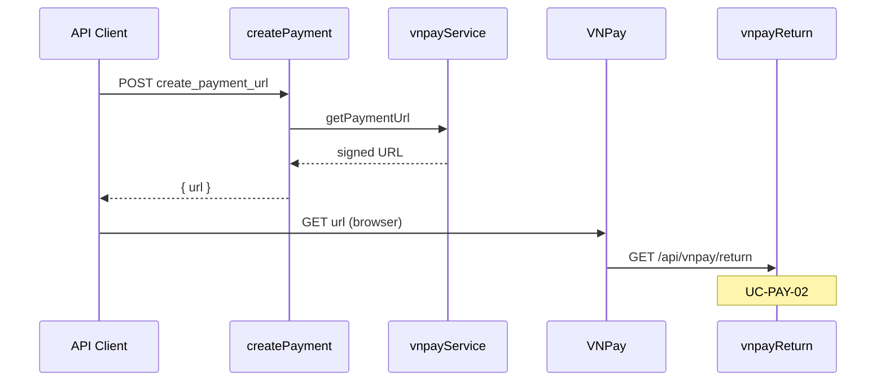

# Use Case — UC-PAY-01: Khởi tạo thanh toán VNPay độc lập (Initiate VNPay Payment Standalone)

| Thuộc tính | Giá trị |
|------------|---------|
| **ID** | UC-PAY-01 |
| **Tên** | Tạo URL cổng VNPay qua API standalone (không qua luồng đặt hàng FE) |
| **Mức độ ưu tiên** | Thấp (endpoint có sẵn, **FE không gọi**) |
| **Phiên bản** | Bám code hiện tại |
| **Liên quan FR** | `FR_CreateVNPayPaymentUrl.md` |
| **Liên quan UC** | UC-ORD-03 (create order + redirect), UC-PAY-02 (return) |

---

## 1. Mô tả ngắn

Hệ thống cung cấp endpoint **công khai** (không JWT) để sinh link thanh toán VNPay mà **không** cần đi qua `POST /api/orders`:

```
POST /api/vnpay/create_payment_url
Body: { "orderId": "...", "amount": number }
Response: { "url": "https://sandbox.vnpayment.vn/paymentv2/vpcpay.html?..." }
```

Handler **`vnpayController.createPayment`** gọi lõi **`vnpayService.getPaymentUrl`** — cùng hàm dùng trong `createOrder`, `retryVnpayPayment`, `changePaymentMethod`.

**Luồng sản phẩm chính** của đồ án **không** dùng UC này: `CheckoutPage` nhận `redirect` từ `POST /orders`. UC mô tả API phụ trợ (Postman, tích hợp ngoài, debug) và **rủi ro bảo mật** khi gọi trực tiếp.

---

## 2. Tác nhân

| Tác nhân | Vai trò |
|----------|---------|
| **API Client** | Postman, script, app tương lai |
| **vnpayController.createPayment** | Validate body, sinh `txnRef`, trả URL |
| **vnpayService.getPaymentUrl** | Build query + HMAC-SHA512 |
| **VNPay Gateway** | Nhận redirect GET |
| **Browser** | User mở `url` (thủ công hoặc FE khác) |

---

## 3. Preconditions

| # | Điều kiện |
|---|-----------|
| PRE-01 | Server chạy, mount `app.use("/api", vnpayRoutes)` |
| PRE-02 | `vnpayService` config có `tmnCode`, `secretKey`, `vnpUrl`, `returnUrl` |
| PRE-03 | Body có đủ `orderId` và `amount` |
| PRE-04 | (Khuyến nghị nghiệp vụ, **không enforce**) Order + Payment tồn tại, amount khớp `payments.amount` |

---

## 4. Postconditions

| # | Kết quả |
|---|---------|
| POST-01 | Client nhận URL redirect hợp lệ chữ ký VNPay |
| POST-02 | `txnRef = {orderId}-{Date.now()}` — **không** ghi DB tại bước này |
| POST-03 | User thanh toán trên VNPay → Return URL (UC-PAY-02) cập nhật DB |
| POST-E01 | Thiếu field → `400` |
| POST-E02 | Lỗi service → `500` |

---

## 5. Trigger

`POST /api/vnpay/create_payment_url` với JSON body.

**Trong repo:** không có file `client/**` gọi endpoint này (`grep` rỗng).

---

## 6. Luồng chính

| Bước | Tác nhân | Hành động |
|------|----------|-----------|
| 1 | Client | `POST` body `orderId`, `amount` |
| 2 | BE | Parse `orderId`, `amount` — thiếu → 400 |
| 3 | BE | Lấy IP: `x-forwarded-for` hoặc `socket.remoteAddress` (trim) |
| 4 | BE | `txnRef = `${orderId}-${Date.now()}`` |
| 5 | BE | `getPaymentUrl({ amount, txnRef, orderDesc, ipAddr })` — **không** truyền `method` |
| 6 | BE | `200 { url }` |
| 7 | Client | Mở URL (browser / WebView) |
| 8 | VNPay | Sau thanh toán → `GET /api/vnpay/return?...` |

---

## 7. So sánh với luồng đặt hàng (integrated)

| Tiêu chí | **Standalone (UC-PAY-01)** | **createOrder / retry / changePM** |
|----------|---------------------------|----------------------------------|
| Endpoint | `POST /vnpay/create_payment_url` | `POST /orders`, `.../payments/retry`, `.../payment-method` |
| Auth | **Không** | JWT `authenticateToken` |
| Tạo Order/Payment | Không | Có (transaction) |
| Cập nhật `txn_ref` DB | Không (trừ khi return/retry khác) | Có trước redirect |
| ENV check | Không (`VNP_*`) | createOrder check `VNP_*` (tên khác `VNPAY_*`) |
| FE hiện tại | Không dùng | Checkout, OrderDetail |

---

## 8. `getPaymentUrl` — tham số & chữ ký

### Input (standalone)

```javascript
await getPaymentUrl({
  amount,           // VND — nhân 100 trong vnp_Amount
  txnRef,           // `${orderId}-${timestamp}`
  orderDesc: `Thanh toan don hang #${orderId}`,
  ipAddr,
  // method: không truyền — vnp_BankCode không set (user chọn trên cổng VNPay)
});
```

### Config (`vnpayService.js`)

| Biến ENV | Fallback |
|----------|----------|
| `VNPAY_TMN_CODE` | `XGEX2VEC` |
| `VNPAY_SECRET_KEY` | sandbox default |
| `VNPAY_URL` | `https://sandbox.vnpayment.vn/paymentv2/vpcpay.html` |
| `VNPAY_RETURN_URL` | `http://localhost:5000/api/vnpay/return` |

**Return URL luôn trỏ backend** — không trỏ React trực tiếp.

### Tham số VNPay chính

| Param | Giá trị |
|-------|----------|
| `vnp_Version` | `2.1.0` |
| `vnp_Command` | `pay` |
| `vnp_CurrCode` | `VND` |
| `vnp_Amount` | `Math.round(amount * 100)` |
| `vnp_TxnRef` | txnRef |
| `vnp_ReturnUrl` | `config.returnUrl` |
| `vnp_SecureHash` | HMAC-SHA512 |

Đoạn ép `vnp_BankCode` theo `method` **đã comment** trong service — dù order flow truyền `VNPAYQR`, cổng vẫn cho user chọn phương thức.

---

## 9. API contract

### Request

```http
POST /api/vnpay/create_payment_url
Content-Type: application/json

{
  "orderId": "42",
  "amount": 22530000
}
```

### Response 200

```json
{
  "url": "https://sandbox.vnpayment.vn/paymentv2/vpcpay.html?vnp_Version=2.1.0&..."
}
```

### Errors

| HTTP | Body |
|------|------|
| 400 | `{ "message": "Thiếu orderId hoặc amount" }` |
| 500 | `{ "message": "Lỗi tạo link thanh toán" }` |

---

## 10. Luồng thay thế / ngoại lệ

### ALT-01 — Dùng cùng `txnRef` với Payment record

Nếu order đã có `payments.txn_ref` từ `createOrder`, standalone tạo **txnRef mới** không sync DB → Return URL có thể cập nhật `payment.txn_ref` lần thanh toán thành công (UC-PAY-02).

### EXC-01 — `orderId` không tồn tại

Vẫn trả URL; thanh toán xong Return có thể redirect success nhưng **không** update DB (GAP UC-PAY-02).

### EXC-02 — `amount` sai so với đơn

Không verify — user có thể trả số tiền khác (VNPay vẫn thu theo URL).

---

## 11. Sơ đồ



---

## 12. Routing & bảo mật

```javascript
// server/routes/vnpayRoutes.js — KHÔNG authenticateToken
router.post("/vnpay/create_payment_url", vnpayController.createPayment);
```

| Rủi ro | Mô tả |
|--------|--------|
| SEC-01 | Ai cũng tạo link cho bất kỳ `orderId` |
| SEC-02 | Không verify ownership / amount |
| SEC-03 | Có thể spam sinh URL (DoS nhẹ) |

---

## 13. Ánh xạ mã nguồn

| Thành phần | Đường dẫn |
|------------|-----------|
| Controller | `server/controllers/vnpayController.js` — `createPayment` |
| Service | `server/services/vnpayService.js` — `getPaymentUrl` |
| Routes | `server/routes/vnpayRoutes.js` |
| Mount | `server/server.js` — `app.use("/api", vnpayRoutes)` |
| Model Payment | `server/models/Payment.js` — `txn_ref` (không đụng ở standalone) |

---

## 14. Known gaps

| # | Gap |
|---|-----|
| GAP-01 | **FE không sử dụng** — endpoint “mồ côi” |
| GAP-02 | **Public, không auth** |
| GAP-03 | Không validate order / payment / amount |
| GAP-04 | Không cập nhật `payments.txn_ref` khi tạo link |
| GAP-05 | ENV `VNP_*` vs `VNPAY_*` — createOrder check khác service đọc |
| GAP-06 | `method` / `payment_method` bị bỏ qua — không map `vnp_BankCode` |
| GAP-07 | Default secret sandbox hardcode trong service — không an toàn production |

---

## 15. Tiêu chí chấp nhận

- [ ] POST đủ body → URL mở được trên sandbox VNPay
- [ ] Thiếu `orderId` hoặc `amount` → 400
- [ ] Return URL trong link trỏ `GET /api/vnpay/return`
- [ ] Sau thanh toán thành công, cùng `orderId` trong txnRef → DB cập nhật qua return handler

---

## 16. Khi nào dùng / không dùng

| Nên dùng | Không nên dùng |
|----------|----------------|
| Test tích hợp VNPay thủ công | Luồng checkout production |
| Tool nội bộ có auth riêng | Thay `POST /orders` đã có JWT + validation |
| Mobile app tương lai **sau khi** thêm auth + validate | Hiện trạng public endpoint |
