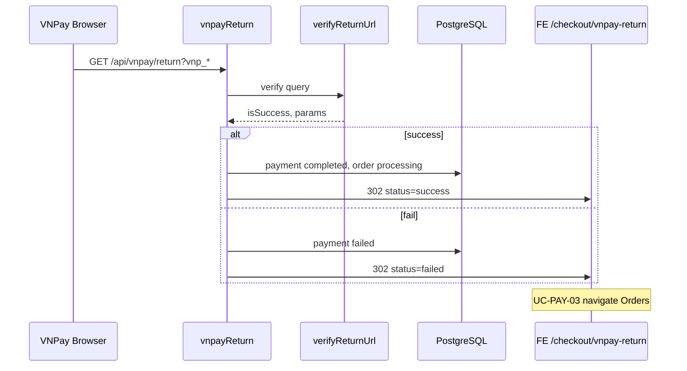

# Use Case — UC-PAY-02: Xử lý VNPay Return URL (Process VNPay Return Callback)

| Thuộc tính | Giá trị |
|------------|---------|
| **ID** | UC-PAY-02 |
| **Tên** | Nhận callback trình duyệt từ VNPay, xác minh chữ ký, cập nhật DB, redirect FE |
| **Mức độ ưu tiên** | **Rất cao** — nguồn sự thật duy nhất cho trạng thái **đã thanh toán** (không có IPN) |
| **Phiên bản** | Bám code hiện tại |
| **Liên quan FR** | `FR_ProcessVNPayReturn.md` |
| **Liên quan UC** | UC-PAY-01, UC-PAY-03, UC-ORD-03, UC-ORD-10 |

---

## 1. Mô tả ngắn

Sau khi khách thanh toán trên cổng VNPay, **trình duyệt** được redirect tới **backend** (cấu hình `vnp_ReturnUrl` / `VNPAY_RETURN_URL`):

```
GET /api/vnpay/return?vnp_Amount=...&vnp_TxnRef=...&vnp_ResponseCode=...&vnp_SecureHash=...&vnp_TransactionNo=...
Handler: vnpayController.vnpayReturn
```

Luồng:

1. **`verifyReturnUrl(req.query)`** — HMAC-SHA512 + `vnp_ResponseCode === "00"`.
2. Parse **`order_id`** từ `vnp_TxnRef` (format `{orderId}-{timestamp}`).
3. Cập nhật **`payments`** và **`orders`** (nếu thành công).
4. **HTTP 302** → `{FE_APP_URL}/checkout/vnpay-return?status=...&orderId=...`.

**Không có IPN** (`POST /api/vnpay/ipn`) trong codebase — nếu user đóng tab trước redirect, trạng thái có thể tạm lệch đến khi retry/cron.

---

## 2. Tác nhân

| Tác nhân | Vai trò |
|----------|---------|
| **VNPay Gateway** | Redirect browser kèm query `vnp_*` |
| **vnpayService.verifyReturnUrl** | Kiểm tra chữ ký + mã phản hồi |
| **vnpayController.vnpayReturn** | Persistence + redirect |
| **Order / Payment models** | `processing` / `completed` / `failed` |
| **releaseReservations cron** | Có thể hủy đơn 24h — race với return muộn |
| **VnpayReturn.jsx** | FE nhận redirect (UC-PAY-03) |

---

## 3. Preconditions

| # | Điều kiện |
|---|-----------|
| PRE-01 | User đã từng mở URL thanh toán với `vnp_TxnRef` hợp lệ |
| PRE-02 | VNPay gửi đủ query params + `vnp_SecureHash` |
| PRE-03 | `VNPAY_SECRET_KEY` (service) khớp cổng đã ký |
| PRE-04 | Thường đã có bản ghi `orders` + `payments` (tạo lúc checkout) |

---

## 4. Postconditions

### Thành công (`isSuccess === true`)

| # | Kết quả |
|---|---------|
| POST-01 | `payment.payment_status = completed` (nếu chưa completed) |
| POST-02 | `payment.txn_ref`, `transaction_id`, `paid_at` cập nhật |
| POST-03 | `order.status = processing` |
| POST-04 | Redirect `status=success&orderId=...` |

### Thất bại (hash sai hoặc `vnp_ResponseCode` ≠ `00`)

| # | Kết quả |
|---|---------|
| POST-F01 | `payment.payment_status = failed` (nếu có payment row) |
| POST-F02 | `order.status` **thường giữ** `AWAITING_PAYMENT` |
| POST-F03 | Redirect `status=failed&orderId=...` |

### Không parse được orderId

| # | Kết quả |
|---|---------|
| POST-E01 | Redirect `status=failed&orderId=unknown` |

### Exception trong handler

| # | Kết quả |
|---|---------|
| POST-E02 | Redirect `{FE}/orders?error=unknown` — **không** qua VnpayReturn |

---

## 5. Trigger

VNPay gọi Return URL (GET) khi user hoàn tất / hủy / lỗi trên cổng — **browser redirect**, không phải server-to-server IPN.

---

## 6. Luồng chính — Xác minh chữ ký

```javascript
const { isSuccess, vnp_Params } = verifyReturnUrl({ ...req.query });
```

| Bước | Logic |
|------|--------|
| 1 | Clone params, lấy `vnp_SecureHash` |
| 2 | Xóa `vnp_SecureHash`, `vnp_SecureHashType` |
| 3 | `sortObject` + `qs.stringify` |
| 4 | HMAC-SHA512 với `config.secretKey` |
| 5 | `isSuccess = (hash khớp) && (vnp_ResponseCode === "00")` |

**Không kiểm tra:** `vnp_Amount` vs `payments.amount`, `vnp_TmnCode`, thời hạn `txnRef`.

---

## 7. Luồng chính — Parse order ID

```javascript
const txnRef = vnp_Params["vnp_TxnRef"] || "";
const orderId = txnRef.split("-")[0];
```

| Ví dụ txnRef | orderId |
|--------------|---------|
| `42-1710000000000` | `42` |

**Giả định:** `order_id` số nguyên, không chứa `-`.

---

## 8. Nhánh thành công

```javascript
if (isSuccess) {
  const order = await Order.findByPk(orderId);
  const payment = await Payment.findOne({ where: { order_id: orderId } });

  if (order && payment) {
    if (payment.payment_status !== "completed") {
      payment.payment_status = "completed";
      payment.txn_ref = txnRef;
      payment.transaction_id = vnp_Params["vnp_TransactionNo"] || null;
      payment.paid_at = new Date();
      await payment.save();

      order.status = "processing";
      await order.save();
    }
  }

  return res.redirect(
    `${frontendUrl}/checkout/vnpay-return?status=success&orderId=${encodeURIComponent(orderId)}`
  );
}
```

| Quy tắc | Chi tiết |
|---------|----------|
| Idempotent | Đã `completed` → skip update, vẫn redirect success |
| Order status | **`processing`** — không dùng enum `PAID` |
| Reserve | **Không** clear `reserve_expires_at` |
| Transaction | **Không** bọc transaction — race với cron có thể |
| Thiếu order/payment | Vẫn redirect **success** nếu `isSuccess` — DB có thể không đổi |

---

## 9. Nhánh thất bại

```javascript
else {
  const payment = await Payment.findOne({ where: { order_id: orderId } });
  if (payment) {
    payment.payment_status = "failed";
    await payment.save();
  }
  return res.redirect(
    `${frontendUrl}/checkout/vnpay-return?status=failed&orderId=${encodeURIComponent(orderId)}`
  );
}
```

| Hiện tượng | Ghi chú |
|------------|---------|
| `order.status` | Không đổi → thường `AWAITING_PAYMENT` |
| Tab FE `failed` | Filter `order.status === FAILED` — **mismatch** với payment failed + order awaiting |
| Kho | Vẫn đã trừ lúc tạo đơn — user hủy hoặc chờ cron 24h |

Hash không hợp lệ cũng vào nhánh `else` (`isSuccess === false`).

---

## 10. Error handler

```javascript
catch (error) {
  console.error("VNPAY Return Error:", error);
  return res.redirect(`${frontendUrl}/orders?error=unknown`);
}
```

User vào **`/orders`** trực tiếp — không qua `VnpayReturn`, query `error=unknown` **không** được OrdersPage xử lý đặc biệt.

---

## 11. Tương tác cron `releaseReservations`

Job `*/2 * * * *` — đơn `AWAITING_PAYMENT` quá `reserve_expires_at`:

| Hành động cron | Giá trị |
|----------------|---------|
| Hoàn kho | `increment stock_quantity` |
| Payment | `failed` (VNPAY pending) |
| Order | `cancelled` |

**Race:** Return success sau khi cron hủy có thể set lại `processing` + `completed` nếu payment chưa completed — cần QA thực tế.

---

## 12. Bảng trạng thái sau sự kiện

| Sự kiện | order.status | payment.payment_status | Stock |
|---------|--------------|------------------------|-------|
| Return success | processing | completed | Giữ trừ |
| Return fail | AWAITING (thường) | failed | Giữ trừ |
| Cron expire | cancelled | failed | Hoàn |
| User cancel awaiting | cancelled | failed | Hoàn |

---

## 13. Redirect frontend

```javascript
const frontendUrl = process.env.FE_APP_URL || "http://localhost:3000";
```

| Kết quả | URL |
|---------|-----|
| Success | `/checkout/vnpay-return?status=success&orderId={id}` |
| Fail | `/checkout/vnpay-return?status=failed&orderId={id}` |
| No orderId | `...&orderId=unknown` |
| Exception | `/orders?error=unknown` |

---

## 14. Sơ đồ sequence



---

## 15. Auth & routing

```javascript
// vnpayRoutes.js — public, không JWT
router.get("/vnpay/return", vnpayController.vnpayReturn);
```

Đúng thiết kế callback VNPay (gateway không gửi Bearer token).

---

## 16. Fields không cập nhật

| Field | Model | Ghi chú |
|-------|-------|---------|
| `raw_return` | Payment | Có cột JSONB — **không** gán trong handler |
| `raw_ipn` | Payment | IPN chưa có |
| `reserve_expires_at` | Order | Không clear sau paid |
| `payment_method` | Payment | Giữ giá trị lúc tạo đơn |

---

## 17. Ánh xạ mã nguồn

| Thành phần | Đường dẫn |
|------------|-----------|
| Handler | `server/controllers/vnpayController.js` — `vnpayReturn` |
| Verify | `server/services/vnpayService.js` — `verifyReturnUrl` |
| Route | `server/routes/vnpayRoutes.js` |
| Cron | `server/jobs/releaseReservations.js` |
| Models | `server/models/Order.js`, `Payment.js` |
| FE đích | `client/app/pages/checkout/VnpayReturn.jsx` |

---

## 18. Known gaps

| # | Gap |
|---|-----|
| GAP-01 | **Không IPN** — đóng tab trước redirect → có thể chưa `completed` dù VNPay đã thu |
| GAP-02 | Fail không set `order.FAILED` — tab Orders `failed` thường trống |
| GAP-03 | Không verify amount / TMN code |
| GAP-04 | Không lưu `raw_return` audit |
| GAP-05 | Success khi thiếu order/payment vẫn redirect success |
| GAP-06 | Không clear `reserve_expires_at` sau paid |
| GAP-07 | Race cron 24h vs return muộn |
| GAP-08 | Exception → `/orders?error=unknown` bỏ qua VnpayReturn |
| GAP-09 | Không gửi email xác nhận thanh toán tại return (email lúc create order) |
| GAP-10 | Master spec `PAID` / `success` vs code `processing` / `completed` |

---

## 19. Tiêu chí chấp nhận

- [ ] `vnp_ResponseCode=00` + hash đúng → payment completed, order processing
- [ ] Hash sai → payment failed, redirect failed
- [ ] Gọi return lần 2 khi đã completed → không corrupt
- [ ] `vnp_TransactionNo` → `payment.transaction_id`
- [ ] Redirect đúng `status` và `orderId` query

---

## 20. Liên kết luồng end-to-end

```text
Checkout POST /orders (VNPAY) → redirect VNPay
  → GET /api/vnpay/return (UC-PAY-02)
  → /checkout/vnpay-return (UC-PAY-03)
  → /orders?tab=to_ship | failed
```

Retry / đổi COD→VNPAY dùng **cùng** return handler với `txnRef` mới.
