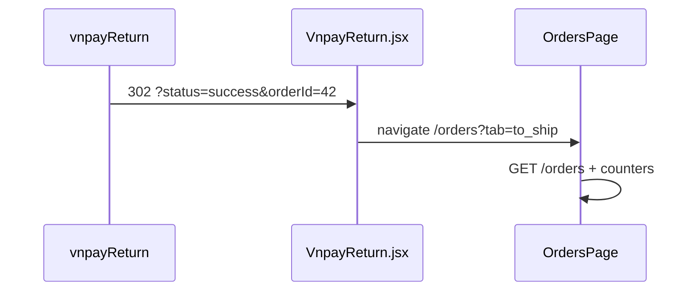

# Use Case — UC-PAY-03: Xem trang kết quả VNPay (View VNPay Return Result Page)

| Thuộc tính | Giá trị |
|------------|---------|
| **ID** | UC-PAY-03 |
| **Tên** | Trang trung gian FE sau redirect từ backend Return URL |
| **Mức độ ưu tiên** | Cao |
| **Phiên bản** | Bám code hiện tại |
| **Liên quan FR** | `FR_VNPayReturnPage.md` |
| **Liên quan UC** | UC-PAY-02 (BE callback), UC-ORD-01 (Orders tabs) |

> **Ghi chú:** Yêu cầu gốc liệt kê `UC_ProcessVNPayReturnCallback.md` hai lần. File thứ ba được đặt tên **`UC_ViewVNPayReturnResultPage.md`** để mô tả **phía frontend** sau UC-PAY-02 — hoàn chỉnh vòng đời thanh toán VNPay.

---

## 1. Mô tả ngắn

Sau khi **`vnpayReturn`** (UC-PAY-02) xử lý chữ ký và cập nhật DB, browser nhận **HTTP 302** tới:

```
/checkout/vnpay-return?status=success|failed&orderId={id}
Component: VnpayReturn.jsx
```

Trang **không gọi API**, **không** verify lại VNPay. Comment trong code: backend đã xử lý xong — FE chỉ **điều hướng** tới tab đơn hàng phù hợp:

| `status` | Đích |
|----------|------|
| `success` | `/orders?tab=to_ship` |
| `failed` | `/orders?tab=failed` |
| (thiếu) | Countdown 5s → `/orders` |

**Khác `CheckoutSuccessPage`:** COD dùng `/checkout/success` + `location.state`; VNPay dùng UC này.

---

## 2. Tác nhân

| Tác nhân | Vai trò |
|----------|---------|
| **Browser** | Nhận redirect 302 từ BE |
| **VnpayReturn.jsx** | Parse query, `navigate` |
| **OrdersPage** | Hiển thị list theo tab |
| **User** | Thấy spinner ngắn (flash redirect) |

---

## 3. Preconditions

| # | Điều kiện |
|---|-----------|
| PRE-01 | UC-PAY-02 đã redirect với query `status` (hoặc user mở URL thủ công) |
| PRE-02 | User thường **đã login** (đã checkout trước khi sang VNPay) — route **không** ép JWT |
| PRE-03 | Để xem `/orders` có nội dung → cần session còn hiệu lực |

---

## 4. Postconditions

| # | Kết quả |
|---|---------|
| POST-01 | User kết thúc tại `OrdersPage` tab `to_ship` (success) |
| POST-02 | User kết thúc tại tab `failed` (failed) — có thể **trống** (GAP tab filter) |
| POST-03 | Thiếu `status` → sau ≤5s về `/orders` tab mặc định |
| POST-E01 | Session hết hạn → ProtectedRoute `/orders` đẩy login |

---

## 5. Trigger

Redirect từ backend:

```text
${FE_APP_URL}/checkout/vnpay-return?status=success&orderId=42
${FE_APP_URL}/checkout/vnpay-return?status=failed&orderId=42
${FE_APP_URL}/checkout/vnpay-return?status=failed&orderId=unknown
```

Hoặc user bookmark / share URL (edge).

---

## 6. Luồng chính

| Bước | Hành động |
|------|-----------|
| 1 | Mount `VnpayReturn` — `useLocation().search` |
| 2 | `URLSearchParams`: `status`, `orderId` |
| 3 | `useEffect`: nếu `status === "success"` → `navigate("/orders?tab=to_ship", { replace: true })` |
| 4 | Nếu `status === "failed"` → `navigate("/orders?tab=failed", { replace: true })` |
| 5 | UI hiển thị tạm: tiêu đề, OrderId, Status, `LoadingSpinner` |
| 6 | User thấy Orders list (refetch khi vào trang protected) |

### Code điều hướng (rút gọn)

```javascript
useEffect(() => {
  if (status === "success") {
    navigate("/orders?tab=to_ship", { replace: true });
    return;
  }
  if (status === "failed") {
    navigate("/orders?tab=failed", { replace: true });
    return;
  }
  const t = setInterval(() => setCountdown((c) => Math.max(0, c - 1)), 1000);
  return () => clearInterval(t);
}, [status, navigate]);

useEffect(() => {
  if (countdown === 0) navigate("/orders", { replace: true });
}, [countdown, navigate]);
```

---

## 7. Query parameters

| Param | Giá trị | Nguồn |
|-------|---------|--------|
| `status` | `success` \| `failed` | BE sau `verifyReturnUrl` |
| `orderId` | PK đơn (string) | `txnRef.split("-")[0]` |

**Không truyền:** `order_code`, `final_amount`, message VNPay, `vnp_ResponseCode` raw.

---

## 8. UI hiển thị (flash)

| Element | Nội dung |
|---------|----------|
| Tiêu đề | “Đang xử lý kết quả thanh toán” |
| OrderId | Hiển thị query hoặc `-` |
| Status | success / failed / `-` |
| Thiếu status | “Tự chuyển về đơn hàng sau {countdown}s…” |
| Spinner | “Đang điều hướng…” |

Do `navigate` trong `useEffect` ngay khi có `status`, user **có thể không kịp đọc** — UX flash.

---

## 9. Luồng thay thế

### ALT-01 — Backend exception (UC-PAY-02)

Redirect ` /orders?error=unknown` — **không** mount `VnpayReturn` → UC-PAY-03 không chạy.

### ALT-02 — Mở URL không có `status`

Countdown 5 giây → `/orders` (không `tab`).

### ALT-03 — `orderId=unknown`

Vẫn navigate theo `status`; list không deep-link chi tiết đơn.

### ALT-04 — Success nhưng chưa login

`/orders` → `ProtectedRoute` → `/login` — mất context return.

---

## 10. Mapping tab Orders sau redirect

### `status=success` → `tab=to_ship`

Tab **“Chờ giao hàng”** filter BE (`getUserOrdersV2`):

- `order.status = processing`
- COD + `payment.pending` **hoặc** VNPAY + `payment.completed`

Sau return success: order **processing** + payment **completed** → **khớp** tab `to_ship`.

### `status=failed` → `tab=failed`

Tab filter `order.status === FAILED`.

Return fail chỉ set `payment.failed`, order thường vẫn **`AWAITING_PAYMENT`** → tab **failed có thể rỗng** (GAP đồng bộ BE/FE).

---

## 11. So sánh với CheckoutSuccessPage

| | **VnpayReturn** | **CheckoutSuccessPage** |
|---|-----------------|-------------------------|
| Route | `/checkout/vnpay-return` | `/checkout/success` |
| Dữ liệu | Query string | `location.state` |
| API | Không | Không |
| PT | VNPay | COD (chính) |
| Đích | Orders tabs | `/orders` list hoặc `/` |
| CTA chi tiết đơn | Không | Không (chỉ list) |

---

## 12. Routing

```jsx
// App.jsx — KHÔNG ProtectedRoute
<Route path="checkout/vnpay-return" element={<VnpayReturn />} />
```

| Route | Auth |
|-------|------|
| `/checkout` | Protected |
| `/checkout/vnpay-return` | Public |
| `/orders` | Protected |

---

## 13. React Query / cache

`VnpayReturn` **không** gọi `invalidateQueries`. `OrdersPage` fetch lại khi mount — thường đủ nếu user vẫn logged in.

**Gap:** Nếu cache stale ngắn, có thể thấy trạng thái cũ vài giây trước refetch.

---

## 14. Sơ đồ



---

## 15. Ánh xạ mã nguồn

| Thành phần | Đường dẫn |
|------------|-----------|
| Page | `client/app/pages/checkout/VnpayReturn.jsx` |
| Route | `client/app/App.jsx` |
| BE redirect | `server/controllers/vnpayController.js` |
| Orders UI | `client/app/pages/OrdersPage.jsx` |
| Tab utils | `client/app/utils/orderTabs.js` |

---

## 16. Known gaps

| # | Gap |
|---|-----|
| GAP-01 | Flash redirect — hầu như không có UX “thanh toán thành công” |
| GAP-02 | Tab `failed` **mismatch** với BE (payment failed, order awaiting) |
| GAP-03 | Không deep-link `/orders/:orderId` dù có `orderId` query |
| GAP-04 | Không invalidate React Query tại return page |
| GAP-05 | `orderId` hiển thị nhưng không dùng cho navigation |
| GAP-06 | Exception BE → `/orders?error=unknown` không xử lý trên OrdersPage |
| GAP-07 | Public route — có thể spam URL (vô hại, chỉ redirect) |
| GAP-08 | Không hiển thị `order_code` thân thiện |

---

## 17. Tiêu chí chấp nhận

- [ ] `?status=success` → vào Orders tab to_ship, đơn VNPay processing + paid hiển thị
- [ ] `?status=failed` → navigate tab failed (chấp nhận list có thể trống — bug known)
- [ ] Không `status` → về `/orders` sau countdown
- [ ] Không gọi API từ VnpayReturn (network tab sạch)

---

## 18. Cải thiện đề xuất (ngoài scope code)

1. Trang success vài giây + nút “Xem đơn #order_code” → `/orders/:id`.
2. Invalidate `orders`, `order-counters` trước navigate.
3. Đồng bộ tab failed với `payment.failed` hoặc set `order.FAILED` ở BE return.
4. Map `error=unknown` trên OrdersPage thành toast.
