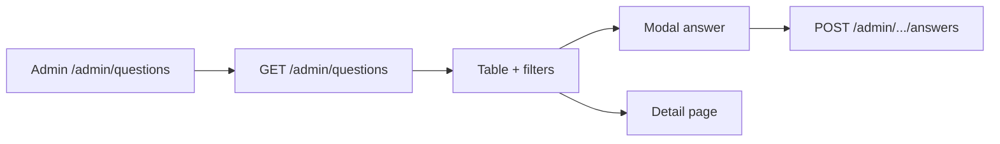

# Use Case — UC-QA-03: Admin duyệt danh sách câu hỏi (Admin Browse Questions)

| Thuộc tính | Giá trị |
|------------|---------|
| **ID** | UC-QA-03 |
| **Tên** | Quản trị xem, lọc, phân trang danh sách câu hỏi |
| **Mức độ ưu tiên** | Cao |
| **Phiên bản** | Bám code hiện tại |
| **Liên quan FR** | `FR_AdminListQuestions.md` |
| **Liên quan UC** | UC-QA-02, UC-QA-01 |

---

## 1. Mô tả ngắn

User **`admin`** hoặc **`manager`** (middleware `authorizeRoles`) mở **`/admin/questions`** (`AdminQuestions.jsx`). Trang gọi:

```
GET /api/admin/questions?page=&limit=&answered=&has_product=&sort_by=&sort_order=
Authorization: Bearer <JWT>
```

Trả danh sách câu hỏi **mọi loại** (global + product), kèm preview answers, user, product. Admin lọc trạng thái trả lời, loại câu hỏi (có/không SP), sort, pagination — và có thể **trả lời nhanh** qua modal hoặc **xem chi tiết**.

**Không** include `children` follow-up trong list API.

---

## 2. Tác nhân

| Tác nhân | Vai trò |
|----------|---------|
| **Admin / Manager** | Duyệt Q&A |
| **questionsController.getAllQuestions** | List + filter |
| **AdminQuestions.jsx** | UI table, filters, modal |
| **useAdminQuestions** | React Query hook |

---

## 3. Preconditions

| # | Điều kiện |
|---|-----------|
| PRE-01 | JWT + role `admin` hoặc `manager` |
| PRE-02 | `AdminRoute` cho phép truy cập |
| PRE-03 | Route mount `GET /admin/questions` |

**Staff** role **không** vào được `/admin/*` — chỉ trả lời trên PDP (UC-QA-04).

---

## 4. Postconditions

| # | Kết quả |
|---|---------|
| POST-01 | Bảng hiển thị tối đa `limit` (20) câu / trang |
| POST-02 | Badge Đã/Chưa trả lời |
| POST-03 | Pagination khi `totalPages > 1` |
| POST-04 | Có thể mở modal trả lời hoặc navigate detail |

---

## 5. Trigger

Navigate menu Admin **「Q&A」** → `/admin/questions`.

---

## 6. Query parameters (BE)

| Param | Giá trị | Effect |
|-------|---------|--------|
| `page` | default 1 | Offset tính từ page |
| `limit` | default 20 | Page size |
| `answered` | `true` / `false` | Filter `is_answered` |
| `has_product` | `true` | `product_id IS NOT NULL` |
| `has_product` | `false` | `product_id IS NULL` (global) |
| `sort_by` | `created_at`, `updated_at`, `question_id` | Sort field |
| `sort_order` | `ASC` / `DESC` | |

```javascript
const { count, rows } = await Question.findAndCountAll({
  where,
  include: [User, Product (optional), Answers + User],
  limit, offset,
  order: [[sortField, sortOrder], ['created_at', 'DESC']],
});
```

### Response

```json
{
  "questions": [ /* ... */ ],
  "pagination": {
    "total": 120,
    "page": 1,
    "limit": 20,
    "totalPages": 6
  }
}
```

---

## 7. Luồng chính (FE)

### Hook

```javascript
useAdminQuestions({
  page,
  limit: 20,
  answered: answeredFilter === 'all' ? undefined : answeredFilter,
  has_product: productFilter === 'all' ? undefined : productFilter,
  sort_by: sortBy,
  sort_order: sortOrder,
});
```

### Filters UI

| Filter state | Label |
|--------------|-------|
| `answeredFilter` | all / true / false |
| `productFilter` | all / true (có SP) / false (câu chung) |
| `sortBy`, `sortOrder` | Click header sort |

### Bảng cột

| Cột | Nội dung |
|-----|----------|
| # | STT |
| Câu hỏi | truncate + số answers |
| Khách hàng | full_name, email |
| Sản phẩm | product_name hoặc「Câu hỏi chung」 |
| Ngày | created_at |
| Trạng thái | badge answered |
| Thao tác | Eye (detail), MessageSquare (modal trả lời nếu chưa answered) |

### Actions

| Nút | Hành động |
|-----|-----------|
| Eye | `navigate(/admin/questions/:id)` — UC-QA-02 |
| MessageSquare | Mở `answerModal` — `useCreateAnswer` |
| Làm mới | `refetch()` |

---

## 8. Luồng thay thế

### ALT-01 — Đã trả lời

Icon CheckCircle thay nút trả lời — vào detail để sửa answer (UC-QA-01 nếu route mount).

### ALT-02 — `handleDeleteAnswer` trong file

Hàm + hook `useDeleteAnswer` **import** nhưng **không** gắn UI trong bảng list — chỉ dùng ở detail page.

---

## 9. Sơ đồ



---

## 10. Routing & bảo mật

```javascript
// adminRoutes.js
router.use(authenticateToken);
router.use(authorizeRoles("admin", "manager"));
router.get("/questions", questionsController.getAllQuestions);
```

```jsx
// AdminRoute.jsx — menu Q&A → /admin/questions
```

---

## 11. Ánh xạ mã nguồn

| Thành phần | Đường dẫn |
|------------|-----------|
| Controller | `server/controllers/questionsController.js` — `getAllQuestions` |
| Routes | `server/routes/adminRoutes.js` |
| Hook | `client/app/hooks/useQuestions.js` — `useAdminQuestions` |
| Page | `client/app/pages/admin/AdminQuestions.jsx` |

---

## 12. Known gaps

| # | Gap |
|---|-----|
| GAP-01 | **Staff** không vào admin list |
| GAP-02 | List không hiện follow-up tree |
| GAP-03 | `deleteAnswer` hook unused trên list page |
| GAP-04 | Không search theo text/email |
| GAP-05 | `staleTime: 0` — refetch mỗi mount |
| GAP-06 | Modal trả lời không chặn duplicate answer (admin create) |

---

## 13. Tiêu chí chấp nhận

- [ ] Admin login → thấy list
- [ ] Filter「Chưa trả lời」chỉ hiện `is_answered=false`
- [ ] Filter「Câu hỏi chung」→ `product_id` null
- [ ] Pagination đổi trang
- [ ] Staff user → 403 admin routes
