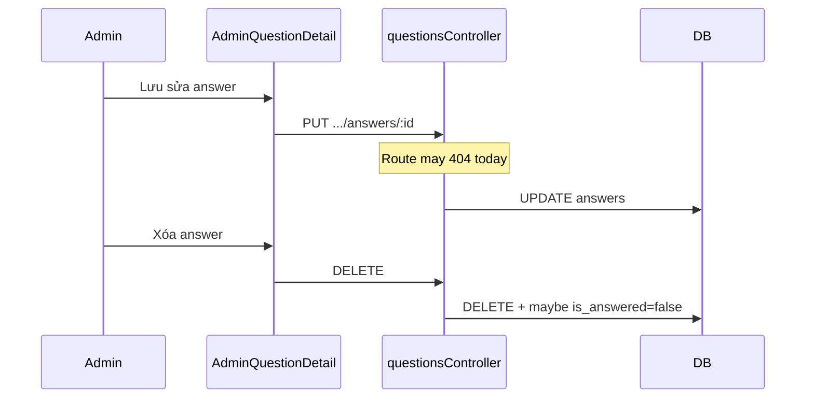

# Use Case — UC-QA-01: Admin sửa / xóa câu trả lời (Admin Edit Or Delete Answer)

| Thuộc tính | Giá trị |
|------------|---------|
| **ID** | UC-QA-01 |
| **Tên** | Chỉnh sửa hoặc xóa câu trả lời trên trang chi tiết admin |
| **Mức độ ưu tiên** | Trung bình |
| **Phiên bản** | Bám code hiện tại |
| **Liên quan FR** | `FR_AdminUpdateAnswer.md`, `FR_AdminDeleteAnswer.md` |
| **Liên quan UC** | UC-QA-02 |

---

## 1. Mô tả ngắn

Trên **`AdminQuestionDetail.jsx`**, admin/manager có thể **sửa** hoặc **xóa** từng câu trả lời trong danh sách. FE gọi qua hooks:

```
PUT    /api/admin/questions/:question_id/answers/:answer_id
DELETE /api/admin/questions/:question_id/answers/:answer_id
Body (PUT): { "answer_text": "..." }
```

Logic BE đã implement trong **`questionsController.updateAnswer`** và **`deleteAnswer`**.

**Trạng thái triển khai quan trọng:** Hai route PUT/DELETE **chưa được đăng ký** trong `adminRoutes.js` (chỉ có POST create). FE gọi sẽ **404** cho đến khi mount route — UC mô tả **cả thiết kế controller** và **gap routing**.

---

## 2. Tác nhân

| Tác nhân | Vai trò |
|----------|---------|
| **Admin / Manager** | Sửa/xóa answer |
| **updateAnswer / deleteAnswer** | Controller handlers |
| **useUpdateAnswer / useDeleteAnswer** | React Query mutations |
| **AdminQuestionDetail** | Inline edit UI |

---

## 3. Preconditions

| # | Điều kiện |
|---|-----------|
| PRE-01 | JWT + admin/manager |
| PRE-02 | Answer thuộc `question_id` trong URL |
| PRE-03 | PUT: `answer_text` non-empty trim |
| PRE-04 | DELETE: user confirm (`confirm()` dialog) |

---

## 4. Postconditions

### PUT thành công

| # | Kết quả |
|---|---------|
| POST-U01 | `answers.answer_text` cập nhật |
| POST-U02 | `updated_at` thay đổi |
| POST-U03 | Invalidate admin-questions queries |

### DELETE thành công

| # | Kết quả |
|---|---------|
| POST-D01 | Answer row xóa |
| POST-D02 | Nếu không còn answer → `questions.is_answered = false` |
| POST-D03 | UI list answers cập nhật sau invalidate |

### Thất bại (hiện tại thường gặp)

| # | Kết quả |
|---|---------|
| POST-E01 | **404** — route chưa mount |

---

## 5. Trigger

| Hành động | UI |
|-----------|-----|
| Sửa | Icon Edit → textarea inline →「Lưu」 |
| Xóa | Icon Trash → `confirm` → delete |

---

## 6. Luồng chính — updateAnswer (BE)

```javascript
exports.updateAnswer = async (req, res, next) => {
  const { question_id, answer_id } = req.params;
  const { answer_text } = req.body;

  if (!answer_text || answer_text.trim().length === 0) {
    return res.status(400).json({ message: 'Answer text is required' });
  }

  const answer = await Answer.findOne({
    where: { answer_id, question_id },
  });
  if (!answer) return res.status(404).json({ message: 'Answer not found' });

  await answer.update({ answer_text: answer_text.trim() });
  res.json({ message: 'Answer updated successfully', answer });
};
```

---

## 7. Luồng chính — deleteAnswer (BE)

```javascript
exports.deleteAnswer = async (req, res, next) => {
  const answer = await Answer.findOne({
    where: { answer_id, question_id },
  });
  if (!answer) return res.status(404).json({ message: 'Answer not found' });

  await answer.destroy();

  const remainingAnswers = await Answer.count({ where: { question_id } });
  if (remainingAnswers === 0) {
    await Question.update({ is_answered: false }, { where: { question_id } });
  }

  res.json({ message: 'Answer deleted successfully' });
};
```

| Rule | Ý nghĩa |
|------|---------|
| BR-01 | Xóa hết answers → câu hỏi lại「Chưa trả lời」 |
| BR-02 | Không xóa question row — chỉ answer |
| BR-03 | Khác `productController.deleteQuestion` (xóa cả question + answers) |

---

## 8. Luồng chính (FE)

### useUpdateAnswer

```javascript
mutationFn: async ({ questionId, answerId, answerText }) => {
  const { data } = await api.put(
    `/admin/questions/${questionId}/answers/${answerId}`,
    { answer_text: answerText }
  );
  return data;
},
```

### useDeleteAnswer

```javascript
mutationFn: async ({ questionId, answerId }) => {
  const { data } = await api.delete(
    `/admin/questions/${questionId}/answers/${answerId}`
  );
  return data;
},
```

### Inline edit state

```javascript
const [editingAnswer, setEditingAnswer] = useState({ id: null, text: '' });
// Edit → set id + text
// Save → handleUpdateAnswer(answerId)
// Cancel → clear editing state
```

---

## 9. Route gap (cần mount để UC hoạt động)

**Hiện có trong `adminRoutes.js`:**

```javascript
router.post("/questions/:question_id/answers", questionsController.createAnswer);
```

**Thiếu (theo FR / hooks):**

```javascript
router.put("/questions/:question_id/answers/:answer_id", questionsController.updateAnswer);
router.delete("/questions/:question_id/answers/:answer_id", questionsController.deleteAnswer);
```

---

## 10. So sánh xóa answer vs xóa question

| | **deleteAnswer (admin)** | **deleteQuestion (productController)** |
|---|--------------------------|----------------------------------------|
| Route | `/admin/.../answers/:id` (chưa mount) | Không mount public |
| Phạm vi | 1 answer | Whole question + all answers |
| `is_answered` | false nếu hết answer | question row gone |
| Quyền | admin/manager route | owner hoặc admin/staff |

---

## 11. Sơ đồ



---

## 12. Ánh xạ mã nguồn

| Thành phần | Đường dẫn |
|------------|-----------|
| updateAnswer | `server/controllers/questionsController.js` |
| deleteAnswer | `server/controllers/questionsController.js` |
| Routes (partial) | `server/routes/adminRoutes.js` |
| Hooks | `client/app/hooks/useQuestions.js` |
| UI | `client/app/pages/admin/AdminQuestionDetail.jsx` |
| Unused import | `AdminQuestions.jsx` — `handleDeleteAnswer` không gắn UI |

---

## 13. Known gaps

| # | Gap |
|---|-----|
| GAP-01 | **PUT/DELETE routes chưa mount** — FE 404 |
| GAP-02 | `AdminQuestions` list import `deleteAnswer` nhưng không dùng |
| GAP-03 | PDP staff **không** sửa/xóa answer (chỉ admin detail) |
| GAP-04 | Nhiều answers / question (admin create) — xóa 1 không reset logic phức tạp |
| GAP-05 | Không audit log ai sửa answer |
| GAP-06 | `updateAnswer` response trả answer chưa reload `user` include |

---

## 14. Tiêu chí chấp nhận

- [ ] Sau khi mount routes: sửa text → persist DB
- [ ] Xóa answer cuối → `is_answered=false` trên question
- [ ] Confirm trước khi xóa
- [ ] 404 answer_id sai
- [ ] (Hiện tại) Xác nhận PUT/DELETE trả 404 nếu chưa mount — document as known issue

---

## 15. Việc cần làm để hoàn thiện (tham khảo, ngoài scope doc)

Thêm vào `adminRoutes.js`:

```javascript
router.put("/questions/:question_id/answers/:answer_id", questionsController.updateAnswer);
router.delete("/questions/:question_id/answers/:answer_id", questionsController.deleteAnswer);
```

Không đổi contract hooks FE hiện tại.
