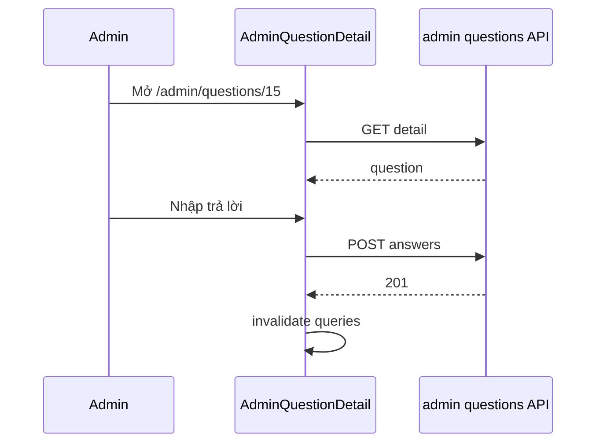

# Use Case — UC-QA-02: Admin xem chi tiết và trả lời câu hỏi (Admin View And Answer Question)

| Thuộc tính | Giá trị |
|------------|---------|
| **ID** | UC-QA-02 |
| **Tên** | Xem chi tiết một câu hỏi và tạo câu trả lời từ admin panel |
| **Mức độ ưu tiên** | Cao |
| **Phiên bản** | Bám code hiện tại |
| **Liên quan FR** | `FR_AdminViewQuestionDetail.md`, `FR_AdminCreateAnswer.md` |
| **Liên quan UC** | UC-QA-03, UC-QA-01, UC-QA-04 |

---

## 1. Mô tả ngắn

Từ danh sách UC-QA-03, admin/manager mở **`/admin/questions/:question_id`** (`AdminQuestionDetail.jsx`).

**Xem chi tiết:**

```
GET /api/admin/questions/:question_id
```

**Tạo trả lời mới** (khi chưa có hoặc bổ sung — xem GAP duplicate):

```
POST /api/admin/questions/:question_id/answers
Body: { "answer_text": "..." }
```

Handler **`questionsController.createAnswer`** — set `is_answered: true`, **không** kiểm tra answer đã tồn tại (khác product API).

Trang hiển thị: nội dung câu hỏi, thông tin khách, SP liên quan (nếu có), danh sách answers, form trả lời mới.

---

## 2. Tác nhân

| Tác nhân | Vai trò |
|----------|---------|
| **Admin / Manager** | Đọc + trả lời |
| **getQuestionDetail** | Load full question |
| **createAnswer** (admin) | Insert answer |
| **AdminQuestionDetail.jsx** | UI |
| **useAdminQuestionDetail**, **useCreateAnswer** | Hooks |

---

## 3. Preconditions

| # | Điều kiện |
|---|-----------|
| PRE-01 | JWT + admin/manager |
| PRE-02 | `question_id` hợp lệ |
| PRE-03 | Tạo answer: `answer_text` trim khác rỗng |

---

## 4. Postconditions

| # | Kết quả |
|---|---------|
| POST-01 | Hiển thị full question + answers array |
| POST-02 | POST answer → `201`, `is_answered=true` |
| POST-03 | React Query invalidate list + detail |
| POST-04 | Form `newAnswer` cleared |
| POST-E01 | 404 question |
| POST-E02 | 400 empty answer text |

---

## 5. Trigger

- Navigate từ list (icon Eye) hoặc URL trực tiếp.
- Submit form「Gửi câu trả lời」ở cuối trang (khi chưa có answer hoặc admin thêm — GAP).

---

## 6. Luồng chính — GET detail (BE)

```javascript
const question = await Question.findByPk(question_id, {
  include: [
    { model: User, as: 'user', attributes: ['user_id', 'username', 'full_name', 'email'] },
    { model: Product, as: 'product', attributes: ['product_id', 'product_name'] },
    { model: Answer, as: 'answers', include: [User], order: [['created_at', 'ASC']] },
  ],
});
```

**Lưu ý:** Không load `children` follow-up — câu hỏi follow-up là row `questions` riêng, có thể xuất hiện như question độc lập trong admin list.

---

## 7. Luồng chính — POST answer (BE admin)

```javascript
const answer = await Answer.create({
  question_id,
  user_id: adminUser.user_id,
  answer_text: answer_text.trim(),
});
await question.update({ is_answered: true });
```

| Khác product `createAnswer` | |
|-----------------------------|---|
| Không check role admin/staff string trên controller — rely route `authorizeRoles` |
| **Không** 409 nếu đã có answer |

---

## 8. Luồng chính (FE)

```javascript
const { data } = useAdminQuestionDetail(question_id);
const createAnswer = useCreateAnswer();

const handleCreateAnswer = async () => {
  await createAnswer.mutateAsync({
    questionId: question_id,
    answerText: newAnswer,
  });
  setNewAnswer('');
};
```

### UI sections

| Section | Nội dung |
|---------|----------|
| Header | Back, badge Đã/Chưa trả lời |
| Question card | Text, product box, customer email |
| Answers list | Mỗi answer + Edit/Delete buttons (UC-QA-01) |
| New answer form | Textarea + submit (ẩn/hiện tùy UI — thường khi chưa answered) |

### Modal trả lời nhanh (UC-QA-03)

List page cũng gọi cùng `useCreateAnswer` — không cần vào detail.

---

## 9. API contract

### GET detail

```http
GET /api/admin/questions/15
```

```json
{
  "question": {
    "question_id": 15,
    "question_text": "...",
    "is_answered": false,
    "product_id": 3,
    "user": { "full_name": "...", "email": "..." },
    "product": { "product_id": 3, "product_name": "Laptop X" },
    "answers": []
  }
}
```

### POST answer

```http
POST /api/admin/questions/15/answers
{ "answer_text": "Chúng tôi hỗ trợ đổi trả trong 7 ngày." }
```

```json
{
  "message": "Answer created successfully",
  "answer": {
    "answer_id": 8,
    "answer_text": "...",
    "user": { "full_name": "Admin" }
  }
}
```

---

## 10. Sơ đồ



---

## 11. Ánh xạ mã nguồn

| Thành phần | Đường dẫn |
|------------|-----------|
| getQuestionDetail | `questionsController.js` |
| createAnswer | `questionsController.js` |
| Routes | `adminRoutes.js` |
| FE page | `AdminQuestionDetail.jsx` |
| Hooks | `useQuestions.js` |

---

## 12. Known gaps

| # | Gap |
|---|-----|
| GAP-01 | Admin có thể tạo **nhiều** answers — không 409 |
| GAP-02 | Không hiển thị follow-up child trên detail |
| GAP-03 | Không sửa `question_text` trên UI admin (`updateQuestion` chưa route) |
| GAP-04 | `question.user.phone_number` có thể undefined (attributes không select phone) |
| GAP-05 | Trả lời từ admin không sync UX PDP (user cần reload PDP) |

---

## 13. Tiêu chí chấp nhận

- [ ] GET detail → đủ user, product, answers
- [ ] POST answer → badge「Đã trả lời」
- [ ] List page refetch sau create
- [ ] 404 với id sai
