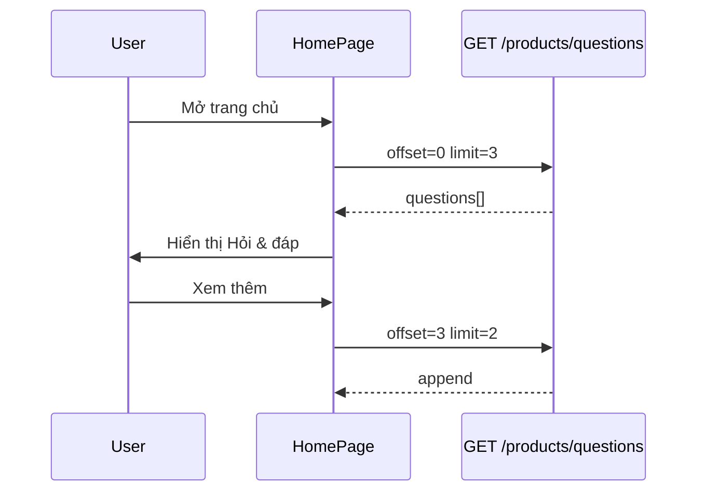

# Use Case — UC-QA-07: Duyệt câu hỏi toàn cục (Browse Global Questions)

| Thuộc tính | Giá trị |
|------------|---------|
| **ID** | UC-QA-07 |
| **Tên** | Xem danh sách Hỏi & đáp trên trang chủ (câu hỏi gốc toàn hệ thống) |
| **Mức độ ưu tiên** | Trung bình |
| **Phiên bản** | Bám code hiện tại |
| **Liên quan FR** | `FR_ListGlobalQuestions.md` |
| **Liên quan UC** | UC-QA-06 (gửi câu hỏi chung), UC-QA-05 (câu hỏi SP cũng có thể xuất hiện) |

---

## 1. Mô tả ngắn

Khách (kể cả **chưa đăng nhập**) mở **`HomePage`** và xem khối **「Hỏi & đáp」** cuối trang. Dữ liệu lấy từ API công khai:

```
GET /api/products/questions?offset=&limit=
```

Backend trả các câu hỏi **gốc** (`parent_question_id IS NULL`) — bao gồm:

- Câu hỏi **global** (`product_id = null`) — đặt từ form trang chủ.
- Câu hỏi **gắn sản phẩm** (đặt trên PDP) nếu vẫn là câu gốc (không phải follow-up).

Mỗi câu kèm `user`, `product` (optional), `answers[]`. **Không** include `children` (follow-up chỉ thấy trên trang chi tiết sản phẩm).

FE: `fetchGlobalQuestions` — `fetch` thuần, **không** React Query; load đầu `limit=3`, nút **「Xem thêm」** `limit=2` + `offset`.

---

## 2. Tác nhân

| Tác nhân | Vai trò |
|----------|---------|
| **Guest / Customer** | Đọc Q&A |
| **getGlobalQuestions** | `productController.getGlobalQuestions` |
| **HomePage.jsx** | UI list, expand answers, load more |

---

## 3. Preconditions

| # | Điều kiện |
|---|-----------|
| PRE-01 | Server chạy, route `GET /api/products/questions` trước `/:id` (đúng thứ tự `productRoutes`) |
| PRE-02 | Có thể có 0 câu hỏi trong DB |

---

## 4. Postconditions

| # | Kết quả |
|---|---------|
| POST-01 | Hiển thị tối đa `limit` câu mỗi lần fetch |
| POST-02 | `qaHasMore` = false khi hết dữ liệu |
| POST-03 | User expand **「Xem phản hồi」** nếu có `answers` |
| POST-E01 | Lỗi mạng → log console, `qaHasMore` false |

---

## 5. Trigger

- `useEffect` mount HomePage: `fetchGlobalQuestions({ offset: 0, limit: 3, append: false })`.
- User bấm **「Xem thêm」** → `loadMoreQuestions`.

---

## 6. Luồng chính (BE)

| Bước | Hành động |
|------|-----------|
| 1 | Parse `page`, `limit` (max 50), `offset` (ưu tiên nếu có) |
| 2 | `where: { parent_question_id: null }` |
| 3 | `findAndCountAll` + include User, Product, Answers |
| 4 | Order: question `created_at DESC`, answers `created_at ASC` |
| 5 | `distinct: true` |
| 6 | JSON: `{ questions, total, page, limit, offset, totalPages }` |

### Response (rút gọn)

```json
{
  "questions": [
    {
      "question_id": 1,
      "product_id": null,
      "question_text": "Có bảo hành quốc tế không?",
      "is_answered": true,
      "created_at": "...",
      "user": { "user_id": 5, "full_name": "Nguyễn A" },
      "product": null,
      "answers": [
        {
          "answer_id": 10,
          "answer_text": "Có, 12 tháng...",
          "user": { "full_name": "Admin" }
        }
      ]
    }
  ],
  "total": 42,
  "offset": 0,
  "limit": 3,
  "totalPages": 14
}
```

---

## 7. Luồng chính (FE)

| Bước | Hành động |
|------|-----------|
| 1 | Render khối Hỏi & đáp dưới form đặt câu hỏi (UC-QA-06) |
| 2 | Map `qaItems` → card: avatar, tên, `timeAgo`, nội dung |
| 3 | Nếu `q.product_id` + `product.product_name` → hiện tên SP |
| 4 | Có answers → nút toggle `openQaReplies[question_id]` |
| 5 | Không answers → text「Chưa có phản hồi」 |
| 6 | Answers hiển thị badge **QTV**, icon Store |
| 7 | Load more: `offset = qaOffset`, append rows |

### Phân trang FE

| Lần | offset | limit |
|-----|--------|-------|
| Initial | 0 | 3 |
| Xem thêm | qaOffset hiện tại | 2 |

---

## 8. Luồng thay thế

### ALT-01 — Danh sách rỗng

「Chưa có câu hỏi nào.」 (khi không loading).

### ALT-02 — Câu hỏi từ PDP xuất hiện trên Home

Do filter chỉ `parent_question_id: null`, **không** lọc `product_id: null` — câu gốc đặt trên sản phẩm vẫn có thể hiện trang chủ kèm tên SP.

### EXC-01 — Không trả lời trên Home

Staff **không** có form trả lời trên HomePage — trả lời qua Admin hoặc PDP (UC-QA-04).

---

## 9. Sơ đồ



---

## 10. Ánh xạ mã nguồn

| Thành phần | Đường dẫn |
|------------|-----------|
| BE | `server/controllers/productController.js` — `getGlobalQuestions` |
| Route | `server/routes/productRoutes.js` — `GET /questions` |
| FE | `client/app/pages/HomePage.jsx` |
| Models | `Question`, `Answer`, `User`, `Product` |

---

## 11. Known gaps

| # | Gap |
|---|-----|
| GAP-01 | Không filter `answered`, search, `product_id` |
| GAP-02 | Follow-up **không** hiện trên Home |
| GAP-03 | `fetch` thuần — không cache React Query |
| GAP-04 | Lỗi fetch chỉ log — không toast user |
| GAP-05 | Global list trộn câu SP + câu global — có thể gây nhầm |
| GAP-06 | Không deep-link từng câu hỏi |

---

## 12. Tiêu chí chấp nhận

- [ ] Guest xem được list không cần login
- [ ] Có ≥4 câu gốc → load more hoạt động
- [ ] Câu đã trả lời → expand thấy answer
- [ ] Câu global và câu SP (gốc) đều có thể xuất hiện
