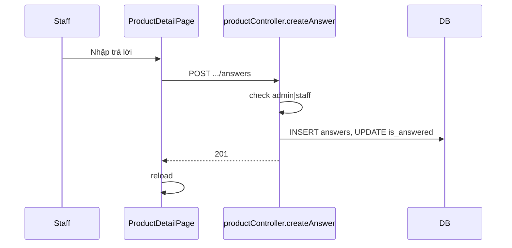

# Use Case — UC-QA-04: Nhân viên trả lời trên trang sản phẩm (Staff Answer On Product Page)

| Thuộc tính | Giá trị |
|------------|---------|
| **ID** | UC-QA-04 |
| **Tên** | Admin/Staff trả lời câu hỏi trực tiếp trên ProductDetailPage |
| **Mức độ ưu tiên** | Cao |
| **Phiên bản** | Bám code hiện tại |
| **Liên quan FR** | `FR_CreateProductQuestion.md` (phần answer) |
| **Liên quan UC** | UC-QA-05, UC-QA-02 (admin trả lời cùng nội dung, API khác) |

---

## 1. Mô tả ngắn

User có role **`admin`** hoặc **`staff`** (đọc từ `localStorage.roles`) trên **`ProductDetailPage`** thấy form trả lời dưới mỗi thread câu hỏi. Submit gọi:

```
POST /api/products/questions/:question_id/answers
Authorization: Bearer <JWT>
Body: { "answer_text": "..." }
```

Handler **`productController.createAnswer`** — **khác** `questionsController.createAnswer` (admin panel).

| Đặc điểm | Product API | Admin API |
|----------|-------------|-----------|
| Path | `/api/products/questions/:id/answers` | `/api/admin/questions/:id/answers` |
| Role | `admin` **hoặc** `staff` | `admin` hoặc `manager` (route admin) |
| Một câu / một answer | **Có** — 409 nếu đã có | **Không check** duplicate |
| Route admin edit/delete | N/A | PUT/DELETE answer **chưa mount** |

---

## 2. Tác nhân

| Tác nhân | Vai trò |
|----------|---------|
| **Staff / Admin** | Trả lời trên PDP |
| **productController.createAnswer** | Role gate + 1 answer limit |
| **ProductDetailPage** | `canAnswer`, `postAnswer` |
| **Customer** | Đọc answer sau reload |

---

## 3. Preconditions

| # | Điều kiện |
|---|-----------|
| PRE-01 | JWT hợp lệ |
| PRE-02 | `req.user.Roles` chứa `admin` hoặc `staff` |
| PRE-03 | `question_id` tồn tại |
| PRE-04 | Chưa có answer cho question (BE) |
| PRE-05 | FE: `canAnswer === true` (`roles` từ localStorage) |

```javascript
const roles = JSON.parse(localStorage.getItem("roles") || "[]");
const canAnswer = roles.includes("admin") || roles.includes("staff");
```

**Lưu ý:** Role **`manager`** có vào admin panel nhưng **không** pass check `createAnswer` product route (chỉ admin/staff).

---

## 4. Postconditions

| # | Kết quả |
|---|---------|
| POST-01 | `answers` row mới, `user_id` = staff |
| POST-02 | `questions.is_answered = true` |
| POST-03 | `201` + `{ answer: { ..., user } }` |
| POST-04 | FE clear draft, `reload()` |
| POST-05 | Follow-up form có thể hiện cho chủ câu hỏi (UC-QA-05) |
| POST-E01 | 403「Only staff can answer」 |
| POST-E02 | 409「This question already has an answer」 |

---

## 5. Trigger

Staff nhập textarea `answerDrafts[question_id]` → bấm gửi trả lời (trong khối thread đã expand).

---

## 6. Luồng chính (BE)

```javascript
const roles = (req.user.Roles || []).map((r) => r.role_name);
const isStaff = roles.includes("admin") || roles.includes("staff");
if (!isStaff) return res.status(403).json({ message: "Only staff can answer" });

const existed = await Answer.findOne({ where: { question_id: q.question_id } });
if (existed) return res.status(409).json({ message: "This question already has an answer" });

const a = await Answer.create({
  question_id: q.question_id,
  user_id: req.user.user_id,
  answer_text: answer_text.trim(),
});
if (!q.is_answered) await q.update({ is_answered: true });
```

| Rule | Chi tiết |
|------|----------|
| BR-01 | Tối đa **1** answer / question (app-level, không unique index model) |
| BR-02 | Follow-up question có thể có answer riêng (question_id khác) |
| BR-03 | Không gửi email thông báo khách |

---

## 7. Luồng chính (FE)

```javascript
const postAnswer = async (question_id) => {
  const answer_text = (answerDrafts[question_id] || "").trim();
  const resp = await fetch(`/api/products/questions/${question_id}/answers`, {
    method: "POST",
    headers: {
      "Content-Type": "application/json",
      Authorization: `Bearer ${token}`,
    },
    body: JSON.stringify({ answer_text }),
  });
  setAnswerDrafts((s) => ({ ...s, [question_id]: "" }));
  window.location.reload();
};
```

### UI staff

| Element | Mô tả |
|---------|--------|
| Form | Chỉ khi `canAnswer` |
| Hiển thị answer | Badge Admin / QTV styling nếu replier là staff |
| `AdminAvatar` / `AdminBadge` | Phân biệt trả lời cửa hàng |

### Ai không thấy form?

- Customer thường: chỉ đọc.
- **Manager** (không có trong localStorage roles admin/staff): không thấy form PDP — phải dùng admin panel nếu có quyền manager.

---

## 8. API contract

```http
POST /api/products/questions/15/answers
Authorization: Bearer ...
Content-Type: application/json

{ "answer_text": "Sản phẩm hỗ trợ nâng RAM tối đa 32GB." }
```

### Response 201

```json
{
  "answer": {
    "answer_id": 20,
    "answer_text": "Sản phẩm hỗ trợ nâng RAM tối đa 32GB.",
    "created_at": "...",
    "user": { "user_id": 1, "username": "admin", "full_name": "Quản trị" }
  }
}
```

---

## 9. So sánh Admin trả lời (UC-QA-02)

| | **PDP (UC-QA-04)** | **Admin panel** |
|---|-------------------|-----------------|
| Endpoint | `/api/products/questions/:id/answers` | `/api/admin/questions/:id/answers` |
| Staff role | ✅ `staff` | ❌ cần `admin`/`manager` |
| Duplicate answer | 409 | Có thể tạo nhiều (GAP) |
| UI | Inline PDP | Modal list / detail page |

---

## 10. Sơ đồ



---

## 11. Ánh xạ mã nguồn

| Thành phần | Đường dẫn |
|------------|-----------|
| BE | `productController.createAnswer` |
| Route | `productRoutes.js` — `POST /questions/:question_id/answers` |
| FE | `ProductDetailPage.jsx` — `postAnswer`, `canAnswer` |
| Model | `server/models/Answer.js` |

---

## 12. Known gaps

| # | Gap |
|---|-----|
| GAP-01 | Roles từ **localStorage** — có thể lệch JWT/session |
| GAP-02 | **Manager** không trả lời được trên PDP |
| GAP-03 | `reload()` UX nặng |
| GAP-04 | Không sửa/xóa answer trên PDP |
| GAP-05 | Admin panel `createAnswer` không chặn duplicate — khác product API |
| GAP-06 | Không thông báo email/push cho người hỏi |

---

## 13. Tiêu chí chấp nhận

- [ ] Staff login → thấy form → trả lời thành công
- [ ] Customer → không thấy form
- [ ] Trả lời lần 2 cùng câu → 409
- [ ] Sau trả lời → `is_answered` true, follow-up enabled (chủ hỏi)
