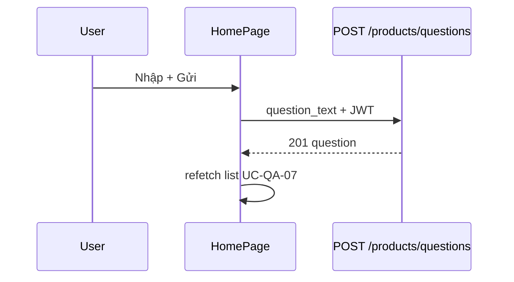

# Use Case — UC-QA-06: Gửi câu hỏi chung (Submit Global Question)

| Thuộc tính | Giá trị |
|------------|---------|
| **ID** | UC-QA-06 |
| **Tên** | Khách đã đăng nhập đặt câu hỏi không gắn sản phẩm trên trang chủ |
| **Mức độ ưu tiên** | Trung bình |
| **Phiên bản** | Bám code hiện tại |
| **Liên quan FR** | `FR_CreateGlobalQuestion.md` |
| **Liên quan UC** | UC-QA-07 (hiển thị sau khi gửi) |

---

## 1. Mô tả ngắn

Trên **`HomePage`**, khách **đã đăng nhập** nhập câu hỏi vào textarea và bấm **「Gửi câu hỏi」**. FE gọi:

```
POST /api/products/questions
Authorization: Bearer <JWT>
Body: { "question_text": "..." }
```

Backend tạo `Question` với `product_id: null`, `parent_question_id: null`, `is_answered: false`, `user_id` từ token. Sau success FE refresh list global (offset 0, limit 3).

**Khác UC-QA-05:** không có `product_id`, không follow-up trên endpoint này.

---

## 2. Tác nhân

| Tác nhân | Vai trò |
|----------|---------|
| **Authenticated Customer** | Gửi câu hỏi |
| **createGlobalQuestion** | `productController.createGlobalQuestion` |
| **authenticateToken** | Bắt buộc |
| **HomePage** | Form + `postGlobalQuestion` |

---

## 3. Preconditions

| # | Điều kiện |
|---|-----------|
| PRE-01 | JWT hợp lệ (`localStorage.token`) |
| PRE-02 | `question_text` không rỗng sau trim |
| PRE-03 | `isAuthed === true` trên FE (nút enabled) |

---

## 4. Postconditions

| # | Kết quả |
|---|---------|
| POST-01 | Bản ghi `questions` mới, `product_id = null` |
| POST-02 | `201` + `{ question: { ..., user } }` |
| POST-03 | FE clear textarea, refetch global list |
| POST-E01 | 401 → fetch fail / nút disabled |
| POST-E02 | 400 thiếu text |

---

## 5. Trigger

`postGlobalQuestion()` — click nút Gửi câu hỏi (HomePage).

---

## 6. Luồng chính (FE)

```javascript
const postGlobalQuestion = async () => {
  const text = (qaText || "").trim();
  if (!text || !isAuthed) return;
  setQaPosting(true);
  const resp = await fetch(`/api/products/questions`, {
    method: "POST",
    headers: {
      "Content-Type": "application/json",
      Authorization: `Bearer ${token}`,
    },
    body: JSON.stringify({ question_text: text }),
  });
  // ...
  setQaText("");
  await fetchGlobalQuestions({ offset: 0, limit: 3, append: false });
};
```

| UI | Hành vi |
|----|---------|
| Textarea | `qaText` state |
| Nút | `disabled` nếu !isAuthed \|\| !trim \|\| `qaPosting` |
| Hint | 「Bạn cần đăng nhập để gửi câu hỏi」 |

---

## 7. Luồng chính (BE)

```javascript
const q = await Question.create({
  product_id: null,
  user_id: req.user.user_id,
  question_text: question_text.trim(),
  is_answered: false,
  parent_question_id: null,
});
return res.status(201).json({ question: withUser });
```

| Rule | Chi tiết |
|------|----------|
| Trim | Bắt buộc sau trim |
| Product | Luôn `null` |
| Parent | Luôn `null` |
| Auth | `authenticateToken` trên route |

---

## 8. API contract

### Request

```http
POST /api/products/questions
Authorization: Bearer eyJ...
Content-Type: application/json

{ "question_text": "Shop có hỗ trợ trả góp không?" }
```

### Response 201

```json
{
  "question": {
    "question_id": 100,
    "product_id": null,
    "question_text": "Shop có hỗ trợ trả góp không?",
    "is_answered": false,
    "created_at": "2026-05-27T10:00:00.000Z",
    "parent_question_id": null,
    "user": { "user_id": 5, "username": "kiet", "full_name": "Kiet" }
  }
}
```

### Errors

| HTTP | Message |
|------|---------|
| 400 | `question_text is required` |
| 401 | Unauthorized (middleware) |

---

## 9. Luồng thay thế

### ALT-01 — Chưa đăng nhập

Nút disabled; user cần login (không auto redirect từ form Q&A).

### EXC-01 — Trùng route với GET list

Cùng path `/api/products/questions` — method POST vs GET phân biệt.

---

## 10. Sơ đồ



---

## 11. Ánh xạ mã nguồn

| Thành phần | Đường dẫn |
|------------|-----------|
| BE | `productController.createGlobalQuestion` |
| Route | `productRoutes.js` — `POST /questions` + `authenticateToken` |
| FE | `HomePage.jsx` — `postGlobalQuestion` |
| Model | `server/models/Question.js` |

---

## 12. Known gaps

| # | Gap |
|---|-----|
| GAP-01 | Không moderation / profanity filter |
| GAP-02 | Không rate limit spam |
| GAP-03 | Không thông báo admin realtime |
| GAP-04 | Sau gửi không scroll tới câu mới |
| GAP-05 | `fetch` thuần thay vì axios interceptor thống nhất |
| GAP-06 | Không cho sửa/xóa câu hỏi từ Home (API `updateQuestion` chưa route) |

---

## 13. Tiêu chí chấp nhận

- [ ] User login → gửi thành công → thấy câu trong list Home
- [ ] Guest → không gửi được
- [ ] Text rỗng → không gọi API
- [ ] DB `product_id` null
