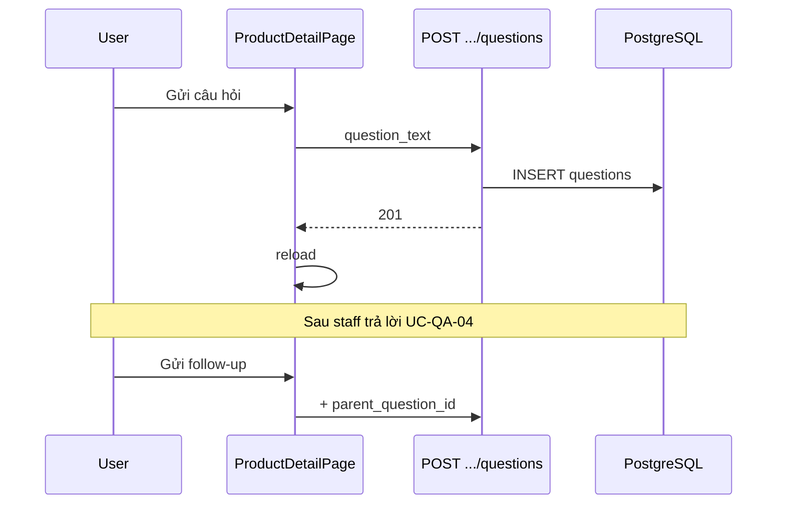

# Use Case — UC-QA-05: Gửi câu hỏi sản phẩm (Submit Product Question)

| Thuộc tính | Giá trị |
|------------|---------|
| **ID** | UC-QA-05 |
| **Tên** | Khách đặt câu hỏi (và follow-up 1 tầng) trên trang chi tiết sản phẩm |
| **Mức độ ưu tiên** | Cao |
| **Phiên bản** | Bám code hiện tại |
| **Liên quan FR** | `FR_CreateProductQuestion.md`, `FR_ListProductQuestionsEmbedded.md` |
| **Liên quan UC** | UC-QA-04 (staff trả lời), UC-QA-07 (câu gốc có thể lên Home) |

---

## 1. Mô tả ngắn

Trên **`ProductDetailPage`** (`/products/:id`), khách đăng nhập gửi:

**Câu hỏi gốc:**

```
POST /api/products/:id/questions
Body: { "question_text": "..." }
```

**Follow-up (tối đa 1 tầng):**

```
POST /api/products/:id/questions
Body: { "question_text": "...", "parent_question_id": <id câu gốc> }
```

`:id` = `product_id` số hoặc **slug**. Câu hỏi gốc và follow-up hiển thị qua **`getProductDetail`** (embed `questions` + `children`), không cần gọi `GET /products/:id/questions` riêng trên FE hiện tại.

---

## 2. Tác nhân

| Tác nhân | Vai trò |
|----------|---------|
| **Authenticated Customer** | Hỏi / follow-up |
| **createQuestion** | `productController.createQuestion` |
| **ProductDetailPage** | Form, follow-up UI |
| **getProductDetail** | Load Q&A tree |

---

## 3. Preconditions

### Câu hỏi gốc

| # | Điều kiện |
|---|-----------|
| PRE-01 | JWT |
| PRE-02 | Sản phẩm tồn tại |
| PRE-03 | `question_text` trim khác rỗng |

### Follow-up

| # | Điều kiện |
|---|-----------|
| PRE-F01 | `parent_question_id` tồn tại, thuộc cùng `product_id` |
| PRE-F02 | Parent là câu **gốc** (`parent_question_id` null trên parent) |
| PRE-F03 | Parent **đã có** ít nhất 1 `Answer` |
| PRE-F04 | Chưa có `children` (unique DB / 409) |
| PRE-F05 | FE: `canShowFollowUp(q)` — user là chủ câu gốc |

```javascript
const canShowFollowUp = (q) => {
  const noChild = (q.children?.length || 0) === 0;
  return isAuthed && q.is_answered && noChild && q.user?.user_id === currentUserId;
};
```

---

## 4. Postconditions

| # | Kết quả |
|---|---------|
| POST-01 | `Question` mới `product_id` set, `is_answered: false` |
| POST-02 | `201` + question kèm `user` |
| POST-03 | FE `window.location.reload()` để thấy Q&A mới |
| POST-F01 | Follow-up gắn `parent_question_id` |
| POST-E01 | 404 product / parent |
| POST-E02 | 400 parent chưa answered / 2 tầng follow-up |
| POST-E03 | 409 đã có follow-up |

---

## 5. Trigger

- **Gốc:** `postQuestion()` — nút「Gửi câu hỏi」.
- **Follow-up:** nút「Gửi follow-up」trong thread từng câu.

---

## 6. Luồng chính — Câu hỏi gốc (BE)

| Bước | Hành động |
|------|-----------|
| 1 | Resolve product by id hoặc slug |
| 2 | Validate `question_text` |
| 3 | `Question.create({ product_id, user_id, parent_question_id: null })` |
| 4 | Reload với include `user` → `201` |

---

## 7. Luồng chính — Follow-up (BE)

| Bước | Kiểm tra |
|------|----------|
| 1 | Parent tồn tại |
| 2 | `parent.parent_question_id` phải null — else 400「Only one follow-up level」 |
| 3 | `parent.product_id === product.product_id` |
| 4 | `Answer` exists cho `parent.question_id` — else 400「Parent must be answered before follow-up」 |
| 5 | Create child question |

**Lưu ý:** Kiểm tra chủ sở hữu parent (`user_id`) **bị comment** — mọi user đăng nhập có thể follow-up nếu đủ điều kiện FE/BE khác.

---

## 8. Luồng chính (FE)

### Gửi câu gốc

```javascript
await fetch(`/api/products/${id}/questions`, {
  method: "POST",
  headers: { Authorization: `Bearer ${token}`, "Content-Type": "application/json" },
  body: JSON.stringify({ question_text: questionText.trim() }),
});
window.location.reload();
```

### Hiển thị Q&A từ product detail

- `product.questions` — chỉ `parent_question_id: null` từ BE include.
- Mỗi item: `answers[]`, `children[]` (follow-up).
- `qaVisibleCount` default 3 — nút xem thêm tăng count.
- Sort FE: `created_at DESC` trên root list.

### Follow-up form

- Key draft: `` `fu_${q.question_id}` `` trong `answerDrafts` state.
- POST body có `parent_question_id: q.question_id`.

---

## 9. Cấu trúc dữ liệu embed (`getProductDetail`)

```text
Product
└── questions[] (parent_question_id IS NULL)
    ├── user
    ├── answers[]
    │   └── user
    └── children[] (follow-up)
        ├── user
        └── answers[]
```

Order: root mới trước; answers ASC; children ASC.

---

## 10. API contract

### POST câu gốc

```http
POST /api/products/acer-swift-3/questions
Authorization: Bearer ...
{ "question_text": "RAM có nâng cấp được không?" }
```

### POST follow-up

```http
POST /api/products/42/questions
{
  "question_text": "Giá nâng RAM bao nhiêu?",
  "parent_question_id": 10
}
```

### Errors

| HTTP | Message |
|------|---------|
| 400 | `question_text is required` |
| 400 | `Only one follow-up level is allowed` |
| 400 | `Parent must be answered before follow-up` |
| 400 | `Parent question does not belong to this product` |
| 404 | `Product not found` / `Parent question not found` |
| 409 | `This question already has a follow-up` |

---

## 11. Sơ đồ



---

## 12. Ánh xạ mã nguồn

| Thành phần | Đường dẫn |
|------------|-----------|
| createQuestion | `server/controllers/productController.js` |
| getProductDetail include | cùng file ~384–475 |
| Route | `server/routes/productRoutes.js` |
| FE | `client/app/pages/ProductDetailPage.jsx` |
| Associations | `server/models/index.js` — Question parent/children |

---

## 13. Known gaps

| # | Gap |
|---|-----|
| GAP-01 | `reload()` thay vì refetch React Query |
| GAP-02 | Owner-only follow-up **tắt** trên BE |
| GAP-03 | `updateQuestion` / `deleteQuestion` **không** mount route — user không sửa/xóa qua API public |
| GAP-04 | `GET /products/:id/questions` tồn tại nhưng FE không dùng |
| GAP-05 | Follow-up **không** có answer riêng trên UI (chỉ hiện `question_text` child) |
| GAP-06 | Câu gốc SP có thể lẫn vào feed Home UC-QA-07 |

---

## 14. Tiêu chí chấp nhận

- [ ] Login → gửi câu gốc → thấy sau reload
- [ ] Chưa login → nút disabled
- [ ] Parent chưa trả lời → follow-up 400
- [ ] Đã có 1 child → follow-up 409 / form ẩn
- [ ] Chủ câu hỏi mới thấy form follow-up (FE)
