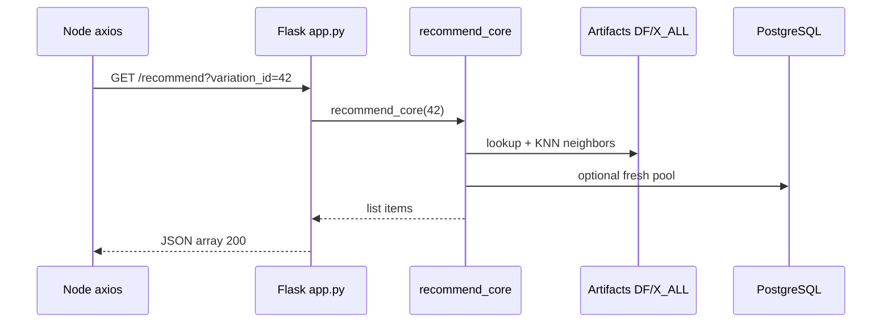

# Use Case — UC-REC-02: Dịch vụ ML sinh gợi ý (ML Service Generate Recommendations)

| Thuộc tính | Giá trị |
|------------|---------|
| **ID** | UC-REC-02 |
| **Tên** | Flask recommendation service — endpoint `/recommend` và `/health` |
| **Mức độ ưu tiên** | Cao |
| **Phiên bản** | Bám code hiện tại |
| **Liên quan FR** | `FR_MLServiceRecommendEndpoint.md` |
| **Liên quan UC** | UC-REC-01 (artifacts), UC-REC-03 (proxy Node) |

---

## 1. Mô tả ngắn

Microservice Python **Flask** (`recommendation_service/`) expose HTTP API gợi ý laptop **tương tự** theo **`variation_id`**, dựa trên KNN weighted 2D: **(price, performance_score)** sau `MinMaxScaler`.

```
GET  /health
GET  /recommend?variation_id={int}
GET  /recommend/{variation_id}
```

Logic lõi: **`recommend_core(variation_id)`** trong `core/recommend.py`.  
Artifacts load **một lần khi import module** (fail fast nếu thiếu file).

**Consumer:** Express `getRecommendedByVariation` gọi `GET ${RECO_API_BASE}/recommend?variation_id=...` (UC-REC-03).

---

## 2. Tác nhân

| Tác nhân | Vai trò |
|----------|---------|
| **Node.js BFF** | HTTP client (axios) |
| **Flask app** | `app.py` routing |
| **recommend_core** | KNN + fresh pool + dedupe |
| **PostgreSQL** | Cold query / fresh variations |
| **Artifacts** | Từ UC-REC-01 |

---

## 3. Preconditions

| # | Điều kiện |
|---|-----------|
| PRE-01 | UC-REC-01 đã chạy — đủ 4 artifacts |
| PRE-02 | `DATABASE_URL` trong `.env` service (cho fresh/cold path) |
| PRE-03 | Service process đang listen (default port **8000** trong `app.py`; Docker có thể **5001**) |
| PRE-04 | `variation_id` hợp lệ (integer) |

---

## 4. Postconditions

| # | Kết quả |
|---|---------|
| POST-01 | HTTP 200 + JSON **mảng** các item gợi ý (tối đa `TOPK`, default 10) |
| POST-02 | Không trùng `product_id` với sản phẩm gốc |
| POST-03 | Mỗi item có `variation_id`, `product_id`, `price`, `performance_score`, `source` |
| POST-E01 | `variation_id` không tồn tại DB → **404** `{ "error": "variation_id not found" }` |
| POST-E02 | Thiếu query param → **400** |

---

## 5. Trigger

HTTP request tới Flask từ Node proxy hoặc curl/Postman test.

---

## 6. API surface (`app.py`)

### GET `/health`

```json
{
  "ok": true,
  "items": 150,
  "x_all_shape": [150, 2]
}
```

| Field | Ý nghĩa |
|-------|---------|
| `items` | `len(DF)` — số variation trong index |
| `x_all_shape` | Shape `knn_X_all.npy` |

### GET `/recommend?variation_id=42`

### GET `/recommend/42`

Tương đương — gọi `recommend_core(42)`.

**Response 200:** JSON array (không bọc `{ items: [...] }`):

```json
[
  {
    "variation_id": 88,
    "product_id": 12,
    "product_name": "Laptop X",
    "price": 25990000,
    "performance_score": 72.5,
    "cpu_source": "json-exact",
    "gpu_source": "rule",
    "score_source": "cpu:json-exact,gpu:rule",
    "source": "indexed"
  }
]
```

**Response 404:**

```json
{ "error": "variation_id not found" }
```

**CORS:** `flask_cors.CORS(app)` — browser *có thể* gọi trực tiếp (FE hiện **không** dùng).

---

## 7. Luồng chính — `recommend_core`

### Phase 1 — Query vector

| Case | Hành động |
|------|-----------|
| `var_id` **có** trong `DF` (index) | Lấy `price`, `performance_score` từ pickle → `SCALER.transform` |
| `var_id` **không** trong index | `fetch_one_variation_from_db` → `calculate_perf_from_mapping_or_rule` → transform |

Lưu `base_product_id` để loại trừ khi dedupe.

### Phase 2 — Indexed KNN

```python
n_neighbors = min(TOPK + 15, len(DF))
dists, idxs = knn_kneighbors_numpy(X_ALL, q_scaled, n_neighbors)
```

- Loại neighbor trùng `variation_id` gốc.
- Similarity: `sim = 1 / (1e-6 + d * (1 + price_jump_pen))` với penalty nếu giá cao hơn gốc (`LAMBDA_PRICE_JUMP`).

Distance weighted: `sqrt(ALPHA * Δprice² + BETA * Δperf²)` (`ALPHA` default 0.6, `BETA` 0.4).

### Phase 3 — Fresh pool

`fetch_fresh_items_from_db(exclude_variation_ids=[base])`:

- Variations `is_available = true`.
- `updated_at/created_at` trong **`FRESH_WINDOW_DAYS`** (default 60 ngày).
- Limit **`FRESH_LIMIT`** (default 200).
- Chỉ biến thể **chưa** có trong index pickle.
- Tính `performance_score` realtime + **`score_fresh_candidates`** (recency boost).

### Phase 4 — Merge & rerank

`pool = cand_knn + cand_fresh` → sort `sim` giảm dần.

### Phase 5 — Dedupe & cap

- `seen_product_ids` bắt đầu với `{ base_product_id }`.
- Chỉ thêm item nếu `product_id` chưa thấy.
- Dừng khi `len(out) >= TOPK` (default 10).

---

## 8. Hyperparameters (`core/config.py`)

| Env | Default | Mô tả |
|-----|---------|--------|
| `RECS_TOPK` | 10 | Số gợi ý tối đa |
| `RECS_ALPHA_PRICE` | 0.6 | Trọng số trục price trong distance |
| `RECS_BETA_PERF` | 0.4 | Trọng số performance |
| `RECS_PRICE_JUMP_LAMBDA` | 0.6 | Penalty giá cao hơn gốc |
| `RECS_FRESH_LIMIT` | 200 | Cap fresh query |
| `RECS_FRESH_WINDOW_DAYS` | 60 | Cửa sổ “mới” |
| `RECS_RECENCY_GAMMA` | 0.12 | Boost biến thể mới |
| `RECS_RECENCY_HALFLIFE` | 21 | Halflife ngày (recency) |
| `USE_BENCH_IN_API` | true | Benchmark trong API path |
| `PORT` | 8000 | Flask listen (`app.py`) |

---

## 9. Sơ đồ sequence



---

## 10. Deploy & vận hành

| Thành phần | Ghi chú |
|------------|---------|
| `Dockerfile` | Python 3.11-slim, `EXPOSE 5001`, `HEALTHCHECK` → `/health` |
| `docker-compose.yml` | Service `recommendation`, port **5001:5001** |
| `app.py` | `PORT` env — nếu không set → **8000** trong container → **mismatch** với map 5001 |

**Node đọc:** `RECO_API_BASE` (default `http://127.0.0.1:8000`), **không** đọc `RECOMMENDATION_SERVICE_URL` trong docker-compose — **GAP cấu hình**.

---

## 11. Khác biệt train vs runtime scoring

| | **UC-REC-01 train** | **UC-REC-02 runtime (fresh)** |
|---|---------------------|-------------------------------|
| CPU/GPU | `train_recommend.py` + JSON Jaccard | `features.py` + `bench.py` percentiles |
| Cùng trọng số 40/35/15/10 | Có | Có (trong `calculate_perf_from_mapping_or_rule`) |
| Scale perf | `scale_bench_to_100` cohort | `scale_0_100` với P5/P95 từ bench module |

Cùng variation có thể có `performance_score` hơi khác giữa index cũ và fresh path.

---

## 12. Ánh xạ mã nguồn

| Thành phần | Đường dẫn |
|------------|-----------|
| App | `recommendation_service/app.py` |
| Core | `recommendation_service/core/recommend.py` |
| KNN | `recommendation_service/core/knn_numpy.py` |
| Features | `recommendation_service/core/features.py` |
| DB | `recommendation_service/core/db.py` |
| Recency | `recommendation_service/core/recency.py` |
| Config | `recommendation_service/core/config.py` |
| Backup legacy | `recommendation_service/backup/app.py` |

---

## 13. Known gaps

| # | Gap |
|---|-----|
| GAP-01 | Response là **array thuần**, không `{ items, generated_at }` — Node phải normalize nhiều shape |
| GAP-02 | **Không** auth API key |
| GAP-03 | Import-time load — **không** hot-reload artifacts |
| GAP-04 | `recommend_core` return thiếu wrapper — `generated_at` do Node tự sinh |
| GAP-05 | PORT 8000 vs Docker 5001 vs `RECO_API_BASE` mismatch |
| GAP-06 | `docker-compose` set `RECOMMENDATION_SERVICE_URL` nhưng **server không đọc** |
| GAP-07 | Không batch recommend, không explain UI từ Flask (chỉ field debug trong item) |
| GAP-08 | Healthcheck Dockerfile dùng `requests` — cần có trong image |

---

## 14. Tiêu chí chấp nhận

- [ ] `/health` → `ok: true`, `items > 0` sau train
- [ ] `/recommend?variation_id=<indexed>` → mảng ≤ TOPK, không chứa product gốc
- [ ] `/recommend?variation_id=999999` → 404
- [ ] `/recommend` thiếu param → 400
- [ ] Variation mới (không trong index) nhưng có trong DB → vẫn 200 (fresh/indexed mix)
