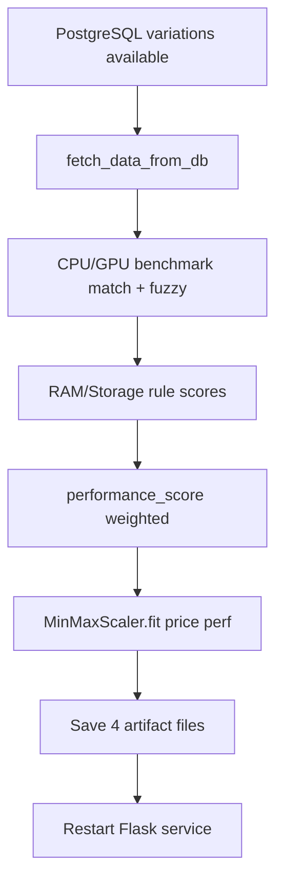

# Use Case — UC-REC-01: Huấn luyện mô hình gợi ý offline (Train Recommendation Model Offline)

| Thuộc tính | Giá trị |
|------------|---------|
| **ID** | UC-REC-01 |
| **Tên** | Chạy pipeline offline build index KNN + scaler từ PostgreSQL |
| **Mức độ ưu tiên** | Cao (tiên quyết cho UC-REC-02, UC-REC-03) |
| **Phiên bản** | Bám code hiện tại |
| **Liên quan FR** | `FR_TrainRecommendationModelOffline.md` |
| **Liên quan UC** | UC-REC-02, UC-REC-03, UC-CAT-11 |

---

## 1. Mô tả ngắn

**Không phải** HTTP API — đây là quy trình **batch/offline** do DevOps/Developer chạy thủ công (hoặc cron ngoài repo) sau khi cập nhật catalog:

```bash
cd recommendation_service
python train_recommend.py
```

Script:

1. Đọc mọi `product_variations` **`is_available = true`** từ PostgreSQL.
2. Map CPU/GPU sang điểm benchmark (JSON) hoặc **rule fallback**.
3. Tính điểm RAM, SSD và **`performance_score`** có trọng số.
4. **Fit `MinMaxScaler`** trên `(price, performance_score)`.
5. Lưu **artifacts** để Flask load khi khởi động (`recommend.py` import-time).

**KNN inference** lúc runtime **không** dùng `sklearn.neighbors.KNeighborsClassifier` — chỉ lưu ma trận `knn_X_all.npy` và tìm láng giềng bằng numpy (`knn_kneighbors_numpy`).

---

## 2. Tác nhân

| Tác nhân | Vai trò |
|----------|---------|
| **Developer / DevOps** | Chạy train, deploy artifacts |
| **train_recommend.py** | Entry script |
| **PostgreSQL** | Nguồn variations |
| **cpu_benchmark.json / gpu_benchmark.json** | Thư viện điểm chuẩn |
| **Flask recommendation_service** | Consumer artifacts lúc start |

---

## 3. Preconditions

| # | Điều kiện |
|---|-----------|
| PRE-01 | Python 3.x + `pip install -r requirements.txt` trong `recommendation_service/` |
| PRE-02 | File `.env` có **`DATABASE_URL`** (PostgreSQL) |
| PRE-03 | Bảng `product_variations`, `products` đã seed, có `processor`, `ram`, `storage`, `graphics_card`, `price` |
| PRE-04 | File `data/cpu_benchmark.json`, `data/gpu_benchmark.json` tồn tại |
| PRE-05 | Thư mục `artifacts/` ghi được (tạo tự động nếu thiếu) |

---

## 4. Postconditions

| # | Kết quả |
|---|---------|
| POST-01 | `artifacts/scaler.joblib` — MinMaxScaler đã fit |
| POST-02 | `artifacts/products_df_from_db.pkl` — DataFrame metadata đầy đủ |
| POST-03 | `artifacts/knn_X_all.npy` — ma trận (N, 2) đã scale |
| POST-04 | `artifacts/knn_variation_ids.npy` — vector `variation_id` khớp hàng |
| POST-05 | Console log số items + đường dẫn đã lưu |
| POST-E01 | DB rỗng → script in「No data.」 và thoát sớm |

---

## 5. Trigger

- Sau import/seed sản phẩm mới hàng loạt.
- Sau thay đổi giá/cấu hình ảnh hưởng `performance_score` hoặc phạm vi scale.
- Trước deploy/restart `recommendation_service` (cần copy artifacts vào image/volume).

**Không** có job train tự động trong `server/jobs/` hoặc CI bắt buộc trong repo hiện tại.

---

## 6. Luồng chính — Pipeline



### Bước 1 — Extract DB

```sql
SELECT pv.variation_id, pv.product_id, p.product_name,
       pv.processor, pv.ram, pv.storage, pv.graphics_card, pv.price
FROM product_variations pv
LEFT JOIN products p ON pv.product_id = p.product_id
WHERE pv.is_available = true;
```

Dùng **`psycopg2`** + `pandas.read_sql` (khác runtime API dùng SQLAlchemy).

### Bước 2 — CPU/GPU scoring

| Nguồn | Cách match |
|-------|------------|
| `json-exact` | Tên sau chuẩn hóa (`simplify_cpu_name` / `simplify_gpu_name`) |
| `json-contains` | Jaccard token ≥ `FUZZY_THRESHOLD` (0.60) |
| `rule` | Heuristic string (`fallback_cpu_score`, `fallback_gpu_score`) |

Hỗ trợ nhân đôi core CPU (`2x` trong tên).

### Bước 3 — RAM & Storage

| Field | Rule ví dụ |
|-------|------------|
| RAM | ≥32GB→100, ≥18GB→80, ≥16GB→70, else 40 |
| Storage | 4TB→100, 2TB→90, 1TB→80, 512GB→60, else 40 |

### Bước 4 — performance_score

```python
performance_score = (
  cpu_score_100 * 0.40 +
  gpu_score_100 * 0.35 +
  ram_score * 0.15 +
  storage_score * 0.10
).round(2)
```

`cpu_score_100` / `gpu_score_100` sau **`scale_bench_to_100`** trên toàn cohort (`SCALE_METHOD`, default `log_p99`).

### Bước 5 — Scale & persist

```python
features = df[["price", "performance_score"]]
scaler = MinMaxScaler()
X = scaler.fit_transform(features)
joblib.dump(scaler, "artifacts/scaler.joblib")
df.to_pickle("artifacts/products_df_from_db.pkl")
np.save("artifacts/knn_X_all.npy", X)
np.save("artifacts/knn_variation_ids.npy", df["variation_id"].values)
```

Drop rows thiếu `price` hoặc `performance_score`.

---

## 7. Biến môi trường (train)

| Biến | Default | Mô tả |
|------|---------|--------|
| `DATABASE_URL` | — | **Bắt buộc** |
| `ARTIFACTS_DIR` | `artifacts` | Output dir |
| `DATA_DIR` | `data` | Benchmark JSON |
| `SCALE_METHOD` | `log_p99` | `log_p99` \| `p99` \| `quantile` |
| `CPU_WEIGHT` / `GPU_WEIGHT` / … | 0.40 / 0.35 / … | Trọng số (hardcode trong script, có thể sửa file) |
| `FUZZY_THRESHOLD` | 0.60 | Match mờ benchmark |

---

## 8. Artifacts output

| File | Nội dung |
|------|----------|
| `scaler.joblib` | `sklearn.preprocessing.MinMaxScaler` fit trên cohort train |
| `products_df_from_db.pkl` | Cột: variation_id, product_id, product_name, specs, scores, sources, price, performance_score |
| `knn_X_all.npy` | `float64` shape `(N, 2)` |
| `knn_variation_ids.npy` | `int64` length `N` |

**Docker:** `Dockerfile` copy toàn bộ `recommendation_service/` — artifacts cần có **trong image** hoặc mount volume; train trong container build step **không** tự động trong Dockerfile hiện tại.

---

## 9. Luồng thay thế / ngoại lệ

### ALT-01 — Chạy lại train

Ghi đè artifacts cũ — Flask cần **restart** để reload (load tại import-time).

### EXC-01 — Thiếu DATABASE_URL

`RuntimeError: DATABASE_URL missing in .env`.

### EXC-02 — Benchmark JSON thiếu

`load_benchmarks` trả empty → toàn bộ CPU/GPU rơi về **rule** (vẫn chạy được).

### EXC-03 — Flask start không có artifacts

Import `core.recommend` → `FileNotFoundError` → service **crash** (không healthy).

---

## 10. Quan hệ runtime (UC-REC-02)

| Train output | Runtime dùng |
|--------------|----------------|
| `DF_PATH` → `products_df_from_db.pkl` | Indexed neighbors |
| `SCALER_PATH` | Transform query + fresh candidates |
| `XALL_PATH` | KNN distance |
| `VARIDS_PATH` | Align row index |

Variation **mới** sau train (chưa re-train) vẫn có thể gợi ý qua nhánh **fresh** (query DB realtime) — không nằm trong index.

---

## 11. Ánh xạ mã nguồn

| Thành phần | Đường dẫn |
|------------|-----------|
| Entry | `recommendation_service/train_recommend.py` |
| Legacy backup | `recommendation_service/backup/train_recommender.py` |
| Benchmark data | `recommendation_service/data/*.json` |
| Requirements | `recommendation_service/requirements.txt` |
| Consumer load | `recommendation_service/core/recommend.py` (import-time) |
| Config paths | `recommendation_service/core/config.py` |

---

## 12. Known gaps

| # | Gap |
|---|-----|
| GAP-01 | **Không** train tự động khi admin thêm SP — phải chạy tay |
| GAP-02 | **Không** versioning artifacts (S3, tag ngày) trong code |
| GAP-03 | Train dùng **psycopg2**; API runtime dùng **SQLAlchemy** — cùng DB nhưng stack khác |
| GAP-04 | Trọng số CPU/GPU/RAM/SSD **hardcode** trong `train_recommend.py`, khác một phần `features.py` runtime (`bench.py` percentiles) |
| GAP-05 | Chỉ index `is_available = true` — variation hết hàng biến mất khỏi index |
| GAP-06 | Dockerfile **không** RUN train trong build — image có thể thiếu artifacts nếu không copy |
| GAP-07 | Không collaborative filtering / lịch sử đơn hàng |

---

## 13. Tiêu chí chấp nhận

- [ ] `python train_recommend.py` thành công, 4 file trong `artifacts/`
- [ ] `GET /health` sau restart Flask → `items` = N khớp số variation available lúc train
- [ ] Variation có trong DB lúc train → xuất hiện trong KNN indexed pool
- [ ] Sau train mới, restart service → gợi ý PDP thay đổi phản ánh catalog mới

---

## 14. Checklist vận hành (tham khảo)

1. Backup `artifacts/` cũ (nếu cần rollback).
2. `cd recommendation_service && python train_recommend.py`.
3. Verify file size / `items` qua `/health`.
4. Restart container `recommendation` hoặc process Flask.
5. Smoke test `GET /recommend?variation_id=<known>` và PDP.
