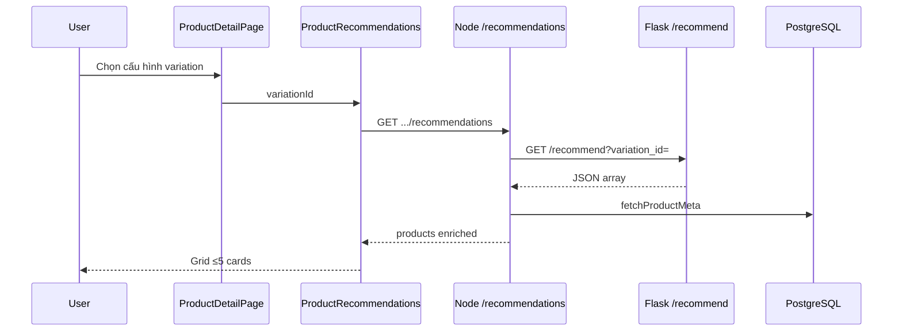

# Use Case — UC-REC-03: Xem gợi ý KNN trên PDP (View KNN Recommendations)

| Thuộc tính | Giá trị |
|------------|---------|
| **ID** | UC-REC-03 |
| **Tên** | Khách xem block gợi ý sản phẩm tương tự theo cấu hình đang chọn |
| **Mức độ ưu tiên** | Trung bình–Cao (phụ thuộc service ML chạy) |
| **Phiên bản** | Bám code hiện tại |
| **Liên quan FR** | `FR_ProxyRecommendationsFromBackend.md`, `FR_ViewKNNRecommendationsOnProduct.md` |
| **Liên quan UC** | UC-REC-02, UC-CAT-05, UC-CAT-11 (catalog — nội dung tương đương) |

---

## 1. Mô tả ngắn

Trên **`ProductDetailPage`** (`/products/:id`), khi khách đã chọn **một biến thể** (variation — mặc định primary/cheapest hoặc đổi cấu hình), section **「Gợi ý cho cấu hình đang chọn」** hiển thị tối đa **5** laptop gợi ý tương tự.

**Luồng end-to-end:**

```text
ProductDetailPage
  → ProductRecommendations(variationId=currentVariationId)
  → useRecommendedByVariation (React Query)
  → GET /api/products/variations/:variation_id/recommendations  (Node, public)
  → GET {RECO_API_BASE}/recommend?variation_id=...             (Flask UC-REC-02)
  → enrich fetchProductMeta từ PostgreSQL
  → grid RecoCard (link + thêm giỏ)
```

**Không** gọi Flask trực tiếp từ browser trong luồng chính.

---

## 2. Tác nhân

| Tác nhân | Vai trò |
|----------|---------|
| **Guest / Customer** | Xem gợi ý, mở PDP khác, thêm giỏ từ card |
| **ProductDetailPage** | Truyền `currentVariationId` |
| **ProductRecommendations** | UI section + skeleton |
| **useRecommendedByVariation** | `client/app/hooks/useProducts.js` |
| **getRecommendedByVariation** | Node proxy + enrich |
| **Recommendation service** | Upstream KNN |

---

## 3. Preconditions

| # | Điều kiện |
|---|-----------|
| PRE-01 | PDP load xong, `product.variations.length > 0` |
| PRE-02 | `currentVariationId` là số hợp lệ (sau default select hoặc user chọn RAM/SSD/color) |
| PRE-03 | (Khuyến nghị) Flask + artifacts UC-REC-01 đang chạy |
| PRE-04 | Node `RECO_API_BASE` trỏ đúng host/port service |

---

## 4. Postconditions

### Thành công

| # | Kết quả |
|---|---------|
| POST-01 | Section hiển thị ≤ **5** `RecoCard` (`limit` prop default 5) |
| POST-02 | Mỗi card: `name`, `image`, `price`, link `/products/{slug}?v={variation_id}` |
| POST-03 | Response meta: `basedOn.variationId`, `source: "knn"`, `generated_at` |
| POST-04 | Có thể `dispatch(addItem)` từ RecoCard |

### Không có gợi ý / lỗi

| # | Kết quả |
|---|---------|
| POST-E01 | UI: 「Chưa có gợi ý phù hợp.」 |
| POST-E02 | Node **502** `{ products: [], error: ... }` — FE vẫn render empty (không crash) |

### Đổi cấu hình

| # | Kết quả |
|---|---------|
| POST-C01 | User đổi variation → `queryKey` đổi → refetch (sau `staleTime` 60s hoặc ngay nếu invalidate) |

---

## 5. Trigger

| Sự kiện | Hành động |
|---------|-----------|
| Mount PDP | `useEffect` chọn variation mặc định → `currentVariationId` set |
| User `toggleSelect` cấu hình | `selectedVariation` đổi → prop `variationId` đổi |
| React Query | `enabled: !!variationId`, `keepPreviousData: true` |

---

## 6. Luồng chính — Frontend

### Hook `useRecommendedByVariation`

```javascript
return useQuery({
  queryKey: ["reco-by-variation", variationId ?? "none"],
  queryFn: async () => {
    if (!variationId) return { products: [], basedOn: { variationId: 0 }, source: "knn" };
    const res = await api.get(`/products/variations/${variationId}/recommendations`);
    return res.data;
  },
  enabled: !!variationId,
  keepPreviousData: true,
  staleTime: 60 * 1000,
});
```

### `ProductRecommendations.jsx`

| State | UI |
|-------|-----|
| `isLoading` | Grid skeleton × `limit` |
| `items.length === 0` | 「Chưa có gợi ý phù hợp.」 |
| Có data | `items.slice(0, limit).map` → `RecoCard` |

### `RecoCard` hành vi

| Tính năng | Chi tiết |
|-----------|----------|
| Link | `/products/${slug||id}?v=${variation_id}` |
| Giá | `item.price` từ BE (variation price) |
| Ảnh | `item.image` — ưu tiên `thumbnail_url` DB qua proxy |
| Rating | `rating_average` (sao); `review_count` thường 0 (không enrich) |
| Thêm giỏ | Redux `addItem` với payload tối thiểu + `variations: [{ variation_id, price }]` |

**Không** hiển thị `score` / `explain` trên UI (dù BE có).

### Gắn PDP

```jsx
<ProductRecommendations variationId={currentVariationId} />
```

Đặt **dưới** khối Q&A sản phẩm.

---

## 7. Luồng chính — Node proxy

```javascript
const BASE = process.env.RECO_API_BASE || "http://127.0.0.1:8000";
const TIMEOUT = +(process.env.RECO_TIMEOUT_MS || 7000);

const resp = await axios.get(`${BASE}/recommend`, {
  params: { variation_id: variationId },
  timeout: TIMEOUT,
  validateStatus: () => true,
});
```

### Chuẩn hóa upstream shape

Flask trả **mảng JSON** — Node chấp nhận:

1. `payload.items` (chuẩn tương lai)
2. `payload.debug`
3. `Array.isArray(payload)` ← **hiện tại**

### Dedupe theo product

Giữ biến thể có `score` / `performance_score` cao nhất mỗi `product_id`.

### `fetchProductMeta`

Query `products` + `images` → bổ sung `product_name`, `slug`, `thumbnail_url`, `rating_average`.

### Response FE

```json
{
  "products": [
    {
      "id": 12,
      "variation_id": 88,
      "name": "Laptop X",
      "image": "https://...",
      "slug": "laptop-x",
      "price": 25990000,
      "score": 0.87,
      "rating_average": 4.5,
      "explain": {
        "source": "indexed",
        "score_source": "cpu:json-exact,gpu:rule",
        "cpu_source": "json-exact",
        "gpu_source": "rule"
      }
    }
  ],
  "basedOn": { "variationId": 42 },
  "generated_at": "2026-05-27T...",
  "source": "knn"
}
```

### Lỗi

| Tình huống | HTTP | Body |
|------------|------|------|
| Upstream 4xx/5xx | **502** | `products: []`, `error: upstream_*` |
| Axios exception | **502** | `error: adapter_exception`, `detail` |

Route: **`GET /api/products/variations/:variation_id/recommendations`** — **public**, không JWT.

---

## 8. Luồng thay thế

### ALT-01 — `variationId` null

Hook trả `{ products: [] }` — section empty, không gọi API.

### ALT-02 — Service down

502 → empty state — PDP vẫn dùng được phần còn lại.

### ALT-03 — `keepPreviousData`

Đổi variation nhanh — có thể flash gợi ý cũ trong lúc fetch (tối đa ~timeout).

---

## 9. Sơ đồ end-to-end



---

## 10. Route & bảo mật

| Route | Auth |
|-------|------|
| `GET /api/products/variations/:id/recommendations` | Public |
| Flask `/recommend` | Public (CORS on) |

Không rate limit — có thể spam variation_id.

---

## 11. Env liên quan

| Biến | Nơi đọc | Default | Ghi chú |
|------|---------|---------|---------|
| `RECO_API_BASE` | `productController.js` | `http://127.0.0.1:8000` | **Dùng thực tế** |
| `RECO_TIMEOUT_MS` |同上 | `7000` | |
| `RECOMMENDATION_SERVICE_URL` | docker-compose server | `http://recommendation:5001` | **Không map** vào controller |
| `VITE_RECOMMENDATION_BASE_URL` | client env | — | **Không** dùng cho hook reco |

**Docker local:** Cần `RECO_API_BASE=http://127.0.0.1:5001` (hoặc map port) nếu Flask chạy 5001.

---

## 12. So sánh legacy

`getRecommendedProducts` (cùng category/brand) — **comment out** trong `productController.js`. Toàn bộ gợi ý PDP hiện dùng **KNN path** này.

---

## 13. Ánh xạ mã nguồn

| Thành phần | Đường dẫn |
|------------|-----------|
| FE component | `client/app/components/ProductRecommendations.jsx` |
| FE hook | `client/app/hooks/useProducts.js` — `useRecommendedByVariation` |
| FE page | `client/app/pages/ProductDetailPage.jsx` |
| Node proxy | `server/controllers/productController.js` — `getRecommendedByVariation`, `fetchProductMeta` |
| Route | `server/routes/productRoutes.js` |
| ML service | `recommendation_service/` (UC-REC-02) |
| Catalog UC | `docs/use_cases/catalog/UC_ViewSimilarProductRecommendations.md` |

---

## 14. Known gaps

| # | Gap |
|---|-----|
| GAP-01 | **502 silent** — user chỉ thấy empty, không biết service down |
| GAP-02 | Không hiển thị `score` / lý do gợi ý (`explain`) |
| GAP-03 | `review_count` / `discount_percentage` thường thiếu trên reco payload |
| GAP-04 | `RECO_API_BASE` vs docker env **không thống nhất** |
| GAP-05 | Chỉ 5 items — Flask có thể trả tới TOPK 10 |
| GAP-06 | `api.js` có `getRecommendations` — duplicate naming, hook dùng path trực tiếp |
| GAP-07 | Không fallback rule-based same-category khi ML down |
| GAP-08 | `isFetching` không dùng — chỉ `isLoading` cho skeleton |
| GAP-09 | `ProductDetailPage` gọi `useRecommendedByVariation(selectedVariation?.variation_id)` nhưng **không dùng** kết quả — chỉ `ProductRecommendations` fetch với `currentVariationId` (có fallback variation đầu) |

---

## 15. Tiêu chí chấp nhận

- [ ] PDP có variation → section gợi ý load (skeleton rồi cards)
- [ ] Đổi RAM/SSD/color → gợi ý đổi (sau refetch)
- [ ] Click card → PDP đúng slug + query `?v=`
- [ ] Thêm giỏ từ reco card → cart có variation_id + giá
- [ ] Tắt Flask → 「Chưa có gợi ý phù hợp」hoặc 502, PDP không vỡ
- [ ] Không có variation → không gọi API / section trống

---

## 16. Test plan gợi ý

1. Train artifacts (UC-REC-01) + start Flask.
2. Set `RECO_API_BASE` trên server khớp port.
3. Mở PDP sản phẩm có nhiều biến thể — quan sát block gợi ý.
4. Đổi cấu hình — verify list đổi.
5. Stop Flask — verify graceful empty.
6. curl `GET /api/products/variations/{id}/recommendations` so sánh JSON với UI.
