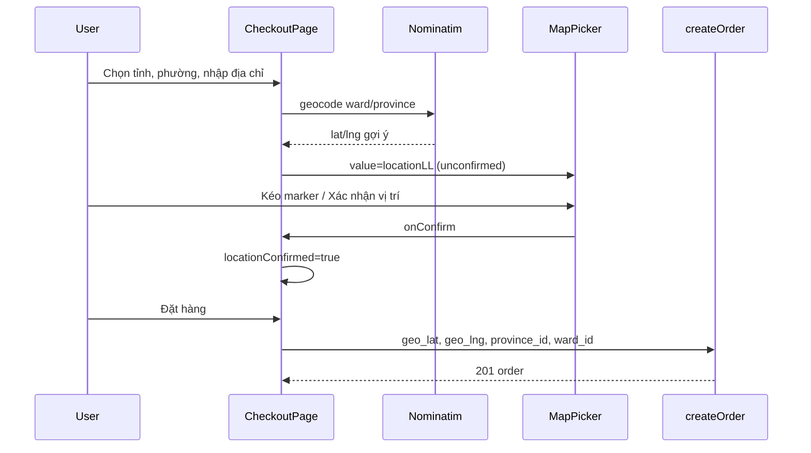

# Use Case — UC-SHIP-01: Xác nhận địa chỉ bằng bản đồ (Confirm Address With Map Picker)

| Thuộc tính | Giá trị |
|------------|---------|
| **ID** | UC-SHIP-01 |
| **Tên** | Chọn và xác nhận tọa độ giao hàng (`geo_lat`, `geo_lng`) trên bản đồ Leaflet |
| **Mức độ ưu tiên** | Cao (bắt buộc trước khi đặt hàng) |
| **Phiên bản** | Bám code hiện tại |
| **Liên quan FR** | `FR_MapPickerAddressConfirmation.md`, `FR_ReverseGeocodeAddress.md` |
| **Liên quan UC** | UC-SHIP-04, UC-SHIP-03, UC-ORD-02/03 (create order) |

---

## 1. Mô tả ngắn

Khách **không thể đặt hàng** nếu chưa **xác nhận vị trí** trên bản đồ. Component **`MapPicker.jsx`** (React Leaflet + OpenStreetMap tiles) cho phép:

- Click map đặt marker
- Kéo marker (`draggable`)
- Nút **「Xác nhận vị trí」** (trong component)

State FE:

- `locationLL` — `{ lat, lng }`
- `locationConfirmed` — `true` chỉ sau khi user xác nhận

Backend **`createOrder`** từ chối nếu thiếu geo:

```javascript
if (geo_lat == null || geo_lng == null) {
  return res.status(400).json({ message: "Vui lòng xác nhận vị trí trên bản đồ" });
}
```

Tọa độ lưu `orders.geo_lat`, `orders.geo_lng` (DECIMAL).

**Dùng tại:** `CheckoutPage` (luồng chính), `EditShippingAddressDialog` (pattern khác — nút xác nhận ngoài map).

---

## 2. Tác nhân

| Tác nhân | Vai trò |
|----------|---------|
| **Customer** | Tương tác map |
| **MapPicker** | Leaflet UI |
| **CheckoutPage** | State, banners, `canSubmit` |
| **EditShippingAddressDialog** | Sửa địa chỉ đơn |
| **Nominatim OSM** | Geocode gợi ý vị trí (FE fetch, không qua BE) |
| **createOrder** | Validate + persist geo |

---

## 3. Preconditions

| # | Điều kiện |
|---|-----------|
| PRE-01 | Đã chọn tỉnh + phường/xã (checkout) |
| PRE-02 | Đã nhập địa chỉ chi tiết (checkout — ô address enabled sau khi có ward) |
| PRE-03 | Leaflet CSS/JS load (CDN unpkg icons) |
| PRE-04 | (Khuyến nghị) Mạng để tải OSM tiles + Nominatim |

---

## 4. Postconditions

| # | Kết quả |
|---|---------|
| POST-01 | `locationConfirmed === true` |
| POST-02 | `canSubmit` checkout true (cùng form đủ field) |
| POST-03 | Order body gồm `geo_lat`, `geo_lng` |
| POST-04 | Mọi thay đổi marker/địa chỉ/tỉnh/xã → `locationConfirmed` reset (checkout) |

---

## 5. Component `MapPicker` — API & hành vi

```javascript
export default function MapPicker({ value, onChange, onConfirm }) {
  // value: { lat, lng } | null
  // onChange(latlng) — click map / drag marker
  // onConfirm(latlng) — nút "Xác nhận vị trí" trong component
}
```

| Tính năng | Implementation |
|-----------|----------------|
| Default center | `[10.776, 106.7]` (TP.HCM) nếu chưa có `value` |
| Tiles | `https://{s}.tile.openstreetmap.org/{z}/{x}/{y}.png` |
| Zoom ban đầu | 15 (`MapContainer`) |
| Click map | `ClickToSetMarker` → `onChange` |
| Drag marker | `dragend` → `onChange` |
| Recenter | `RecenterOnLocation` khi `value` đổi, zoom 17 |

### Nút xác nhận (built-in)

```javascript
<button
  type="button"
  onClick={() => value && onConfirm?.(value)}
  disabled={!value}
>
  Xác nhận vị trí
</button>
```

**Props Checkout truyền nhưng MapPicker không đọc (GAP):** `center`, `zoom`, `flyToOnCenterChange` — geocode set `mapCenter`/`mapZoom` **không** điều khiển map; chỉ khi `setLocationLL` thì `RecenterOnLocation` chạy.

---

## 6. Luồng chính — CheckoutPage

### State

```javascript
const [locationLL, setLocationLL] = useState(null);
const [locationConfirmed, setLocationConfirmed] = useState(false);
const [locBanner, setLocBanner] = useState({ type: "info", text: "" });
const [mapCenter, setMapCenter] = useState(null); // không tác dụng lên MapPicker
const [mapZoom, setMapZoom] = useState(undefined);
```

### `canSubmit`

```javascript
const canSubmit =
  viewItems.length > 0 &&
  formData.full_name && formData.phone && formData.email &&
  formData.address && provinceId && wardId &&
  locationLL && locationConfirmed;
```

### MapPicker wiring

```javascript
<MapPicker
  value={locationLL}
  onChange={(latlng) => {
    setLocationLL(latlng);
    setLocationConfirmed(false);
    setLocBanner({ type: "warning", text: "Vị trí đã thay đổi. Hãy nhấn Xác nhận vị trí..." });
  }}
  onConfirm={(latlng) => {
    setLocationLL(latlng);
    setLocationConfirmed(true);
    setLocBanner({
      type: "success",
      text: `Đã xác nhận vị trí: (${latlng.lat.toFixed(6)}, ${latlng.lng.toFixed(6)})...`,
    });
  }}
/>
```

### Submit order

```javascript
geo_lat: locationLL.lat,
geo_lng: locationLL.lng,
shipping_address: [addressDetail, wardName, provinceName].join(", "),
province_id: +provinceId,
ward_id: +wardId,
```

---

## 7. Geocode hỗ trợ (Nominatim — phía FE)

**Không** reverse geocode BE. FE gọi trực tiếp OpenStreetMap Nominatim:

```javascript
async function geocodeSimple(query) {
  const url = `https://nominatim.openstreetmap.org/search?format=json&limit=1&q=${encodeURIComponent(query)}`;
  const res = await fetch(url, {
    headers: {
      Accept: "application/json",
      "User-Agent": "laptopstore-checkout/1.0 (...)",
    },
  });
  // → { lat, lng }
}
```

### Các trigger geocode (Checkout)

| Sự kiện | Query mẫu | Sau geocode |
|---------|-----------|-------------|
| Chọn ward (`useEffect`) | `{wardName}, {provinceName}, Vietnam` | `locationLL` set, **confirmed = false** |
| Chọn tỉnh, chưa có ward | `{provinceName}, Vietnam` | zoom ~12, unconfirmed |
| Blur ô address (`handleAddressBlur`) | `cleanAddressDetail(...)` | banner success/warning |
| `geocodeAddress` (hàm riêng) | `{address}, {ward}, {province}, Vietnam` | warning bắt confirm |

**Nguyên tắc:** Geocode chỉ **gợi ý** marker — user **bắt buộc** bấm xác nhận trước submit.

### `cleanAddressDetail`

Loại bỏ trùng tên phường/tỉnh và từ hành chính (`phường`, `quận`, `tp`, …) khỏi ô địa chỉ nhập — tránh query Nominatim nhiễu.

---

## 8. Luồng — EditShippingAddressDialog (khác Checkout)

| Khác biệt | Chi tiết |
|-----------|----------|
| `MapPicker` | **Không** truyền `onConfirm` |
| Xác nhận | Nút riêng **bên dưới** map: `setLocationConfirmed(true)` |
| `onChange` | Cập nhật `form.geo_lat`, `form.geo_lng` + reset confirmed |
| Submit modal | `if (!locationConfirmed) alert(...)` |
| Lat/Lng inputs | Có ô nhập tay song song map |

Nút 「Xác nhận vị trí」 **trong** MapPicker vẫn render nhưng `onConfirm` undefined → click **không** set `locationConfirmed` — user dùng nút ngoài.

Initial geo từ order:

```javascript
useState(initialValue?.geo_lat && initialValue?.geo_lng ? {
  lat: initialValue.geo_lat, lng: initialValue.geo_lng
} : null);
```

---

## 9. Sự kiện reset `locationConfirmed`

| Sự kiện | Checkout | Edit dialog |
|---------|----------|-------------|
| Đổi ô `address` | ✅ | ✅ (onChange address) |
| `onChange` map / drag | ✅ | ✅ |
| Geocode thành công | ✅ | ✅ |
| Đổi tỉnh/xã | ✅ (geocode lại) | ✅ |
| `onConfirm` map | Set **true** | Nút ngoài set true |

**Checkout `handleProvinceChange`:** code reset banner/confirm **bị comment** — đổi tỉnh có thể vẫn `locationConfirmed=true` cũ (GAP).

---

## 10. Luồng thay thế / ngoại lệ

### ALT-01 — User chỉ kéo map, không geocode

Hợp lệ: click map → confirm → submit.

### ALT-02 — `geoFallbackToWardCenter` (broken)

```javascript
await api.get(`/geo/wards/${wardId}/centroid`);
```

**API không tồn tại** — hàm có trong Checkout nhưng **không** có `import api` → runtime error nếu gọi.

### EXC-01 — Submit không confirm

`canSubmit` false — nút đặt hàng disabled.

### EXC-02 — Bypass FE, gọi API thiếu geo

`400` — "Vui lòng xác nhận vị trí trên bản đồ".

### EXC-03 — Nominatim rate limit / offline

Alert / banner lỗi — user định vị thủ công trên map.

---

## 11. Banners UX (Checkout)

| Trạng thái | Banner |
|------------|--------|
| Có `locBanner.text` | Custom success/warning/info/error |
| Có LL, chưa confirm | warning — bắt bấm xác nhận |
| Mặc định | info — kéo marker và xác nhận |

---

## 12. Sơ đồ sequence



---

## 13. Backend validation & lưu trữ

| Field | Validation |
|-------|------------|
| `geo_lat` | required (not null) |
| `geo_lng` | required (not null) |
| `province_id`, `ward_id` | required (kèm map UC) |

Không validate tọa độ nằm trong biên Việt Nam / khớp ward polygon.

---

## 14. Ánh xạ mã nguồn

| Thành phần | Đường dẫn |
|------------|-----------|
| MapPicker | `client/app/components/MapPicker.jsx` |
| Checkout | `client/app/pages/CheckoutPage.jsx` |
| Edit dialog | `client/app/components/EditShippingAddressDialog.jsx` |
| createOrder validate | `server/controllers/orderController.js` |
| Order model | `server/models/Order.js` — `geo_lat`, `geo_lng` |

---

## 15. Known gaps

| # | Gap |
|---|-----|
| GAP-01 | Props `center`/`zoom`/`flyToOnCenterChange` **không** implement trong MapPicker |
| GAP-02 | Edit dialog: nút confirm **trong** MapPicker vô hiệu |
| GAP-03 | `geoFallbackToWardCenter` + thiếu `import api` — dead/broken |
| GAP-04 | Không dùng **browser Geolocation API** |
| GAP-05 | Không reverse geocode — lat/lng không tự điền ô address |
| GAP-06 | Đổi tỉnh checkout có thể **không** reset `locationConfirmed` (comment out) |
| GAP-07 | Nominatim public — policy usage / rate limit production |
| GAP-08 | Route `/checkout` protected nhưng map không verify geo range |

---

## 16. Tiêu chí chấp nhận

- [ ] Chưa bấm xác nhận → không submit checkout
- [ ] Sau confirm → `POST /orders` có `geo_lat`, `geo_lng`
- [ ] Kéo marker sau confirm → phải confirm lại
- [ ] API thiếu geo → 400
- [ ] Edit address: không confirm → alert, không gọi PUT
