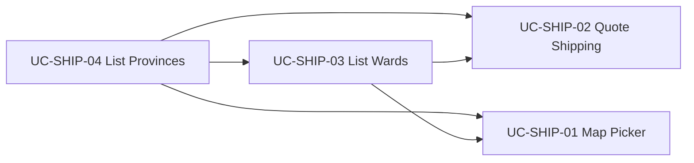

# Use Case — UC-SHIP-04: Liệt kê tỉnh/thành (List Provinces)

| Thuộc tính | Giá trị |
|------------|---------|
| **ID** | UC-SHIP-04 |
| **Tên** | Tải danh sách tỉnh/thành phố cho dropdown địa chỉ giao hàng |
| **Mức độ ưu tiên** | Cao (nền tảng cho checkout & quote ship) |
| **Phiên bản** | Bám code hiện tại |
| **Liên quan FR** | `FR_ListProvinces.md` |
| **Liên quan UC** | UC-SHIP-03 (wards), UC-SHIP-02 (quote), UC-SHIP-01 (map) |

---

## 1. Mô tả ngắn

Hệ thống cung cấp **toàn bộ tỉnh/thành** đã seed trong PostgreSQL, kèm metadata tính phí vận chuyển cấp tỉnh:

```
GET /api/provinces
Auth: Không bắt buộc (public)
```

**Frontend:** hook **`useProvinces()`** gọi một lần khi mount → lưu state local, render `<select>` trên **`CheckoutPage`** và **`EditShippingAddressDialog`** (preload từ `OrderDetailPage`).

Chọn `province_id` kích hoạt UC-SHIP-03 (load wards) và là input bắt buộc cho quote ship / tạo đơn.

---

## 2. Tác nhân

| Tác nhân | Vai trò |
|----------|---------|
| **Customer** | Chọn Tỉnh/Thành trên checkout hoặc sửa địa chỉ đơn |
| **useProvinces** | `api.get("/provinces")` |
| **geo.js router** | `Province.findAll` |
| **shippingService** | `Province.findByPk` khi quote (không dùng list API) |
| **Admin / seed** | Dữ liệu `provinces` table (ngoài scope UC) |

---

## 3. Preconditions

| # | Điều kiện |
|---|-----------|
| PRE-01 | Server + DB đã migrate và seed bảng `provinces` |
| PRE-02 | Route mount: `app.use('/api', geoRoutes)` |
| PRE-03 | FE có kết nối API (`VITE_API_URL` hoặc `http://localhost:5000/api`) |

---

## 4. Postconditions

| # | Kết quả |
|---|---------|
| POST-01 | FE nhận mảng province sorted `name ASC` |
| POST-02 | Dropdown hiển thị `-- Chọn Tỉnh/Thành --` + danh sách |
| POST-03 | User chọn → `provinceId` state → trigger load wards |
| POST-E01 | Lỗi mạng → `data` rỗng, `loading` false (hook không set error riêng) |

---

## 5. Trigger

| Ngữ cảnh | Khi nào gọi |
|----------|-------------|
| **CheckoutPage** | Mount trang checkout (`useProvinces()`) |
| **OrderDetailPage** | Mount detail → `useProvinces()` preload cho dialog |
| **EditShippingAddressDialog** | Nhận `provincesData` từ parent (tránh race modal) |

---

## 6. Luồng chính (BE)

| Bước | Hành động |
|------|-----------|
| 1 | `GET /api/provinces` |
| 2 | `Province.findAll({ order: [['name','ASC']], attributes: [...] })` |
| 3 | `res.json(provinces)` — mảng JSON thuần |

### Attributes trả về

| Field | Kiểu | Vai trò |
|-------|------|---------|
| `province_id` | INTEGER PK | Gửi `orders.province_id`, query quote |
| `name` | STRING | Label dropdown |
| `slug` | STRING | URL-friendly (ít dùng FE) |
| `is_hcm` | BOOLEAN | Freeship khi subtotal ≥ 1.000.000 VND |
| `base_shipping_fee` | INTEGER | Phí ship cơ bản (VND) |
| `is_free_shipping` | BOOLEAN | `true` → quote = 0 ngay |
| `max_shipping_fee` | INTEGER | Trần phí sau cộng ward |

**Không expose:** `region` (ENUM trên model), `created_at`, `updated_at`.

---

## 7. Luồng chính (FE)

### Hook `useProvinces`

```javascript
export function useProvinces() {
  const [data, setData] = useState([]);
  const [loading, setLoading] = useState(true);
  useEffect(() => {
    api.get("/provinces").then(res => setData(res.data))
      .finally(() => setLoading(false));
  }, []);
  return { data, loading };
}
```

### CheckoutPage

```javascript
const { data: provinces = [] } = useProvinces(true); // true bị bỏ qua — hook không nhận tham số
const [provinceId, setProvinceId] = useState("");

const handleProvinceChange = (e) => {
  setProvinceId(e.target.value);
  setWardId(""); // reset ward khi đổi tỉnh
  setFormData(prev => ({ ...prev, city: provinces.find(...)?.name || "" }));
};
```

| UI | Hành vi |
|----|---------|
| `<select name="city">` | `value={provinceId}`, options từ `provinces` |
| Phường/Xã | `disabled` cho đến khi có `provinceId` |

### OrderDetailPage + EditShippingAddressDialog

```javascript
const { data: provincesData } = useProvinces();
// ...
<EditShippingAddressDialog provincesData={provincesData} ... />
```

---

## 8. API contract

### Request

```http
GET /api/provinces
```

Không query params. Không pagination, không search `q`.

### Response 200 (ví dụ)

```json
[
  {
    "province_id": 79,
    "name": "Thành phố Hồ Chí Minh",
    "slug": "ho-chi-minh",
    "is_hcm": true,
    "base_shipping_fee": 30000,
    "is_free_shipping": false,
    "max_shipping_fee": 150000
  }
]
```

---

## 9. Luồng thay thế / ngoại lệ

### ALT-01 — Tỉnh freeship (`is_free_shipping: true`)

Quote ship (UC-SHIP-02) trả `shipping_fee: 0`, `reason: FREE_BY_PROVINCE` — không cần ward để freeship tỉnh (ward vẫn bắt buộc trên **createOrder**).

### ALT-02 — HCM (`is_hcm: true`)

Nếu subtotal ≥ 1.000.000 VND → `HCM_SUBTOTAL_FREE` (kiểm tra trong `quoteShipping`, sau bước cộng ward).

### EXC-01 — DB lỗi

Route **không** try/catch → Express error handler 500.

### EXC-02 — User chưa chọn tỉnh

`createOrder` → `400` "Vui lòng chọn Tỉnh/Thành và Phường/Xã".

---

## 10. Quan hệ với các UC khác



---

## 11. Model & DB

**Bảng:** `provinces` (`server/models/Province.js`)

| Cột | Ghi chú |
|-----|---------|
| `province_id` | PK auto increment |
| `name` | UNIQUE |
| `slug` | UNIQUE |
| `region` | ENUM — không trả API list |
| `base_shipping_fee` | default 0 |
| `is_free_shipping` | default false |
| `max_shipping_fee` | default 150000 |
| `is_hcm` | default false |

**Association:** `Province.hasMany(Ward)`.

---

## 12. Ánh xạ mã nguồn

| Thành phần | Đường dẫn |
|------------|-----------|
| Route | `server/routes/geo.js` |
| Model | `server/models/Province.js` |
| Hook | `client/app/hooks/useProvinces.js` |
| Checkout | `client/app/pages/CheckoutPage.jsx` |
| Edit address | `client/app/components/EditShippingAddressDialog.jsx` |
| Quote logic | `server/services/shippingService.js` |

---

## 13. Known gaps

| # | Gap |
|---|-----|
| GAP-01 | `useProvinces(true)` tại Checkout — tham số **vô hiệu** |
| GAP-02 | Hook **không** expose `error` — UX lỗi mạng kém |
| GAP-03 | Không cache React Query — mỗi mount refetch |
| GAP-04 | Không CRUD admin qua API này |
| GAP-05 | `region` trên DB không dùng cho quote |
| GAP-06 | Phí ship hiển thị checkout chủ yếu qua **previewOrder**, không đọc trực tiếp `base_shipping_fee` từ list |

---

## 14. Tiêu chí chấp nhận

- [ ] `GET /provinces` trả mảng, sort tên A→Z
- [ ] Checkout dropdown populate đủ tỉnh
- [ ] Đổi tỉnh → reset ward, preview ship recalc
- [ ] Chọn tỉnh HCM + đơn ≥1tr → preview `shipping_reason` có thể `HCM_SUBTOTAL_FREE`
