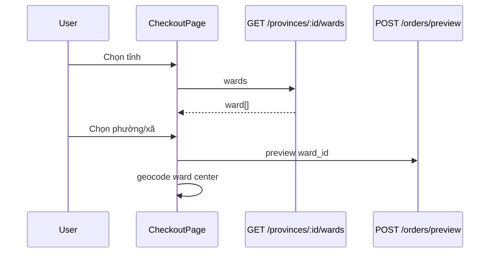

# Use Case — UC-SHIP-03: Liệt kê phường/xã theo tỉnh (List Wards By Province)

| Thuộc tính | Giá trị |
|------------|---------|
| **ID** | UC-SHIP-03 |
| **Tên** | Tải danh sách phường/xã sau khi user chọn tỉnh/thành |
| **Mức độ ưu tiên** | Cao |
| **Phiên bản** | Bám code hiện tại |
| **Liên quan FR** | `FR_ListWardsByProvince.md` |
| **Liên quan UC** | UC-SHIP-04, UC-SHIP-02, UC-SHIP-01 |

---

## 1. Mô tả ngắn

Sau khi khách chọn **tỉnh/thành** (UC-SHIP-04), frontend gọi:

```
GET /api/provinces/:id/wards
Auth: Public
```

`:id` = `province_id`. Trả mảng phường/xã thuộc tỉnh, gồm **`extra_fee`** (phụ phí ship). Hook **`useWards(provinceId)`** fetch khi `provinceId` đổi; nếu null → mảng rỗng.

`ward_id` là bắt buộc khi **`POST /orders`** và được dùng trong **`quoteShipping`** để cộng phụ phí.

---

## 2. Tác nhân

| Tác nhân | Vai trò |
|----------|---------|
| **Customer** | Chọn Phường/Xã |
| **useWards** | `api.get(\`/provinces/${provinceId}/wards\`)` |
| **geo.js** | `Ward.findAll` filter `province_id` |
| **Nominatim** (FE) | Geocode dùng `wardName` + `provinceName` |
| **quoteShipping** | `Ward.findByPk` cộng `extra_fee` |

---

## 3. Preconditions

| # | Điều kiện |
|---|-----------|
| PRE-01 | User đã chọn `province_id` hợp lệ |
| PRE-02 | Bảng `wards` có dữ liệu seed cho tỉnh đó |
| PRE-03 | UC-SHIP-04 đã load (hoặc `provinceId` đã biết) |

---

## 4. Postconditions

| # | Kết quả |
|---|---------|
| POST-01 | Dropdown Phường/Xã enabled, list wards |
| POST-02 | `wardId` state dùng cho preview / create order |
| POST-03 | Đổi tỉnh → `wardId` reset, wards list mới |
| POST-E01 | Tỉnh không có ward → `[]`, user không chọn được xã |

---

## 5. Trigger

| Sự kiện | Hành động |
|---------|-----------|
| `handleProvinceChange` / đổi `form.province_id` | `setWardId("")`, `useWards` refetch |
| `provinceId` từ `""` → số | GET wards |
| `provinceId` null/undefined | Hook clear `data: []` |

---

## 6. Luồng chính (BE)

```javascript
router.get('/provinces/:id/wards', async (req, res) => {
  const wards = await Ward.findAll({
    where: { province_id: req.params.id },
    order: [['name', 'ASC']],
    attributes: ['ward_id', 'name', 'slug', 'extra_fee', 'province_id'],
  });
  res.json(wards);
});
```

| Bước | Chi tiết |
|------|----------|
| 1 | Parse `req.params.id` (string URL → Sequelize coerce) |
| 2 | Filter `province_id` |
| 3 | Sort `name ASC` |
| 4 | JSON array |

### Response fields

| Field | Mô tả |
|-------|--------|
| `ward_id` | PK — `orders.ward_id` |
| `name` | Hiển thị dropdown |
| `slug` | Slug |
| `extra_fee` | VND cộng vào `base_shipping_fee` |
| `province_id` | FK |

---

## 7. Luồng chính (FE)

### Hook `useWards`

```javascript
export function useWards(provinceId) {
  useEffect(() => {
    if (!provinceId) { setData([]); return; }
    setLoading(true);
    api.get(`/provinces/${provinceId}/wards`)
      .then(res => setData(res.data))
      .finally(() => setLoading(false));
  }, [provinceId]);
  return { data, loading };
}
```

### CheckoutPage

```javascript
const { data: wards = [] } = useWards(provinceId || null);
const wardName = useMemo(
  () => wards.find((w) => +w.ward_id === +wardId)?.name || "",
  [wards, wardId]
);

// Select disabled khi !provinceId
<select name="ward" value={wardId} onChange={handleWardChange} disabled={!provinceId}>
```

### Khi chọn ward — side effects (Checkout)

| Effect | Mô tả |
|--------|--------|
| `useOrderPreview` | Debounce 500ms → `POST /orders/preview` với `ward_id` |
| `useEffect([wardId, wardName, provinceName])` | Geocode Nominatim `"Ward, Province, Vietnam"` → đặt marker (chưa confirm) |
| Ô địa chỉ | `disabled` cho đến khi có cả tỉnh + xã |

### EditShippingAddressDialog

- `useWards(Number(form.province_id))` khi user đổi tỉnh trong modal.
- `useShippingQuote` với `wardId` + `subtotal`.

---

## 8. API contract

### Request

```http
GET /api/provinces/79/wards
```

### Response 200

```json
[
  {
    "ward_id": 12345,
    "name": "Phường Hiệp Bình Chánh",
    "slug": "hiep-binh-chanh",
    "extra_fee": 5000,
    "province_id": 79
  }
]
```

Mảng `[]` hợp lệ nếu chưa seed ward.

---

## 9. Luồng thay thế / ngoại lệ

### ALT-01 — `extra_fee > 0`

`quoteShipping`: `fee = base_shipping_fee + ward.extra_fee` (trừ khi freeship tỉnh / HCM rule).

### ALT-02 — Không truyền `ward_id` khi quote HTTP

`GET /api/quote?province_id=79` (không ward) → không cộng extra — **createOrder vẫn bắt buộc ward**.

### EXC-01 — Centroid API (dead code)

`CheckoutPage.geoFallbackToWardCenter`:

```javascript
await api.get(`/geo/wards/${wardId}/centroid`);
```

**Endpoint không tồn tại** trên BE → catch alert thủ công map.

### EXC-02 — `createOrder` thiếu ward

`400` — "Vui lòng chọn Tỉnh/Thành và Phường/Xã".

---

## 10. Tích hợp geocode (UC-SHIP-01)

Sau khi có `wardName` + `provinceName`:

```javascript
const center = await geocodeSimple(`${wardName}, ${provinceName}, Vietnam`);
setLocationLL(center);
setLocationConfirmed(false); // bắt xác nhận map
```

Geocode **không** thay thế chọn ward trên dropdown — chỉ hỗ trợ định vị map.

---

## 11. Sơ đồ



---

## 12. Model

**Bảng:** `wards` (`server/models/Ward.js`)

| Cột | Ghi chú |
|-----|---------|
| `ward_id` | PK |
| `province_id` | FK CASCADE |
| `name` | |
| `slug` | |
| `extra_fee` | default 0 VND |

---

## 13. Ánh xạ mã nguồn

| Thành phần | Đường dẫn |
|------------|-----------|
| Route | `server/routes/geo.js` |
| Model | `server/models/Ward.js` |
| Hook | `client/app/hooks/useWards.js` |
| Checkout | `client/app/pages/CheckoutPage.jsx` |
| Edit dialog | `client/app/components/EditShippingAddressDialog.jsx` |
| Quote | `server/services/shippingService.js` |

---

## 14. Known gaps

| # | Gap |
|---|-----|
| GAP-01 | **`/geo/wards/:id/centroid`** được gọi ở Checkout nhưng **không implement** |
| GAP-02 | Route không try/catch |
| GAP-03 | `useWards` không cache — đổi tỉnh qua lại refetch |
| GAP-04 | Không search/lọc ward trên FE (list dài) |
| GAP-05 | `handleProvinceChange` Checkout **không** reset `locationConfirmed` (code comment out) |
| GAP-06 | FE hỗ trợ cả `w.name` và `w.ward_name` — API chỉ trả `name` |

---

## 15. Tiêu chí chấp nhận

- [ ] Chọn tỉnh → ward dropdown enabled + có options
- [ ] Đổi tỉnh → ward reset, list mới
- [ ] Chọn ward → preview order cập nhật phí ship (nếu có subtotal)
- [ ] Submit order thiếu ward → 400
