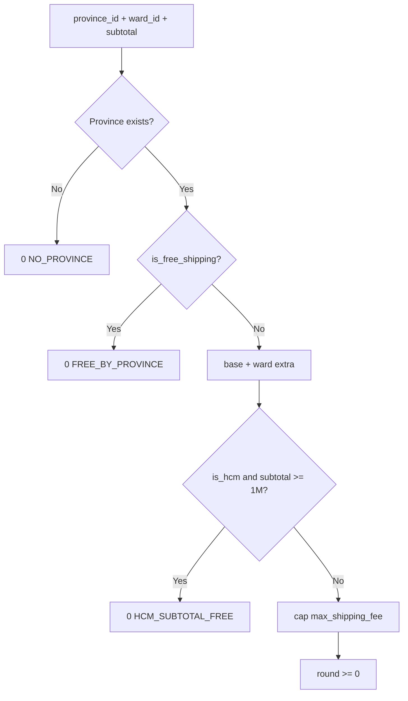

# Use Case — UC-SHIP-02: Báo giá phí vận chuyển (Quote Shipping Fee)

| Thuộc tính | Giá trị |
|------------|---------|
| **ID** | UC-SHIP-02 |
| **Tên** | Tính phí giao hàng theo tỉnh, phường/xã và tạm tính đơn |
| **Mức độ ưu tiên** | Cao |
| **Phiên bản** | Bám code hiện tại |
| **Liên quan FR** | `FR_QuoteShippingFee.md` |
| **Liên quan UC** | UC-SHIP-04, UC-SHIP-03, UC-ORD-05 (preview), UC-ORD-11 (update address) |

---

## 1. Mô tả ngắn

Logic tập trung **`shippingService.quoteShipping({ province_id, ward_id, subtotal })`** trả `{ shipping_fee, reason? }` (VND, integer).

**Ba cách gọi trong đồ án:**

| # | Cách | Endpoint / ngữ cảnh |
|---|------|---------------------|
| A | HTTP public | `GET /api/quote?province_id=&ward_id=&subtotal=` |
| B | Preview checkout | `POST /api/orders/preview` (server gọi nội bộ) |
| C | Persist đơn | `createOrder`, `updateShippingAddress` |

**FE:**

- **Checkout:** `useOrderPreview` → preview API (không gọi `GET /quote` trực tiếp).
- **EditShippingAddressDialog:** `useShippingQuote` → `GET /quote` debounce 300ms.

---

## 2. Tác nhân

| Tác nhân | Vai trò |
|----------|---------|
| **Customer** | Xem phí ship trước khi đặt / sửa địa chỉ |
| **shippingService** | Business rules |
| **shippingController.getQuote** | HTTP wrapper |
| **orderController** | previewOrder, createOrder, updateShippingAddress |
| **useShippingQuote** | FE hook |
| **useOrderPreview** | FE preview tổng đơn |

---

## 3. Preconditions

| # | Điều kiện |
|---|-----------|
| PRE-01 | `province_id` hợp lệ (tồn tại trong DB) — thiếu → `NO_PROVINCE` |
| PRE-02 | `subtotal` là số (sau giảm giá dòng hàng) |
| PRE-03 | (HTTP FE) `useShippingQuote` cần `provinceId` **và** `subtotal` truthy |

---

## 4. Postconditions

| # | Kết quả |
|---|---------|
| POST-01 | `shipping_fee` ≥ 0, VND integer |
| POST-02 | `reason` giải thích case freeship (optional) |
| POST-03 | Preview/checkout hiển thị phí + tổng |
| POST-04 | `createOrder` lưu `orders.shipping_fee`, `final_amount` |

---

## 5. Business rules — thứ tự thực thi

```javascript
async function quoteShipping({ province_id, ward_id, subtotal }) {
  const province = await Province.findByPk(province_id);
  if (!province) return { shipping_fee: 0, reason: "NO_PROVINCE" };

  let fee = Number(province.base_shipping_fee || 0);

  if (province.is_free_shipping)
    return { shipping_fee: 0, reason: "FREE_BY_PROVINCE" };

  if (ward_id) {
    const ward = await Ward.findByPk(ward_id);
    if (ward) fee += Number(ward.extra_fee || 0);
  }

  if (province.is_hcm && Number(subtotal) >= 1_000_000)
    return { shipping_fee: 0, reason: "HCM_SUBTOTAL_FREE" };

  if (province.max_shipping_fee != null)
    fee = Math.min(fee, Number(province.max_shipping_fee));

  return { shipping_fee: Math.max(0, Math.round(fee)) };
}
```

| Bước | Điều kiện | Kết quả |
|------|-----------|---------|
| 1 | Province không tồn tại | `0`, `NO_PROVINCE` |
| 2 | `is_free_shipping` | `0`, `FREE_BY_PROVINCE` — **không** cộng ward |
| 3 | Có `ward_id` | `fee += ward.extra_fee` |
| 4 | `is_hcm` && subtotal ≥ 1.000.000 | `0`, `HCM_SUBTOTAL_FREE` |
| 5 | `max_shipping_fee` | `fee = min(fee, max)` |
| 6 | Round | `Math.max(0, Math.round(fee))` |

**Out of scope:** cân nặng, kích thước, coupon freeship, VAT ship.

---

## 6. HTTP API — `GET /api/quote`

### Mount

```javascript
// server/routes/shippingRoutes.js
router.get("/quote", getQuote);
// server.js: app.use("/api", shippingRoutes);
```

### Request

```http
GET /api/quote?province_id=79&ward_id=12345&subtotal=1500000
```

| Query | Bắt buộc | Ghi chú |
|-------|----------|---------|
| `province_id` | Có (implicit) | `Number(province_id)` |
| `ward_id` | Không | Thiếu → không load ward |
| `subtotal` | Không | Default `0` |

### Response 200

```json
{
  "shipping_fee": 35000,
  "reason": null
}
```

Ví dụ có reason:

```json
{ "shipping_fee": 0, "reason": "HCM_SUBTOTAL_FREE" }
```

### Error 500

```json
{ "error": "QUOTE_FAILED" }
```

**Auth:** không bắt buộc.

---

## 7. Luồng FE — `useShippingQuote`

```javascript
export function useShippingQuote({ provinceId, wardId, subtotal }) {
  // Debounce 300ms
  // Skip if !provinceId || !subtotal  ← subtotal=0 cũng skip
  const { data } = await api.get("/quote", { params: {
    province_id: Number(provinceId),
    ward_id: wardId ? Number(wardId) : undefined,
    subtotal: Number(subtotal || 0),
  }});
}
```

**Dùng tại:** `EditShippingAddressDialog` — `subtotal = order.final_amount - order.shipping_fee`.

Hiển thị confirm khi `newShippingFee !== currentShippingFee` trước `PUT shipping-address`.

---

## 8. Luồng FE — Checkout (`useOrderPreview`)

```javascript
POST /api/orders/preview
{
  "province_id": 79,
  "ward_id": 12345,
  "items": [{ "variation_id": 10, "quantity": 1 }]
}
```

Server (`previewOrder`):

1. Tính giá/giảm từng dòng + stock warnings.
2. `subtotal_after_discount` = tổng sau giảm.
3. `quoteShipping({ province_id, ward_id, subtotal: subtotal_after_discount })`.
4. `final_amount = subtotal_after_discount + shipping_fee`.

Checkout UI:

```javascript
const showShipping = preview?.shipping_fee ?? 0;
const showTotal = preview?.final_amount ?? fallbackSubtotalAfterDiscount;
// Hiển thị preview.shipping_reason trong label phí ship
```

**Debounce:** 500ms (preview), không dùng `useShippingQuote` tại checkout.

### Dead code Checkout (GAP)

```javascript
const shipping = 30000;
const total = subtotal + shipping;
```

Biến **không** dùng cho UI cột phải — UI lấy từ `preview`.

---

## 9. Luồng BE — `createOrder`

Sau khi tính `subtotalAfterDiscount`:

```javascript
const { shipping_fee } = await quoteShipping({ province_id, ward_id, subtotal: subtotalAfterDiscount });
const finalAmount = subtotalAfterDiscount + Number(shipping_fee || 0);
```

Lưu `orders.shipping_fee`, `orders.final_amount`.  
`Payment.amount` = `finalAmount` (VNPay/COD).

---

## 10. Luồng BE — `updateShippingAddress`

Tính lại ship khi đổi tỉnh/xã:

```javascript
const { shipping_fee: newShipFee } = await quoteShipping({
  province_id: newProvinceId,
  ward_id: newWardId,
  subtotal,
});
// Chặn nếu VNPAY completed && phí đổi → 400
```

---

## 11. Bảng `reason`

| `reason` | Ý nghĩa |
|----------|---------|
| `NO_PROVINCE` | ID tỉnh không tồn tại |
| `FREE_BY_PROVINCE` | `is_free_shipping` |
| `HCM_SUBTOTAL_FREE` | HCM + đơn ≥ 1tr |
| `null` / undefined | Phí tính bình thường |

---

## 12. Sơ đồ



---

## 13. Ánh xạ mã nguồn

| Thành phần | Đường dẫn |
|------------|-----------|
| Service | `server/services/shippingService.js` |
| Controller | `server/controllers/shippingController.js` |
| Routes | `server/routes/shippingRoutes.js` |
| previewOrder | `server/controllers/orderController.js` |
| createOrder | `server/controllers/orderController.js` |
| updateShippingAddress | `server/controllers/orderController.js` |
| Hook quote | `client/app/hooks/useShippingQuote.js` |
| Hook preview | `client/app/hooks/useOrderPreview.js` |
| Checkout UI | `client/app/pages/CheckoutPage.jsx` |
| Edit dialog | `client/app/components/EditShippingAddressDialog.jsx` |

---

## 14. Known gaps

| # | Gap |
|---|-----|
| GAP-01 | Checkout **không** gọi `useShippingQuote` — chỉ `previewOrder` |
| GAP-02 | `useShippingQuote` skip khi `subtotal` falsy (0) |
| GAP-03 | `GET /quote` không validate JWT — có thể probe phí |
| GAP-04 | Không verify `subtotal` khớp giỏ thật trên quote HTTP |
| GAP-05 | `shipping = 30000` dead code trên CheckoutPage |
| GAP-06 | Không tính theo trọng lượng / danh mục SP |
| GAP-07 | `previewOrder` yêu cầu JWT qua interceptor; `GET /quote` public |

---

## 15. Tiêu chí chấp nhận

- [ ] HCM, subtotal 1.500.000 → `shipping_fee: 0`, reason `HCM_SUBTOTAL_FREE`
- [ ] Tỉnh `is_free_shipping` → 0 bất kể ward
- [ ] Ward `extra_fee` 5000 → cộng vào base
- [ ] Checkout đổi tỉnh/xã → preview cập nhật phí trong ~500ms
- [ ] Edit address đổi tỉnh → dialog hiện chênh phí ship
