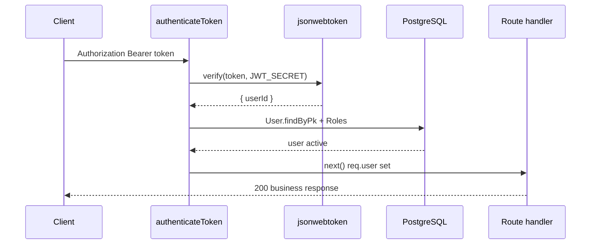

# Use Case — UC-SYS-01: Xác thực JWT trên request (Authenticate JWT Requests)

| Thuộc tính | Giá trị |
|------------|---------|
| **ID** | UC-SYS-01 |
| **Tên** | Middleware `authenticateToken` — verify Bearer JWT và gắn `req.user` |
| **Mức độ ưu tiên** | Cao (nền tảng bảo mật API) |
| **Phiên bản** | Bám code hiện tại |
| **Liên quan FR** | `FR_JWTAuthenticationMiddleware.md` |
| **Liên quan UC** | UC-SYS-02, UC-ADM-01, các UC auth/order/cart |

---

## 1. Mô tả ngắn

Mọi request tới route **được bảo vệ** phải gửi header:

```http
Authorization: Bearer <access_token>
```

Middleware **`authenticateToken`** (`server/middleware/auth.js`):

1. Tách token từ header.
2. `jwt.verify` với `JWT_SECRET`.
3. Load `User` + `Roles` từ PostgreSQL theo `decoded.userId`.
4. Từ chối user **inactive**.
5. Gắn `req.user`, `req.userId`, `req.userRoles` → `next()`.

**Phát hành token** (login, register, OAuth) nằm ở `authController` / `passport.js` — **không** thuộc UC này.

---

## 2. Tác nhân

| Tác nhân | Vai trò |
|----------|---------|
| **Client (browser/app)** | Gửi token (axios interceptor) |
| **authenticateToken** | Middleware async |
| **jsonwebtoken** | Verify / expired |
| **User, Role models** | DB lookup |

---

## 3. Preconditions

| # | Điều kiện |
|---|-----------|
| PRE-01 | Route mount `authenticateToken` (router-level hoặc per-route) |
| PRE-02 | Token ký bằng cùng `JWT_SECRET` |
| PRE-03 | Payload chứa `userId` khớp user còn tồn tại |
| PRE-04 | `user.is_active === true` |

---

## 4. Postconditions

| # | Kết quả |
|---|---------|
| POST-01 | `req.user` có roles, **không** có `password_hash` |
| POST-02 | Controller dùng `req.userId` hoặc `req.user.user_id` |
| POST-E01 | Thiếu token → **401** `{ message: "Access token required" }` |
| POST-E02 | Token invalid/expired → **401** `{ message: "Invalid or expired token" }` |
| POST-E03 | User inactive / không tồn tại → **403** `{ message: "User not found or inactive" }` |

---

## 5. Trigger

Bất kỳ HTTP request protected nào sau khi client đã login / OAuth / verify email (session JWT).

---

## 6. Luồng chính



### Implementation

```javascript
const decoded = jwt.verify(token, process.env.JWT_SECRET || "your-secret-key");

const user = await User.findByPk(decoded.userId, {
  include: [{ model: Role, through: { attributes: [] } }],
  attributes: { exclude: ["password_hash"] },
});

if (!user || !user.is_active) {
  return res.status(403).json({ message: "User not found or inactive" });
}

req.user = user;
req.userId = user.user_id;
req.userRoles = user.Roles?.map(r => r.role_name) || [];
next();
```

---

## 7. Phát hành token (liên quan)

| Nguồn | Hàm | TTL |
|-------|-----|-----|
| Login / register thành công | `generateToken(userId)` | **7d** |
| OAuth success | `passport.js` `jwt.sign` | **7d** |
| Verify email redirect | `authController` | **7d** |

```javascript
jwt.sign({ userId }, process.env.JWT_SECRET || "your-secret-key", { expiresIn: "7d" });
```

**Payload session:** chỉ `{ userId }` — không embed roles trong JWT (roles load DB mỗi request).

### JWT đặc mục đích (ngoài middleware)

| Mục đích | Claim / TTL | Middleware session? |
|---------|-------------|---------------------|
| Email verify | `purpose: "email_verify"` | Không |
| Reset password | `purpose: "reset_password"` | Không |

---

## 8. Router áp dụng middleware

| Router | Pattern | Prefix |
|--------|---------|--------|
| `cartRoutes` | `router.use(authenticateToken)` | `/api/cart/*` |
| `orderRoutes` | `router.use(authenticateToken)` | `/api/orders/*` |
| `adminRoutes` | `router.use` + UC-SYS-02 | `/api/admin/*` |
| `authRoutes` | Per-route | `GET /me`, `PUT /profile` |
| `productRoutes` | Per-route | POST Q&A |

### Public (không UC-SYS-01)

| Nhóm | Ví dụ |
|------|--------|
| Auth | `POST /auth/login`, register, forgot-password |
| Catalog | `GET /products`, categories, brands |
| Geo / shipping quote | `GET /provinces`, quote |
| VNPay | return URL, create payment |
| Health | `GET /api/health` |

---

## 9. Frontend — axios (`client/app/services/api.js`)

### Request interceptor

```javascript
const token = localStorage.getItem("token");
if (token) {
  config.headers.Authorization = `Bearer ${token}`;
}
```

### Response interceptor (401 / legacy 403)

| Điều kiện | Hành vi |
|-----------|---------|
| 401 hoặc 403 + message token invalid | Clear `token`, `user`, `roles` |
| Không áp dụng | `/auth/login`, `/auth/register` |
| Sau clear | `logout`, `clearCart`, `window.location = "/login"` |

**Lưu ý:** Admin khóa user → API trả **403 inactive** — FE có thể redirect login (nếu message khớp legacy check).

### Redux restore

`App.jsx` đọc `localStorage` → `setCredentials` — token không re-validate server cho đến request đầu.

---

## 10. Luồng thay thế

### ALT-01 — Header sai format

`Authorization` thiếu `Bearer ` → `split(" ")[1]` undefined → 401 Access token required.

### ALT-02 — Admin bị khóa giữa phiên

Token còn hạn nhưng `is_active: false` → 403 — mọi protected API fail.

### EXC-01 — Fallback secret dev

`JWT_SECRET` không set → `"your-secret-key"` — rủi ro production.

---

## 11. Ánh xạ mã nguồn

| Thành phần | Đường dẫn |
|------------|-----------|
| Middleware | `server/middleware/auth.js` |
| Token issue | `server/controllers/authController.js` |
| OAuth JWT | `server/config/passport.js` |
| FE client | `client/app/services/api.js` |
| FE guard pages | `ProtectedRoute.jsx`, `AdminRoute.jsx` (role riêng) |

---

## 12. Known gaps

| # | Gap |
|---|-----|
| GAP-01 | **Không refresh token** — hết 7d phải login lại |
| GAP-02 | **Không blacklist** sau logout — token vẫn valid đến hết hạn |
| GAP-03 | Roles **không** trong JWT — đổi role DB không invalidate token cũ |
| GAP-04 | Fallback `your-secret-key` |
| GAP-05 | 403 inactive vs 401 invalid — FE legacy map một phần |
| GAP-06 | `req.userRoles` set nhưng nhiều controller vẫn đọc `req.user.Roles` |

---

## 13. Tiêu chí chấp nhận

- [ ] `GET /api/cart` không token → 401
- [ ] Token hợp lệ → 200
- [ ] Token expired → 401 Invalid or expired
- [ ] User `is_active: false` → 403
- [ ] Login nhận token → request kèm Bearer thành công
