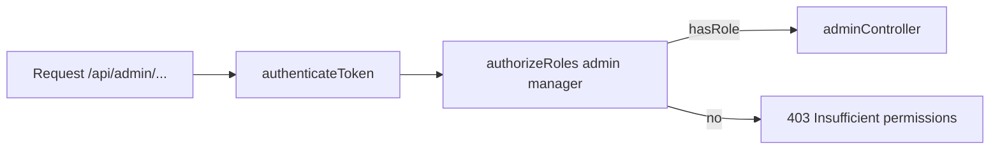

# Use Case — UC-SYS-02: Phân quyền theo role (Authorize By Role)

| Thuộc tính | Giá trị |
|------------|---------|
| **ID** | UC-SYS-02 |
| **Tên** | Middleware `authorizeRoles` — kiểm tra role sau JWT |
| **Mức độ ưu tiên** | Cao |
| **Phiên bản** | Bám code hiện tại |
| **Liên quan FR** | `FR_RoleBasedAuthorizationMiddleware.md` |
| **Liên quan UC** | UC-SYS-01, UC-ADM-01, UC-ADM-07 |

---

## 1. Mô tả ngắn

Sau **UC-SYS-01**, một số route cần role cụ thể. Middleware **`authorizeRoles(...allowedRoles)`** kiểm tra `req.user.Roles` có **ít nhất một** `role_name` trong danh sách cho phép (logic **OR**).

**Mount chính:**

```javascript
// adminRoutes.js
router.use(authenticateToken);
router.use(authorizeRoles("admin", "manager"));
```

**Không** dùng bảng `permissions` / `role_permissions` — model có quan hệ nhưng **runtime không check permission**.

---

## 2. Tác nhân

| Tác nhân | Vai trò |
|----------|---------|
| **admin** | Pass whitelist |
| **manager** | Pass whitelist (API) |
| **customer** | 403 trên `/api/admin` |
| **authorizeRoles** | Higher-order middleware |

---

## 3. Preconditions

| # | Điều kiện |
|---|-----------|
| PRE-01 | UC-SYS-01 đã chạy — `req.user` + `Roles` loaded |
| PRE-02 | User có ≥1 role trong tham số middleware |

---

## 4. Postconditions

| # | Kết quả |
|---|---------|
| POST-01 | Role khớp → `next()` → controller admin |
| POST-E01 | Không role khớp → **403** `{ message: "Insufficient permissions" }` |
| POST-E02 | `!req.user` (mount sai thứ tự) → **401** `{ message: "Authentication required" }` |

---

## 5. Trigger

HTTP request tới **`/api/admin/*`** với JWT hợp lệ.

---

## 6. Luồng chính



### Code

```javascript
const authorizeRoles = (...roles) => {
  return (req, res, next) => {
    if (!req.user) {
      return res.status(401).json({ message: "Authentication required" });
    }
    const userRoles = req.user.Roles.map((role) => role.role_name);
    const hasRole = roles.some((role) => userRoles.includes(role));
    if (!hasRole) {
      return res.status(403).json({ message: "Insufficient permissions" });
    }
    next();
  };
};
```

| Rule | Chi tiết |
|------|----------|
| OR | `admin` **hoặc** `manager` đủ |
| Case-sensitive | `"Admin"` ≠ `"admin"` |
| Nguồn roles | DB `user_roles` — không đọc JWT claim |

---

## 7. Ma trận quyền (thực tế đồ án)

| `role_name` | `/api/admin/*` | `/api/orders`, `/cart` | FE `/admin` UI |
|-------------|----------------|-------------------------|----------------|
| `customer` | **403** | 200 (nếu auth) | Redirect `/` |
| `admin` | **200** | 200 | Cho phép |
| `manager` | **200** | 200 | **Chặn** (chỉ `admin`) |
| `staff` | **403** | 200 | Redirect `/` |

### Phân quyền inline (không dùng `authorizeRoles`)

| Chức năng | File | Rule |
|-----------|------|------|
| Trả lời Q&A storefront | `productController.createAnswer` | `admin` **hoặc** `staff` trong `req.userRoles` |
| Sửa/xóa câu hỏi | `updateQuestion` / `deleteQuestion` | Owner **hoặc** admin/staff |

```javascript
const isStaff = roles.includes("admin") || roles.includes("staff");
```

**Staff** có thể trả lời Q&A nhưng **không** vào admin API mount.

---

## 8. Phạm vi route `/api/admin` (sau authorize)

| Nhóm | Ví dụ endpoint |
|------|----------------|
| Products | POST/PUT/DELETE products, variations |
| Orders | GET/PUT status, ship, deliver, refund |
| Users | GET users, PUT status |
| Catalog meta | categories, brands |
| Roles | CRUD roles, PUT user roles |
| Analytics | dashboard, sales |
| Q&A admin | questions CRUD (questionsController) |

Toàn bộ dùng chung pipeline **JWT + admin/manager**.

---

## 9. So sánh FE vs BE

```javascript
// AdminRoute.jsx — chỉ FE
const isAdmin = user?.roles?.includes("admin");
```

| Kịch bản | API | UI |
|----------|-----|-----|
| User `manager` | Gọi `GET /api/admin/orders` → **200** | `/admin` → **/** |
| User `customer` + token | **403** | **/** |

**Manager paradox:** API mở, portal đóng.

---

## 10. Luồng thay thế

### ALT-01 — Customer thử admin API

JWT customer hợp lệ → authenticateToken OK → authorizeRoles fail → 403.

### ALT-02 — Mở rộng role

Thêm `authorizeRoles("admin", "manager", "warehouse")` — phải sửa code; không config-driven.

### EXC-01 — User không có role nào

`setRoles([])` → 403 mọi admin route.

---

## 11. Ánh xạ mã nguồn

| Thành phần | Đường dẫn |
|------------|-----------|
| Middleware | `server/middleware/auth.js` |
| Mount | `server/routes/adminRoutes.js` L8–9 |
| FE guard | `client/app/components/AdminRoute.jsx` |
| Q&A staff check | `server/controllers/productController.js` |
| Models | `server/models/index.js` — User↔Role M:N |

---

## 12. Known gaps

| # | Gap |
|---|-----|
| GAP-01 | **Permissions table unused** |
| GAP-02 | **manager** API vs FE admin only |
| GAP-03 | **staff** Q&A nhưng không admin routes |
| GAP-04 | Không audit log 403 |
| GAP-05 | `authorizeRoles` chỉ trên `adminRoutes` — không tái dùng cho resource-level |
| GAP-06 | Role đổi runtime — token cũ vẫn pass đến khi hết hạn JWT |

---

## 13. Tiêu chí chấp nhận

- [ ] Token `admin` → `GET /api/admin/users` → 200
- [ ] Token `customer` → cùng endpoint → 403 Insufficient permissions
- [ ] Token `manager` → 200 API, FE admin chặn
- [ ] Không mount authenticateToken trước → 401 Authentication required
