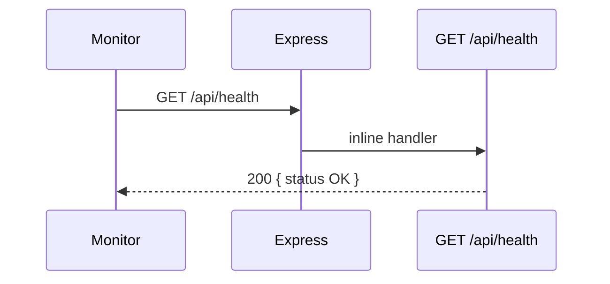

# Use Case — UC-SYS-04: Kiểm tra sức khỏe hệ thống (Check System Health)

| Thuộc tính | Giá trị |
|------------|---------|
| **ID** | UC-SYS-04 |
| **Tên** | Liveness check API chính + health tầng hạ tầng liên quan |
| **Mức độ ưu tiên** | Trung bình |
| **Phiên bản** | Bám code hiện tại |
| **Liên quan FR** | `FR_HealthCheckAPI.md` |
| **Liên quan UC** | UC-REC-02 (ML `/health`) |

---

## 1. Mô tả ngắn

Use case mô tả **cách xác nhận hệ thống đang chạy** — tập trung endpoint chính:

```http
GET /api/health
```

Trả JSON cố định — **không** auth, **không** ping database.

Bổ sung ngữ cảnh đồ án: health **PostgreSQL** (docker), **nginx** stub, **recommendation Flask**, và **lỗi path** Dockerfile BE.

---

## 2. Tác nhân

| Tác nhân | Vai trò |
|----------|---------|
| **Dev / Ops** | curl, browser |
| **Docker / CI** | Probe (nếu path đúng) |
| **Express** | Inline handler `server.js` |
| **Nginx** | Static `200 healthy` (tùy deploy) |

---

## 3. Preconditions

| # | Điều kiện |
|---|-----------|
| PRE-01 | Process Node đã `listen` port (`PORT` default **5000**) |
| PRE-02 | Không yêu cầu JWT |

---

## 4. Postconditions

| # | Kết quả |
|---|---------|
| POST-01 | HTTP **200** + body JSON schema cố định |
| POST-E01 | Connection refused — process down / sai port |

---

## 5. Trigger

| Sự kiện | Ví dụ |
|---------|--------|
| Manual smoke | `curl http://localhost:5000/api/health` |
| Sau deploy | Kiểm tra nhanh |
| Monitor uptime | HTTP GET định kỳ |

---

## 6. API chính — `GET /api/health`

### Request

```http
GET /api/health
Accept: application/json
```

| Thuộc tính | Giá trị |
|------------|---------|
| Auth | **Không** |
| Body | Không |

### Response 200

```json
{
  "status": "OK",
  "message": "Server is running"
}
```

### Implementation

```javascript
// server/server.js — sau routes, trước errorHandler
app.get("/api/health", (req, res) => {
  res.json({ status: "OK", message: "Server is running" });
});
```

| Đặc điểm | Chi tiết |
|----------|----------|
| Liveness only | Process HTTP stack sống |
| DB | **Không** `sequelize.authenticate()` trong handler |
| Startup | `startServer()` authenticate DB **trước** listen — fail startup thì không có health |

### Thứ tự middleware

1. `cors`, `express.json`, `passport.initialize`
2. Mount `/api/auth`, `/api/products`, …
3. **`GET /api/health`**
4. `errorHandler`

---

## 7. Health các thành phần khác (toàn đồ án)

| Thành phần | Endpoint | Kiểm tra DB? | Ghi chú |
|------------|----------|--------------|---------|
| **Main API** | `GET /api/health` | Không | UC-SYS-04 |
| **Recommendation** | `GET /health` (Flask) | Gián tiếp (`items` từ artifacts) | Port 5001/8000 |
| **PostgreSQL** | `pg_isready` | Có | `docker-compose` healthcheck |
| **Nginx** | `GET /health` | Không | `return 200 "healthy\n"` text/plain |
| **Client SPA** | — | Không | Không expose health API riêng |

### Flask recommendation (`recommendation_service/app.py`)

```json
{
  "ok": true,
  "items": 150,
  "x_all_shape": [150, 2]
}
```

Dùng xác nhận ML service + artifacts loaded — **khác** contract main API.

---

## 8. Docker & probe — gaps quan trọng

### `server/Dockerfile`

```dockerfile
HEALTHCHECK CMD curl -f http://localhost:5000/health || exit 1
```

| Vấn đề | Thực tế |
|--------|---------|
| Path probe | `/health` |
| Route app | `/api/health` |
| Kết quả | Healthcheck container **có thể fail** dù app OK |

### `docker-compose.yml`

- **postgres:** `pg_isready -U postgres` — OK
- **server:** `depends_on: postgres: service_healthy` — không probe HTTP server path

### FE base URL

`VITE_API_URL` thường `http://localhost:5000/api` → health full URL:

`http://localhost:5000/api/health`

---

## 9. Sơ đồ (main API)



**Readiness** (không implement): cần thêm endpoint ping `sequelize.authenticate()` + VNPay env — hiện **không có**.

---

## 10. Luồng thay thế

### ALT-01 — Server crash sau startup

DB mất kết nối runtime → business API 500 — **`/api/health` vẫn 200** (GAP monitoring).

### ALT-02 — Chỉ check nginx `/health`

Thấy `healthy` text — **không** đảm bảo Node API hoặc DB.

---

## 11. Ánh xạ mã nguồn

| Thành phần | Đường dẫn |
|------------|-----------|
| Main health | `server/server.js` L43–45 |
| Startup DB | `server/server.js` `startServer()` |
| Dockerfile probe | `server/Dockerfile` L28–29 |
| Nginx | `nginx/nginx.conf` L110–114 |
| ML health | `recommendation_service/app.py` |
| Compose postgres | `docker-compose.yml` |

---

## 12. Known gaps

| # | Gap |
|---|-----|
| GAP-01 | Dockerfile **`/health`** vs app **`/api/health`** |
| GAP-02 | Health **không** reflect DB connectivity |
| GAP-03 | Không check recommendation / VNPay / Cloudinary |
| GAP-04 | Nginx `/health` ≠ API health |
| GAP-05 | Không rate limit — có thể spam log (mặc định Express im lặng) |
| GAP-06 | Không versioning / build sha trong response |

---

## 13. Tiêu chí chấp nhận

- [ ] `curl http://localhost:5000/api/health` → 200 + JSON đúng
- [ ] Không cần Authorization header
- [ ] Server chưa start → connection refused
- [ ] Document: sửa probe thành `/api/health` nếu dùng Docker healthcheck

---

## 14. Test plan gợi ý

1. `npm start` trong `server/` → curl `/api/health`.
2. So sánh `curl /health` → expect 404 (main app).
3. Docker build → inspect HEALTHCHECK fail/pass.
4. Flask: `curl http://localhost:5001/health` khi service up.
5. Stop postgres → `/api/health` vẫn 200, `GET /products` có thể 500.
