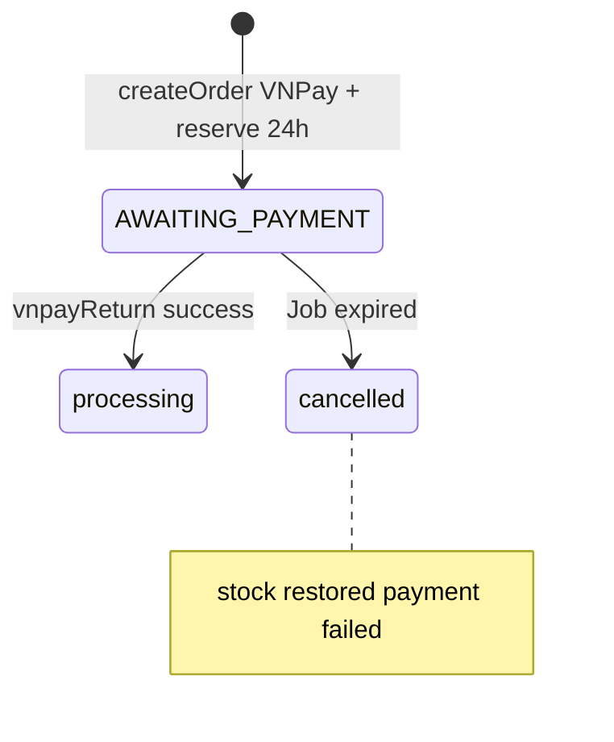
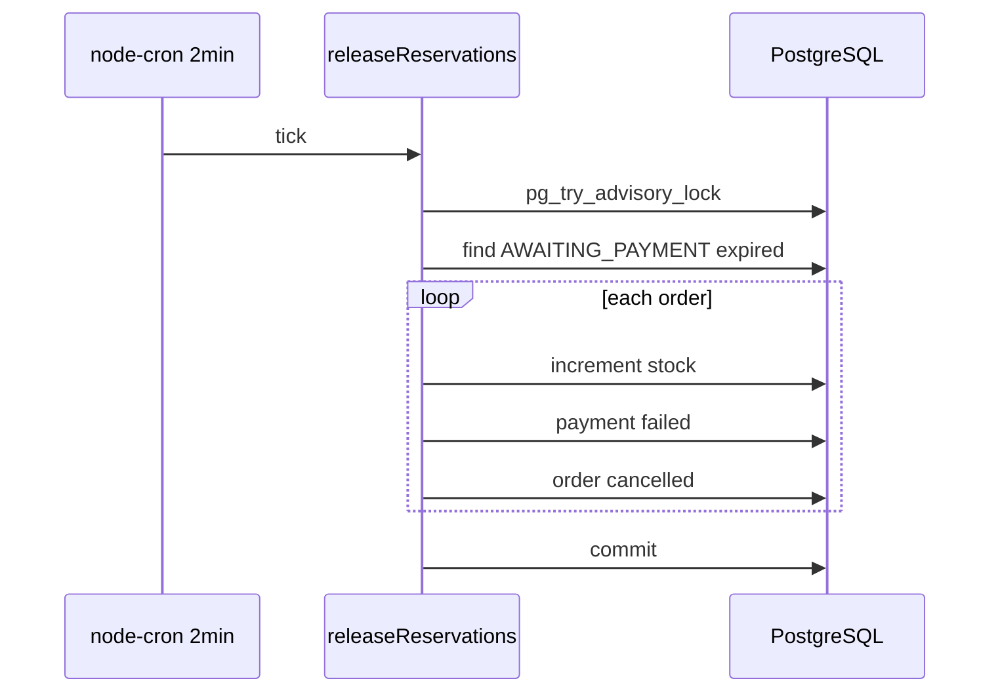

# Use Case — UC-SYS-05: Giải phóng giữ chỗ đơn hết hạn (Release Expired Order Reservations)

| Thuộc tính | Giá trị |
|------------|---------|
| **ID** | UC-SYS-05 |
| **Tên** | Cron job hoàn kho và hủy đơn VNPay quá hạn `reserve_expires_at` |
| **Mức độ ưu tiên** | Cao (tồn kho + thanh toán VNPay) |
| **Phiên bản** | Bám code hiện tại |
| **Liên quan FR** | `FR_ReleaseExpiredReservationsJob.md` |
| **Liên quan UC** | UC-ORD-03 (VNPay create), UC-PAY-*, UC-NOT-02 (không email) |

---

## 1. Mô tả ngắn

Khi khách đặt hàng **VNPay**, hệ thống:

- Trừ **tồn kho** ngay (`createOrder`).
- Set `status = AWAITING_PAYMENT`.
- Set **`reserve_expires_at = now + 24 giờ`**.

Nếu **không** thanh toán trong 24h, background job **`releaseReservations.js`** (cron **mỗi 2 phút**) sẽ:

1. Hoàn `stock_quantity` theo từng `OrderItem`.
2. `Payment` VNPay `pending` → **`failed`**.
3. `Order.status` → **`cancelled`**, `reserve_expires_at` → `null`.

**COD** (`reserve_expires_at: null`) — **không** nằm trong job.

Job chạy **in-process** cùng server API (`require` trong `server.js`) — không worker riêng.

---

## 2. Tác nhân

| Tác nhân | Vai trò |
|----------|---------|
| **node-cron** | `*/2 * * * *` |
| **releaseReservations** | Transaction + locks |
| **PostgreSQL** | Advisory lock + row locks |
| **createOrder** | Tạo hold 24h |
| **vnpayReturn** | Path thành công — **ngoài** job |
| **Customer** | Gián tiếp — không gọi API job |

---

## 3. Preconditions

| # | Điều kiện |
|---|-----------|
| PRE-01 | Server Node đang chạy (file job được import) |
| PRE-02 | PostgreSQL (advisory lock **chỉ** postgres) |
| PRE-03 | Order thỏa: `status = AWAITING_PAYMENT` AND `reserve_expires_at < NOW()` |

---

## 4. Postconditions

| # | Kết quả |
|---|---------|
| POST-01 | Tồn kho variation **tăng** lại đúng `quantity` đã reserve |
| POST-02 | Order → `cancelled`, `reserve_expires_at = null` |
| POST-03 | Payment VNPay pending → `failed` |
| POST-04 | Transaction commit |
| POST-ALT | Không đơn expired → tick no-op (silent) |
| POST-LOCK | Instance khác giữ advisory lock → **skip** tick |

**Không gửi email** (UC-NOT-02 không trigger cancel job).

---

## 5. Trigger

| Sự kiện | Mô tả |
|---------|--------|
| Cron | Mỗi **2 phút** |
| Import | `require("./jobs/releaseReservations")` khi start `server.js` |
| Điều kiện dữ liệu | Thời gian > `reserve_expires_at` |

---

## 6. Ngữ cảnh tạo hold — `createOrder`

```javascript
const holdMs = isVnpay ? 24 * 60 * 60 * 1000 : 0; // 24h VNPay, COD = 0

await Order.create({
  status: isVnpay ? "AWAITING_PAYMENT" : "processing",
  reserve_expires_at: holdMs ? new Date(Date.now() + holdMs) : null,
  // ...
});
```

| Payment | `reserve_expires_at` | Job xử lý? |
|---------|----------------------|------------|
| VNPAY | now + 24h | **Có** khi hết hạn |
| COD | `null` | **Không** |

### Path thành công (không qua job)

`vnpayController.vnpayReturn` — paid → `processing`, `payment.completed` — kho **giữ** trừ.

### Path user hủy

`cancelOrder` — hoàn kho thủ công — **không** dùng job.

---

## 7. Thuật toán job

### 7.1 Schedule

```javascript
cron.schedule("*/2 * * * *", async () => { ... });
```

| Rule | Ý nghĩa |
|------|---------|
| Mỗi 2 phút | Đơn expired có thể chờ thêm ≤ ~2 phút mới cleanup |
| Mọi env | Dev + prod nếu server chạy |

### 7.2 Advisory lock (multi-instance)

```javascript
const lockKey = 987654321;

SELECT pg_try_advisory_lock(987654321) AS locked;
// false → return (silent, không log)
// true → run job → pg_advisory_unlock
```

Tránh hai instance Node xử lý trùng batch (deploy scale horizontal).

### 7.3 Transaction body

```javascript
const expiredOrders = await Order.findAll({
  where: {
    status: "AWAITING_PAYMENT",
    reserve_expires_at: { [Op.lt]: new Date() },
  },
  transaction: t,
  lock: t.LOCK.UPDATE,
  skipLocked: true,
});

for (const order of expiredOrders) {
  // 1) Load OrderItems
  // 2) increment stock_quantity per variation
  // 3) Payment.update failed for VNPAY pending
  // 4) order.status = cancelled; reserve_expires_at = null; save
}
await t.commit();
```

| Bước | Chi tiết |
|------|----------|
| Select orders | `FOR UPDATE` + `skipLocked` — instance khác skip row đang lock |
| Hoàn kho | `ProductVariation.increment('stock_quantity', { by: quantity })` |
| Payment | `where: { order_id, provider: 'VNPAY', payment_status: 'pending' }` |
| Order | `cancelled` (không dùng `FAILED` enum cho order) |

### 7.4 Lỗi

```javascript
catch (e) {
  await t.rollback();
  console.error("[releaseReservations] error:", e.message);
}
```

Không retry queue — chờ tick cron sau.

---

## 8. Sơ đồ vòng đời VNPay + job





---

## 9. Tác động phía khách hàng

| Kênh | Hành vi |
|------|---------|
| UI `/orders` | Tab cancelled / failed — đơn hiện **cancelled** |
| Thanh toán lại | Có thể cần đặt đơn mới (tùy business) |
| Email | **Không** thông báo auto-cancel |

---

## 10. So sánh trạng thái `FAILED`

| Entity | Job set |
|--------|---------|
| `orders.status` | **`cancelled`** |
| `payments.payment_status` | **`failed`** |

Customer tab `failed` có thể map payment failed — order status cancelled (xem `getUserOrdersV2`).

---

## 11. Luồng thay thế

### ALT-01 — Thanh toán sát deadline

Return VNPay thành công **trước** tick job → `processing` — job không chọn (không còn AWAITING_PAYMENT).

### ALT-02 — Race job vs return

Hiếm: cùng lúc return và job — locks/transaction order quyết định; `skipLocked` giảm deadlock.

### ALT-03 — Multi server không postgres

Advisory lock **không** chạy trên SQLite/MySQL — đồ án dùng **postgres only**.

---

## 12. Ánh xạ mã nguồn

| Thành phần | Đường dẫn |
|------------|-----------|
| Job | `server/jobs/releaseReservations.js` |
| Load job | `server/server.js` L21 |
| Create hold | `server/controllers/orderController.js` L212–226 |
| VNPay success | `server/controllers/vnpayController.js` |
| Model field | `server/models/Order.js` — `reserve_expires_at` |
| Dependency | `node-cron` trong `package.json` |

---

## 13. Known gaps

| # | Gap |
|---|-----|
| GAP-01 | **Không email** khi auto-cancel |
| GAP-02 | Delay tối đa **~2 phút** sau expired |
| GAP-03 | **Không** gọi VNPay cancel API |
| GAP-04 | Job chạy mọi instance import — cần postgres advisory |
| GAP-05 | Silent skip khi không lấy được lock — không metric |
| GAP-06 | Order `cancelled` vs tab naming `FAILED` — có thể gây nhầm |
| GAP-07 | Không xử lý đơn `AWAITING_PAYMENT` **không** có `reserve_expires_at` (data lỗi) |
| GAP-08 | Không worker tách — job dừng nếu process crash |

---

## 14. Tiêu chí chấp nhận

- [ ] Tạo đơn VNPay → `reserve_expires_at` ≈ now+24h, stock giảm
- [ ] Giả lập `reserve_expires_at` trong quá khứ → sau ≤2 phút: stock hoàn, order cancelled, payment failed
- [ ] COD đơn processing → job **không** đổi
- [ ] VNPay return success trước expired → job **không** cancel
- [ ] Chạy 2 instance → không double-restore stock (advisory lock)

---

## 15. Test plan gợi ý

1. Tạo đơn VNPay test, ghi `order_id`.
2. SQL: `UPDATE orders SET reserve_expires_at = NOW() - INTERVAL '1 minute' WHERE order_id = ?`.
3. Đợi 2–4 phút, quan sát log `[releaseReservations]`.
4. Verify `product_variations.stock_quantity`, `orders.status`, `payments.payment_status`.
5. Optional: hai terminal `npm start` — một tick skip lock.
