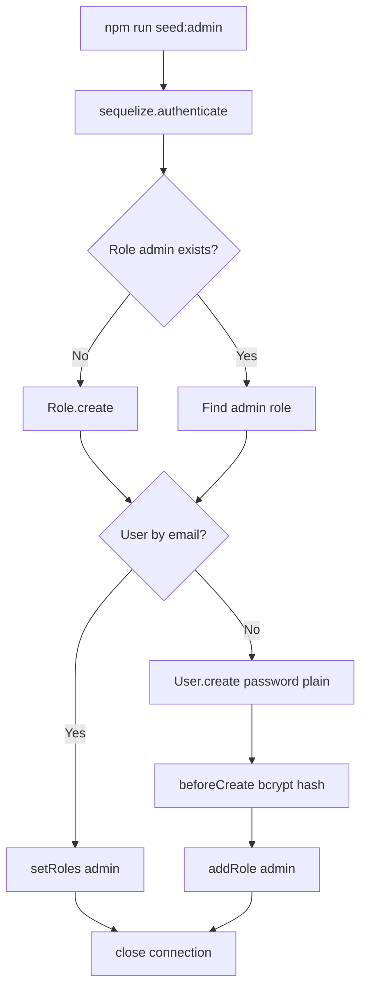

# Use Case — UC-SYS-03: Seed tài khoản admin ban đầu (Seed Initial Admin User)

| Thuộc tính | Giá trị |
|------------|---------|
| **ID** | UC-SYS-03 |
| **Tên** | Script CLI tạo role `admin` và user quản trị mặc định |
| **Mức độ ưu tiên** | Cao (triển khai lần đầu) |
| **Phiên bản** | Bám code hiện tại |
| **Liên quan FR** | `FR_SeedAdminScript.md` |
| **Liên quan UC** | UC-ADM-01, UC-SYS-02 |

---

## 1. Mô tả ngắn

Script **`server/seedAdmin.js`** — chạy **thủ công** (không tự động khi `npm start`) để:

1. Đảm bảo role **`admin`** tồn tại trong `roles`.
2. Tạo user admin mặc định **hoặc** gán lại role nếu email đã tồn tại.

Dùng cho môi trường dev/demo và bước **bootstrap** production khi DB mới.

```bash
cd server
npm run seed:admin
```

---

## 2. Tác nhân

| Tác nhân | Vai trò |
|----------|---------|
| **Developer / DevOps** | Chạy script |
| **seedAdmin.js** | Entry |
| **User model hooks** | Bcrypt `beforeCreate` |
| **Role model** | Upsert `admin` |
| **PostgreSQL** | Qua Sequelize |

---

## 3. Preconditions

| # | Điều kiện |
|---|-----------|
| PRE-01 | `NEON_DATABASE_URL` (hoặc URL trong `.env` server) hợp lệ |
| PRE-02 | Bảng `users`, `roles`, `user_roles` đã tồn tại (migration/sync) |
| PRE-03 | Chạy từ thư mục `server/` (dotenv `./.env`) |

---

## 4. Postconditions

| # | Kết quả |
|---|---------|
| POST-01 | Role `admin` có trong DB |
| POST-02 | User `admin@laptopstore.com` tồn tại, `is_active: true` |
| POST-03 | `user_roles` gán role `admin` |
| POST-04 | `sequelize.close()` trong `finally` |
| POST-ALT | User đã tồn tại → chỉ `setRoles([adminRole])`, không tạo duplicate |

---

## 5. Trigger

| Sự kiện | Ai |
|---------|-----|
| Setup project lần đầu | Dev |
| Mất quyền admin sau thao tác DB | Ops chạy lại seed |
| CI init DB (nếu tích hợp thủ công) | Pipeline |

**Không trigger:** `node server.js`, Docker `CMD npm start`.

---

## 6. Hằng số hardcode

| Constant | Giá trị |
|----------|---------|
| `ADMIN_USERNAME` | `super_admin` |
| `ADMIN_EMAIL` | `admin@laptopstore.com` |
| `ADMIN_PASSWORD` | `AdminPassword123` |
| Role name | `admin` |
| Role description | `Quản trị viên hệ thống` |

| Field user tạo mới | Giá trị |
|--------------------|---------|
| `full_name` | `System Administrator` |
| `is_active` | `true` |

---

## 7. Luồng chính



### Bước chi tiết

| # | Hành động |
|---|-----------|
| 1 | `require('dotenv').config({ path: './.env' })` |
| 2 | `sequelize.authenticate()` |
| 3 | `Role.findOne({ role_name: 'admin' })` — tạo nếu thiếu |
| 4 | `User.findOne({ email: ADMIN_EMAIL })` |
| 5a | **Đã có user** → log ID → `setRoles([adminRole])` → return |
| 5b | **Chưa có** → `User.create({ ..., password_hash: ADMIN_PASSWORD })` — hook hash |
| 6 | `adminUser.addRole(adminRole)` |
| 7 | `finally` → `sequelize.close()` |

### Mật khẩu

```javascript
// User.js beforeCreate
if (user.password_hash) {
  user.password_hash = await bcrypt.hash(user.password_hash, 10);
}
```

Script truyền **plaintext** vào `password_hash` — hook chuyển thành bcrypt.

---

## 8. NPM script

```json
"seed:admin": "node seedAdmin.js"
```

File: `server/package.json`.

---

## 9. Kết nối database

`seedAdmin.js` dùng `require('./models')` → `config/database.js`:

- Biến bắt buộc: **`NEON_DATABASE_URL`**
- Dialect: **PostgreSQL** + SSL (`rejectUnauthorized: false`)

| Gap deploy | `docker-compose.yml` set `DATABASE_URL` — **không** đọc bởi `database.js` nếu thiếu `NEON_DATABASE_URL` |

---

## 10. Sau seed — đăng nhập

| Bước | Hành động |
|------|-----------|
| 1 | `POST /api/auth/login` — `username: super_admin` hoặc email, password `AdminPassword123` |
| 2 | Nhận JWT 7 ngày |
| 3 | FE: roles gồm `admin` → vào `/admin` (UC-ADM-01) |

**Khuyến nghị:** Đổi mật khẩu qua profile / DB sau môi trường thật.

---

## 11. Luồng thay thế / ngoại lệ

### ALT-01 — Chạy lại seed

User đã tồn tại → **không** reset password — chỉ re-assign role.

### EXC-01 — Thiếu `NEON_DATABASE_URL`

`database.js` `process.exit(1)` khi load models.

### EXC-02 — Lỗi DB

`catch` log `Error during admin seeding` — không throw ra process code rõ ràng.

---

## 12. Phạm vi ngoài script

| Không seed | Ghi chú |
|------------|---------|
| `customer`, `manager`, `staff` roles | Register / manual / SQL |
| Products, categories | Seed/migration khác |
| Permissions | Bảng có thể trống |

---

## 13. Ánh xạ mã nguồn

| Thành phần | Đường dẫn |
|------------|-----------|
| Script | `server/seedAdmin.js` |
| User hooks | `server/models/User.js` |
| DB config | `server/config/database.js` |
| NPM | `server/package.json` |

---

## 14. Known gaps

| # | Gap |
|---|-----|
| GAP-01 | Password **hardcode** trong source |
| GAP-02 | Chạy lại **không** rotate password |
| GAP-03 | `DATABASE_URL` vs `NEON_DATABASE_URL` mismatch docker |
| GAP-04 | Không idempotent cho username conflict (chỉ check email) |
| GAP-05 | Không log credential ra stdout (OK) nhưng doc README có thể lộ |
| GAP-06 | Không tạo `manager` mặc định |

---

## 15. Tiêu chí chấp nhận

- [ ] `npm run seed:admin` trên DB trống → user + role admin
- [ ] Login `super_admin` / `AdminPassword123` → JWT + admin API 200
- [ ] Chạy lại lần 2 → không duplicate email, role vẫn admin
- [ ] Thiếu DB URL → fail sớm với message rõ
