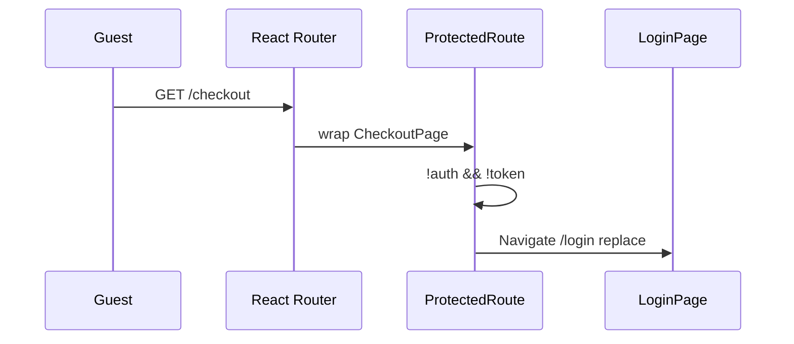

# Use Case — UC-UI-02: Bảo vệ route yêu cầu đăng nhập (Enforce Authenticated Routes)

| Thuộc tính | Giá trị |
|------------|---------|
| **ID** | UC-UI-02 |
| **Tên** | `ProtectedRoute` chặn guest truy cập checkout, profile, danh sách đơn |
| **Mức độ ưu tiên** | Cao |
| **Phiên bản** | Bám code hiện tại |
| **Liên quan UC** | UC-UI-01, UC-SYS-01, UC-ORD-* |

---

## 1. Mô tả ngắn

Một số trang storefront yêu cầu đăng nhập được bọc **`ProtectedRoute`** trong `App.jsx`. Component kiểm tra:

1. Redux `auth.isAuthenticated`, **hoặc**
2. `localStorage.getItem("token")` tồn tại

Nếu **cả hai** đều fail → **`<Navigate to="/login" replace />`**.

Đây là **guard phía client** — không thay thế JWT middleware BE (`UC-SYS-01`). API vẫn trả 401 nếu token invalid.

---

## 2. Tác nhân

| Tác nhân | Vai trò |
|----------|---------|
| **Guest** | Bị redirect login |
| **Customer đã login** | Xem nội dung children |
| **ProtectedRoute** | Wrapper component |
| **React Router** | `Navigate` |

---

## 3. Preconditions

| # | Điều kiện |
|---|-----------|
| PRE-01 | User navigate tới route được bọc `ProtectedRoute` |
| PRE-02 | Route nằm dưới `Layout` (có Header/Footer) |

---

## 4. Postconditions

| # | Kết quả |
|---|---------|
| POST-01 | Authenticated → render `children` (CheckoutPage, ProfilePage, OrdersPage) |
| POST-02 | Guest hoàn toàn → redirect `/login` |
| POST-03 | Có token trong storage nhưng Redux chưa sync → **vẫn** render children (`hasToken`) |

---

## 5. Trigger

| URL path | Page |
|----------|------|
| `/checkout` | `CheckoutPage` |
| `/profile` | `ProfilePage` |
| `/orders` | `OrdersPage` |

**Không bọc ProtectedRoute (public trong Layout):**

| Path | Ghi chú |
|------|---------|
| `/`, `/products/:id`, `/cart` | Catalog |
| `/login`, `/register`, `/oauth/success` | Auth |
| `/orders/:id` | **Chi tiết đơn** — không bọc (có thể lỗi nếu guest gọi API) |
| `/checkout/success`, `/checkout/vnpay-return` | Sau thanh toán |
| `/admin/*` | Dùng `AdminRoute` (UC-UI-03) |

---

## 6. Implementation

```javascript
// ProtectedRoute.jsx
export default function ProtectedRoute({ children }) {
  const { isAuthenticated } = useSelector((state) => state.auth);
  const hasToken = Boolean(localStorage.getItem("token"));

  if (!isAuthenticated && !hasToken) {
    return <Navigate to="/login" replace />;
  }

  return children;
}
```

### Ma trận quyết định

| `isAuthenticated` | `hasToken` | Kết quả |
|---------------------|------------|---------|
| true | * | ✅ children |
| false | true | ✅ children |
| false | false | ❌ → `/login` |

**Lý do `hasToken`:** Tránh flash redirect trong khoảng giữa mount và `main.jsx` bootstrap (hiếm nếu bootstrap OK).

---

## 7. Luồng chính — Guest vào checkout



---

## 8. Luồng chính — Đã login

| Bước | Hành động |
|------|-----------|
| 1 | UC-UI-01 restore session |
| 2 | Navigate `/checkout` |
| 3 | `ProtectedRoute` pass |
| 4 | `CheckoutPage` mount — gọi API cart, shipping (JWT) |

### Login redirect sau checkout

`LoginPage` / `OAuthSuccess` kiểm tra `pendingCheckout` trong `localStorage` → `navigate('/checkout', { state })`.

`CheckoutPage` có thể đọc `location.state` — luồng restore checkout (UC-ORD).

---

## 9. Tương tác API 401

`api.js` response interceptor:

- 401 hoặc legacy 403 token message
- Trừ `/auth/login`, `/auth/register`
- → clear storage, logout Redux, `window.location.href = "/login"`

| Layer | Hành vi |
|-------|---------|
| ProtectedRoute | Chặn **không có** token |
| Interceptor | Chặn token **invalid/expired** giữa session |

---

## 10. So sánh `AdminRoute`

| | ProtectedRoute | AdminRoute |
|---|----------------|------------|
| Cần login | Có (+ token fallback) | Có (**không** token fallback) |
| Cần role | Không | `admin` |
| Redirect fail | `/login` | `/login` hoặc `/` |
| Layout extra | Không | `AdminLayout` sidebar |

---

## 11. Route map (`App.jsx`)

```jsx
<Route path="/" element={<Layout />}>
  <Route path="checkout" element={
    <ProtectedRoute><CheckoutPage /></ProtectedRoute>
  } />
  <Route path="profile" element={
    <ProtectedRoute><ProfilePage /></ProtectedRoute>
  } />
  <Route path="orders" element={
    <ProtectedRoute><OrdersPage /></ProtectedRoute>
  } />
</Route>
```

Tất cả vẫn có **Header + Footer** từ `Layout` (UC-UI-04).

---

## 12. Luồng thay thế

### ALT-01 — Deep link `/orders` sau login

User login từ `/login` — mặc định `navigate('/')` trừ khi `pendingCheckout`.

### ALT-02 — `/orders/:id` không protected

Guest mở URL chi tiết đơn — **không** redirect login ở FE — BE có thể 401/404.

### EXC-01 — Token rác trong storage

`hasToken === true` nhưng token invalid → vào page → API fail → interceptor logout.

---

## 13. Ánh xạ mã nguồn

| Thành phần | Đường dẫn |
|------------|-----------|
| Guard | `client/app/components/ProtectedRoute.jsx` |
| Routes | `client/app/App.jsx` L95–121 |
| Pages | `CheckoutPage.jsx`, `ProfilePage.jsx`, `OrdersPage.jsx` |
| Login redirect | `LoginPage.jsx`, `OAuthSuccess.jsx` |
| API guard | `client/app/services/api.js` |

---

## 14. Known gaps

| # | Gap |
|---|-----|
| GAP-01 | **`/orders/:id` không ProtectedRoute** — inconsistent |
| GAP-02 | Không lưu `returnUrl` — sau login về `/` thay vì URL ban đầu |
| GAP-03 | `hasToken` without `user` vẫn pass — API có thể lỗi lạ |
| GAP-04 | Không validate role (customer-only — đủ cho storefront) |
| GAP-05 | Hard redirect `window.location` on 401 — mất React state |

---

## 15. Tiêu chí chấp nhận

- [ ] Guest `/checkout` → `/login`
- [ ] Logged-in `/checkout` → trang checkout
- [ ] Guest `/profile`, `/orders` → login
- [ ] Logout → vào `/orders` → login
- [ ] Token expired trên `/profile` → redirect login (interceptor)
