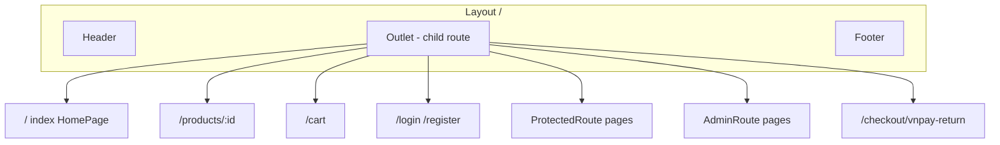
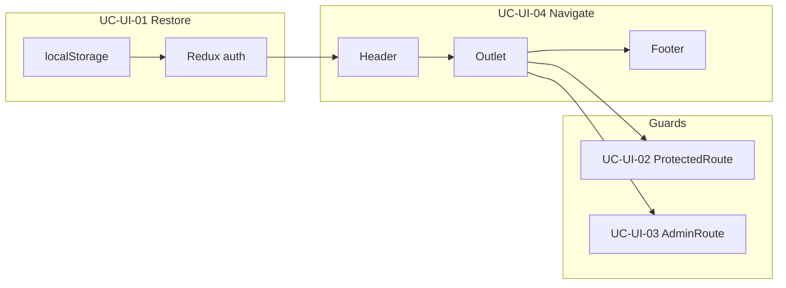

# Use Case — UC-UI-04: Điều hướng site với Layout (Navigate Site With Layout)

| Thuộc tính | Giá trị |
|------------|---------|
| **ID** | UC-UI-04 |
| **Tên** | Shell storefront: Header + `<Outlet>` + Footer trên hầu hết route công khai và customer |
| **Mức độ ưu tiên** | Cao |
| **Phiên bản** | Bám code hiện tại |
| **Liên quan UC** | UC-UI-01, UC-UI-02, UC-UI-03, UC-CAT-* |

---

## 1. Mô tả ngắn

`App.jsx` đăng ký **một parent route** bọc toàn bộ storefront:

```jsx
<Route path="/" element={<Layout />}>
  {/* child routes */}
</Route>
```

**`Layout.jsx`** render:

1. **`Header`** — logo, tìm kiếm, cart, auth menu  
2. **`<Outlet />`** — page theo URL con  
3. **`Footer`** — links marketing, danh mục  

React Router v6 **nested routes** — URL thay đổi chỉ swap `Outlet`, Header/Footer **giữ** (SPA).

**Ngoại lệ thực tế:** Admin routes **vẫn** nằm trong `Layout` → admin pages có **thêm** `AdminLayout` bên trong (UC-UI-03 GAP).

---

## 2. Tác nhân

| Tác nhân | Vai trò |
|----------|---------|
| **Visitor / Customer** | Duyệt catalog, cart |
| **Header** | Search, nav, cart badge |
| **Footer** | Secondary links |
| **React Router** | Matching + `Outlet` |
| **Child pages** | HomePage, PDP, Cart, … |

---

## 3. Preconditions

| # | Điều kiện |
|---|-----------|
| PRE-01 | SPA loaded (`main.jsx` → `App`) |
| PRE-02 | `BrowserRouter` với future flags v7 |

---

## 4. Postconditions

| # | Kết quả |
|---|---------|
| POST-01 | Mọi child của `/` hiển thị trong shell thống nhất |
| POST-02 | Navigate giữa `/`, `/products/1`, `/cart` — Header/Footer persist |
| POST-03 | Auth state Header phản ánh Redux (`isAuthenticated`, `user`) |

---

## 5. Trigger

User click `Link`, `navigate()`, hoặc gõ URL — bất kỳ route con của `/`.

---

## 6. Cấu trúc routing (`App.jsx`)



### Bảng route con (đầy đủ)

| Path | Wrapper | Page | Auth UI |
|------|---------|------|---------|
| `/` | — | `HomePage` | Public |
| `/products/:id` | — | `ProductDetailPage` | Public |
| `/cart` | — | `CartPage` | Public (API cart cần login) |
| `/login` | — | `LoginPage` | Public |
| `/register` | — | `RegisterPage` | Public |
| `/oauth/success` | — | `OAuthSuccess` | Public |
| `/checkout` | `ProtectedRoute` | `CheckoutPage` | Login required |
| `/checkout/success` | — | `CheckoutSuccessPage` | Public |
| `/checkout/vnpay-return` | — | `VnpayReturn` | Public |
| `/profile` | `ProtectedRoute` | `ProfilePage` | Login |
| `/orders` | `ProtectedRoute` | `OrdersPage` | Login |
| `/orders/:id` | — | `OrderDetailPage` | **Public route** |
| `/admin` … | `AdminRoute` | admin pages | Admin role |

---

## 7. Component `Layout.jsx`

```jsx
export default function Layout() {
  return (
    <div className="min-h-screen flex flex-col">
      <Header />
      <main className="flex-1">
        <Outlet />
      </main>
      <Footer />
    </div>
  );
}
```

| Phần | Tailwind | Vai trò |
|------|----------|---------|
| Root | `min-h-screen flex flex-col` | Sticky footer pattern |
| Main | `flex-1` | Đẩy footer xuống đáy viewport |

---

## 8. Header — hành vi chính

File: `client/app/components/Header.jsx`

| Tính năng | Chi tiết |
|-----------|----------|
| Logo / home | `Link` → `/` |
| Search desktop | Form → `navigate('/?search=...')` |
| Autocomplete | `useSearchSuggestions` khi query ≥ 2 ký tự |
| Empty search | Mock history + trending (client-only) |
| Cart badge | Redux `cart.items` quantity sum |
| Cart API | `useGetCart()` khi mount |
| Auth menu | Login/Register **hoặc** Profile, Orders, Admin, Logout |
| Mobile | Hamburger `isMenuOpen` — menu col (partial) |
| Logout | `useLogout()` + `navigate('/')` |

### Search → catalog

```javascript
navigate(`/?search=${searchQuery}`);
// HomePage đọc query params filter
```

Suggestion click → `/products/${slug}`.

---

## 9. Footer — hành vi chính

File: `client/app/components/Footer.jsx`

| Cột | Nội dung |
|-----|----------|
| Brand | LaptopStore + social icons (placeholder `#`) |
| Sản phẩm | `Link` → `/?category=gaming` etc. |
| Hỗ trợ | Static links (about, contact — có thể chưa có route) |
| Liên hệ | Mail, phone, address icons |

Footer **không** phụ thuộc auth state.

---

## 10. Router config

```jsx
<Router
  future={{
    v7_startTransition: true,
    v7_relativeSplatPath: true,
  }}
>
```

Chuẩn bị React Router v7 — không đổi URL structure hiện tại.

---

## 11. Luồng điều hướng điển hình

### 11.1 Khách mua hàng

```text
/ (Home) → /products/5 → /cart → /login → /checkout → /checkout/success
```

| Bước | Layout giữ | Outlet đổi |
|------|------------|------------|
| Browse | ✅ | Home → PDP |
| Cart | ✅ | CartPage |
| Login | ✅ | LoginPage (vẫn có Header) |
| Checkout | ✅ | CheckoutPage |

### 11.2 Admin từ Header

```text
/ → click Admin → /admin
```

Outlet: `AdminRoute` → sidebar **+** vẫn Header/Footer ngoài.

### 11.3 OAuth return

`/oauth/success?token=...` → trong Layout → message 「Đang hoàn tất đăng nhập...」→ redirect `/` hoặc `/checkout`.

---

## 12. Tích hợp global state

| State | Ảnh hưởng Layout |
|-------|------------------|
| `auth` | Header menu guest vs user |
| `cart` (Redux) | Badge số lượng |
| React Query | Cart fetch, search suggestions |

Pages con tự gọi hooks — Layout **không** prefetch business data.

---

## 13. Pages không dùng Layout

Không có — **mọi** route trong `App.jsx` đều under `/` + `Layout`.

(Popup/modal nội bộ page không đổi route.)

---

## 14. Luồng thay thế

### ALT-01 — Guest xem cart page

Route public — UI render — `useGetCart` có thể 401 → cart empty.

### ALT-02 — Direct URL admin

Layout Header + Admin sidebar + Footer cùng lúc.

### ALT-03 — Checkout success không protected

Share link success page — không cần login FE.

---

## 15. Ánh xạ mã nguồn

| Thành phần | Đường dẫn |
|------------|-----------|
| Router | `client/app/App.jsx` |
| Shell | `client/app/components/Layout.jsx` |
| Header | `client/app/components/Header.jsx` |
| Footer | `client/app/components/Footer.jsx` |
| Pages | `client/app/pages/*.jsx` |
| Hooks search/cart | `client/app/hooks/useProducts.js`, `useCart.js` |
| Entry | `client/app/main.jsx` |

---

## 16. Known gaps

| # | Gap |
|---|-----|
| GAP-01 | Admin routes **vẫn** có storefront Header/Footer |
| GAP-02 | `/orders/:id` public route — inconsistent với `/orders` list |
| GAP-03 | Search history/trending **mock** — không persist |
| GAP-04 | Footer links một số route có thể **404** |
| GAP-05 | Mobile menu nav incomplete comment trong code |
| GAP-06 | Cart page public nhưng API protected — UX confusing |
| GAP-07 | Không breadcrumbs trong Layout |
| GAP-08 | Không active nav highlight cho `/cart` vs `/orders` trên desktop (chỉ links trong menu user) |

---

## 17. Tiêu chí chấp nhận

- [ ] Navigate `/` → `/products/1` — Header/Footer không unmount
- [ ] Search submit → Home với query `search`
- [ ] Login → Header đổi sang profile/orders/logout
- [ ] Cart badge tăng khi thêm SP (logged in)
- [ ] `/admin` vẫn thấy Header storefront (documented behavior)
- [ ] Footer hiển thị mọi trang con của Layout

---

## 18. Sơ đồ tổng thể 4 UC UI


