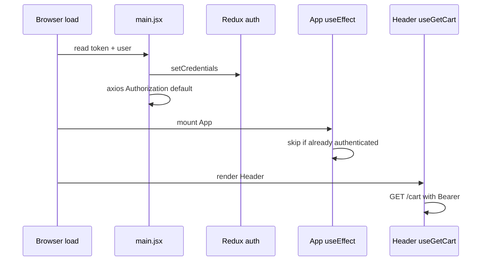

# Use Case — UC-UI-01: Khôi phục phiên đăng nhập từ localStorage (Restore Auth From LocalStorage)

| Thuộc tính | Giá trị |
|------------|---------|
| **ID** | UC-UI-01 |
| **Tên** | Bootstrap auth client sau F5 / mở tab mới — Redux + axios từ `token` và `user` |
| **Mức độ ưu tiên** | Cao |
| **Phiên bản** | Bám code hiện tại |
| **Liên quan UC** | UC-SYS-01, UC-UI-03, UC-ADM-01 |
| **Liên quan FR** | (Auth session persistence — storefront) |

---

## 1. Mô tả ngắn

Ứng dụng React **không** dùng cookie session — phiên đăng nhập sống trong:

| Storage key | Nội dung |
|-------------|----------|
| `localStorage.token` | JWT access token (7 ngày BE) |
| `localStorage.user` | JSON user (gồm `roles[]`) |
| `localStorage.roles` | (tùy chọn) JSON array — set lúc login, **không** đọc khi restore |

Khôi phục xảy ra **hai lớp** (cùng mục tiêu, thứ tự thời gian):

1. **`main.jsx`** — **trước** `ReactDOM.render` (eager bootstrap).
2. **`App.jsx` `useEffect`** — bổ sung nếu Redux chưa `isAuthenticated`.

Sau restore: `auth.isAuthenticated === true`, axios gắn `Authorization: Bearer`, Header hiển thị menu đã login.

**Không** gọi `GET /auth/me` tự động khi F5 (trừ OAuth flow).

---

## 2. Tác nhân

| Tác nhân | Vai trò |
|----------|---------|
| **Browser** | Lưu `localStorage` |
| **main.jsx** | Bootstrap sớm |
| **App.jsx** | Restore fallback |
| **authSlice.setCredentials** | Ghi Redux + persist |
| **api.js interceptor** | Đọc token mỗi request |

---

## 3. Preconditions

| # | Điều kiện |
|---|-----------|
| PRE-01 | Lần login/OAuth/register trước đó đã gọi `setCredentials` |
| PRE-02 | `token` và `user` JSON hợp lệ trong `localStorage` |
| PRE-03 | User chưa logout (keys chưa bị xóa) |

---

## 4. Postconditions

| # | Kết quả |
|---|---------|
| POST-01 | Redux: `isAuthenticated: true`, `user`, `token` |
| POST-02 | `api.defaults.headers.common.Authorization` set (từ `main.jsx`) |
| POST-03 | Mỗi request axios vẫn đọc `localStorage.token` (interceptor) |
| POST-E01 | Parse `user` lỗi → xóa `token`, `user`, `roles` — guest |
| POST-E02 | Token hết hạn server-side → API 401 → interceptor logout (UC-UI-03 liên quan) |

---

## 5. Trigger

| Sự kiện | Mô tả |
|---------|--------|
| F5 / mở URL mới | Full page load |
| Đóng tab mở lại cùng origin | `localStorage` còn |
| Hard refresh sau login | Bootstrap chạy lại |

**Không trigger restore:** tab đầu tiên sau register chưa login.

---

## 6. Luồng chính — Lớp 1: `main.jsx` (eager)

```javascript
const token = localStorage.getItem("token");
const rawUser = localStorage.getItem("user");
if (token && rawUser) {
  try {
    const user = JSON.parse(rawUser);
    store.dispatch(setCredentials({ token, user }));
    api.defaults.headers.common.Authorization = `Bearer ${token}`;
  } catch (_) {}
}
```

| Bước | Thời điểm | Hành động |
|------|-----------|-----------|
| 1 | Trước render | Đọc storage |
| 2 | Sync | `dispatch(setCredentials)` — **cũng** ghi lại storage trong reducer |
| 3 | Sync | Set axios default header |
| 4 | Render tree | `Provider` → `QueryClient` → `App` |

**Lợi ích:** Request React Query đầu tiên (ví dụ `useGetCart` trong Header) đã có Bearer.

---

## 7. Luồng chính — Lớp 2: `App.jsx` (fallback)

```javascript
useEffect(() => {
  const token = localStorage.getItem('token');
  const userStr = localStorage.getItem('user');

  if (token && userStr && !isAuthenticated) {
    try {
      const user = JSON.parse(userStr);
      dispatch(setCredentials({ token, user }));
    } catch (error) {
      localStorage.removeItem('token');
      localStorage.removeItem('user');
      localStorage.removeItem('roles');
    }
  }
}, [dispatch, isAuthenticated]);
```

| Điều kiện | Ý nghĩa |
|-----------|---------|
| `token && userStr` | Đủ cặp |
| `!isAuthenticated` | Tránh dispatch trùng sau bootstrap `main.jsx` |

### Effect phụ — `pendingCheckout`

Khi `isAuthenticated`, xóa `pendingCheckout` cũ hơn **5 phút** — tránh redirect checkout sai session.

---

## 8. Ghi session — nguồn truth

### `authSlice.setCredentials`

```javascript
setCredentials: (state, action) => {
  state.user = action.payload.user;
  state.token = action.payload.token;
  state.isAuthenticated = true;
  localStorage.setItem("token", action.payload.token);
  localStorage.setItem("user", JSON.stringify(action.payload.user));
},
```

### `useLogin.onSuccess`

- `setAuthHeader(data.token)`
- `localStorage.setItem("token", ...)`
- `localStorage.setItem("roles", JSON.stringify(roles))` — **riêng**
- `dispatch(setCredentials({ token, user }))`

### `OAuthSuccess.jsx`

- `localStorage.setItem("token", token)`
- `GET /auth/me` → `setCredentials({ token, user: data.user })`

### `logout` / `useLogout`

- `authSlice.logout` xóa `token`, `user`, `roles`
- `useLogout` cũng `removeItem token`, `roles`, clear queries

**GAP:** `useLogout` không gọi `removeItem('user')` trực tiếp — **`logout` reducer** xóa `user`.

---

## 9. axios — đọc token mỗi request

```javascript
api.interceptors.request.use((config) => {
  const token = localStorage.getItem("token");
  if (token) {
    config.headers.Authorization = `Bearer ${token}`;
  }
  return config;
});
```

Restore storage **không bắt buộc** set `defaults.headers` nếu interceptor luôn chạy — nhưng `main.jsx` vẫn set default để đồng bộ sớm.

---

## 10. Sơ đồ



---

## 11. Dữ liệu `user` trong storage

Typical shape sau login:

```json
{
  "user_id": 1,
  "username": "super_admin",
  "email": "admin@laptopstore.com",
  "full_name": "System Administrator",
  "roles": ["admin"]
}
```

| Field dùng UI | Component |
|---------------|-----------|
| `roles` | `AdminRoute`, Header link Admin |
| `full_name` / `email` | Header greeting |
| `user_id` | Implicit qua API |

**Stale roles:** Đổi role trên DB — JWT + `localStorage.user` **không** tự cập nhật đến hết hạn token.

---

## 12. Luồng thay thế

### ALT-01 — Chỉ có `token`, mất `user`

`App` restore không chạy; `main.jsx` không restore → guest UI dù token còn — **ProtectedRoute** vẫn pass nhờ `hasToken` (UC-UI-03).

### ALT-02 — StrictMode double mount

React 18 StrictMode — effect có thể chạy 2 lần dev; `!isAuthenticated` guard hạn chế duplicate set.

### EXC-01 — Token expired

Restore OK → API 401 → response interceptor clear storage + `/login`.

---

## 13. Ánh xạ mã nguồn

| Thành phần | Đường dẫn |
|------------|-----------|
| Bootstrap | `client/app/main.jsx` L12–23 |
| Restore effect | `client/app/App.jsx` L35–55 |
| Slice | `client/app/store/slices/authSlice.js` |
| Login persist | `client/app/hooks/useAuth.js` — `useLogin` |
| OAuth | `client/app/pages/OAuthSuccess.jsx` |
| Interceptor | `client/app/services/api.js` |

---

## 14. Known gaps

| # | Gap |
|---|-----|
| GAP-01 | **Hai lớp** restore trùng logic — khó bảo trì |
| GAP-02 | **Không** validate token với `/auth/me` on boot |
| GAP-03 | `localStorage.roles` không dùng khi restore |
| GAP-04 | `user` stale so với DB |
| GAP-05 | XSS có thể đọc `localStorage` token |
| GAP-06 | Console.log debug còn trong `App.jsx` production |

---

## 15. Tiêu chí chấp nhận

- [ ] Login → F5 → vẫn thấy tên user + menu Đơn hàng
- [ ] F5 → request cart có Authorization (network tab)
- [ ] Xóa `user` JSON, giữ token → restore fail / guest
- [ ] Logout → F5 → guest
- [ ] OAuth success → F5 → vẫn logged in
